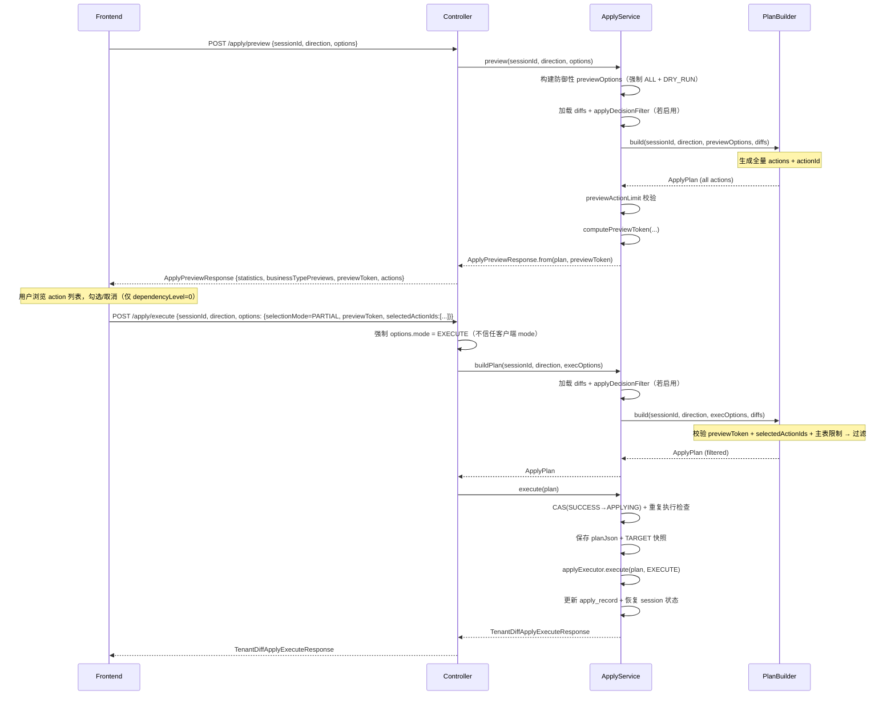

# Apply 勾选机制设计文档

> **版本**：v4.0 | 2026-03-16
> **状态**：SSOT — 面向 AI 实施（V1 收口版，编排层精确对齐实现）
> **前置文档**：[design-doc.md](design-doc.md) §4.2 Apply 流程

---

## 1. 问题陈述

### 1.1 当前断层

用户视角下，Apply 是一条连贯流程：

```
对比 → 查看明细 → 勾选要同步的项 → 预览影响 → 确认执行 → （回滚）
```

但当前实现在 **preview → execute** 之间存在粒度断层：

| 环节 | 当前能力 | 缺失 |
|------|---------|------|
| `/session/getBusinessDetail` | 返回 record/field 级 diff 明细 | — |
| `/apply/preview` | 仅返回 businessType 维度的聚合统计（insertCount/updateCount/deleteCount） | 无 action 级明细，用户看不到具体哪条记录会被操作 |
| `/apply/execute` | `ApplyOptions` 支持 `businessKeys`/`businessTypes`/`diffTypes` 粗粒度过滤 | 无 record 级选择能力，无法只执行用户勾选的特定记录 |

### 1.2 具体场景

```
场景：用户对比了 EXAMPLE_PRODUCT 类型，发现 10 条记录差异。
其中 3 条是 INSERT，5 条是 UPDATE，2 条是 DELETE。

用户只想同步其中 6 条（2 INSERT + 4 UPDATE），跳过其余 4 条。

当前：
  - preview 返回 {insertCount:3, updateCount:5, deleteCount:2} — 只有数字
  - execute 要么全做，要么按 businessType 整体过滤 — 无法选择具体记录

期望：
  - preview 返回 10 条 action 的明细列表，每条带唯一标识
  - 用户在 UI 上勾选 6 条
  - execute 传入这 6 条的标识，只执行它们
```

---

## 2. 设计目标与分期规划

### 2.1 V1 设计目标

| 目标 | 说明 |
|------|------|
| 补齐 preview → execute 的选择链路 | preview 返回 action 级明细，execute 接受用户勾选 |
| 最小改动原则 | 不引入新接口、**不修改 DB schema**、不改变现有 Controller 签名 |
| 与现有过滤机制兼容 | `selectedActionIds` 与 `businessKeys`/`businessTypes`/`diffTypes` 叠加（AND），不替代 |
| 无状态 | 不持久化勾选状态到 DB，selection 仅作为 execute 请求参数传入 |
| V1 仅支持主表选择 | `selectionMode=PARTIAL` 仅允许 `dependencyLevel=0` 的动作，防止子表 IdMapping 静默数据污染 |

### 2.2 分期路线

| 分期 | 范围 | 触发条件 |
|------|------|---------|
| **V1（本期）** | actionId + preview actions + PARTIAL 主表过滤 + previewToken 防陈旧 + previewActionLimit | 当前需求 |
| **V2** | 子表 PARTIAL 支持（需解决 IdMapping miss 时的安全策略）；`clientRequestId` 服务端幂等（DDL + selectOne） | V1 上线后用户反馈需要子表勾选 |
| **V3** | 持久化 decision（PATCH 接口 + PlanBuilder 检查 decision）；AUTO_INCLUDE 自动补齐依赖闭包；Preview 分页 | 出现多人协作审批场景 |

**V2/V3 明确不在本文档 MUST 范围内**，仅作为演进方向记录。

---

## 3. 方案设计

### 3.1 方案选型

| 方案 | 思路 | 优点 | 缺点 | 结论 |
|------|------|------|------|------|
| **A. 无状态 ActionId Selection** | preview 返回带 `actionId` 的 action 列表；execute 时传 `selectedActionIds` 过滤 | 简单，不改 DB，不改接口签名 | 勾选不持久化，刷新页面丢失 | **采用** |
| B. 持久化 Decision | 新增 PATCH 接口修改 `RecordDiff.decision`，PlanBuilder 检查 decision | 勾选持久化，多人协作友好 | 需要新增写接口 + 更新 `diffJson` 大字段 | V3 |
| C. ApplyOptions 多级白名单 | 在 ApplyOptions 中增加 `Map<String, List<String>> recordKeysByBusinessKey` | 利用现有过滤机制 | 前端构造复杂，跨 businessType 勾选时传参臃肿 | 不采用 |

### 3.2 ActionId 生成规则

一条 `ApplyAction` 由 4 个维度定位：

```
actionId = "v1:{escape(businessType)}:{escape(businessKey)}:{escape(tableName)}:{escape(recordBusinessKey)}"
```

其中 `escape(x)` 使用固定规则转义保留字符（`%`、`:`），避免分隔歧义：

```
escape(x): x.replace("%", "%25").replace(":", "%3A")
```

约束：

- MUST：4 个分量均非 null 且非空白；否则抛 `IllegalArgumentException`（由现有 handler 映射为 `PARAM_INVALID`）
- MUST：生成顺序固定为 `businessType -> businessKey -> tableName -> recordBusinessKey`，不得调整
- MUST：不做大小写归一化，不做 trim，不引入随机值，确保同一份 diff 数据计算结果稳定
- MUST：`actionId` 带版本前缀 `v1:`
- SHOULD：`actionId` 长度不超过 512 字符

唯一性说明：

- 同一 session 的同一份 diff 数据中，`businessType + businessKey + tableName + recordBusinessKey` 组合必须唯一
- 同一份 diff 数据、多次 preview/execute 计算出的 `actionId` 必须完全一致

### 3.3 整体交互流程



---

## 4. 模型变更

### 4.1 ApplyAction 增加 actionId

**文件**：`tenant-diff-core/.../domain/apply/ApplyAction.java`

```java
@Data
@Builder
@NoArgsConstructor
@AllArgsConstructor
public class ApplyAction {
    // --- 新增 ---
    /** 动作唯一标识，格式 v1:{escape(businessType)}:{escape(businessKey)}:{escape(tableName)}:{escape(recordBusinessKey)}。 */
    private String actionId;

    // --- 已有字段不变 ---
    private String businessType;
    private String businessKey;
    private String tableName;
    private Integer dependencyLevel;
    private String recordBusinessKey;
    private DiffType diffType;
    @Builder.Default
    private Map<String, Object> payload = Collections.emptyMap();

    public static String computeActionId(String businessType, String businessKey,
                                         String tableName, String recordBusinessKey) {
        return "v1:" + String.join(":",
            escapeRequired("businessType", businessType),
            escapeRequired("businessKey", businessKey),
            escapeRequired("tableName", tableName),
            escapeRequired("recordBusinessKey", recordBusinessKey));
    }

    private static String escapeRequired(String fieldName, String value) {
        if (value == null || value.isBlank()) {
            throw new IllegalArgumentException("actionId component is blank: " + fieldName);
        }
        return value.replace("%", "%25").replace(":", "%3A");
    }
}
```

### 4.2 ApplyOptions 增加选择字段

**文件**：`tenant-diff-core/.../domain/apply/ApplyOptions.java`

```java
@Data
@Builder
@NoArgsConstructor
@AllArgsConstructor
public class ApplyOptions {
    // --- 已有字段不变 ---
    @Builder.Default
    private ApplyMode mode = ApplyMode.DRY_RUN;
    @Builder.Default
    private boolean allowDelete = false;
    @Builder.Default
    private int maxAffectedRows = 1000;
    @Builder.Default
    private List<String> businessKeys = Collections.emptyList();
    @Builder.Default
    private List<String> businessTypes = Collections.emptyList();
    @Builder.Default
    private List<DiffType> diffTypes = Collections.emptyList();

    // --- 新增 ---
    /** ALL=全量执行；PARTIAL=仅执行 selectedActionIds 指定动作。 */
    @JsonSetter(nulls = Nulls.SKIP)
    @Builder.Default
    private SelectionMode selectionMode = SelectionMode.ALL;

    /** 用户勾选的 actionId 集合。selectionMode=PARTIAL 时必须非空。 */
    @Builder.Default
    private Set<String> selectedActionIds = Collections.emptySet();

    /** preview 返回的一致性令牌。selectionMode=PARTIAL 时必须传入。 */
    private String previewToken;

    /** 客户端请求标识（可选），仅用于审计日志追踪，不做服务端幂等。 */
    private String clientRequestId;
}
```

Jackson 兼容性说明：`@JsonSetter(nulls = Nulls.SKIP)` 确保 JSON 中 `null` 或缺失 `selectionMode` 时保留 `ALL` 默认值。PlanBuilder 中也做 `null → ALL` 的防御（双重保护）。

### 4.2.1 SelectionMode 枚举

**文件**：`tenant-diff-core/.../domain/apply/SelectionMode.java`

```java
public enum SelectionMode {
    /** 全量执行（向后兼容默认值）。 */
    ALL,
    /** 仅执行 selectedActionIds 指定项（V1 仅支持 dependencyLevel=0）。 */
    PARTIAL
}
```

### 4.3 ApplyPreviewResponse 增加 action 明细

**文件**：`tenant-diff-standalone/.../web/dto/response/ApplyPreviewResponse.java`

`ActionPreviewItem` 独立于 `ApplyAction` 定义，隐藏 domain 层的 `payload` 字段。

原方法签名 `from(ApplyPlan plan)` **替换**为 `from(ApplyPlan plan, String previewToken)`。

已知调用方（MUST 同步适配）：
- `TenantDiffStandaloneApplyServiceImpl.preview()` — 本次修改时一并适配

```java
@Data
@Builder
@NoArgsConstructor
@AllArgsConstructor
public class ApplyPreviewResponse {
    private Long sessionId;
    private ApplyDirection direction;
    private ApplyStatistics statistics;
    private List<BusinessTypePreview> businessTypePreviews;

    // --- 新增 ---
    private String previewToken;
    private List<ActionPreviewItem> actions;

    @Data @Builder @NoArgsConstructor @AllArgsConstructor
    public static class BusinessTypePreview { /* ... 不变 ... */ }

    @Data
    @Builder
    @NoArgsConstructor
    @AllArgsConstructor
    public static class ActionPreviewItem {
        private String actionId;
        private String businessType;
        private String businessKey;
        private String tableName;
        private String recordBusinessKey;
        private DiffType diffType;
        private Integer dependencyLevel;
    }
}
```

---

## 5. 核心逻辑变更

### 5.1 PlanBuilder — `build()` 方法变更

**文件**：`tenant-diff-core/.../apply/PlanBuilder.java`

```java
public ApplyPlan build(Long sessionId, ApplyDirection direction,
                       ApplyOptions options, List<BusinessDiff> diffs) {
    // ... 参数校验、初始化 effectiveOptions（不变）...

    List<ApplyAction> allActions = new ArrayList<>();
    // ... 现有的白名单过滤逻辑（businessType / businessKey / diffType / allowDelete）不变 ...

    // 新增：在构建 ApplyAction 时计算 actionId
    //   .actionId(ApplyAction.computeActionId(
    //       businessDiff.getBusinessType(), businessDiff.getBusinessKey(),
    //       tableDiff.getTableName(), recordDiff.getRecordBusinessKey()))

    SelectionMode mode = effectiveOptions.getSelectionMode() == null
        ? SelectionMode.ALL
        : effectiveOptions.getSelectionMode();

    List<ApplyAction> actions = allActions;
    if (mode == SelectionMode.PARTIAL) {
        // 1) previewToken 必须存在
        requireNonBlank(effectiveOptions.getPreviewToken(),
            "previewToken is required when selectionMode=PARTIAL");
        // 2) selectedActionIds 归一化 + 非空校验
        Set<String> selectedIds = normalizeSelectedIds(
            effectiveOptions.getSelectedActionIds());
        if (selectedIds.isEmpty()) {
            throw new TenantDiffException(ErrorCode.SELECTION_EMPTY);
        }
        // 3) previewToken 防陈旧校验
        validatePreviewToken(sessionId, direction, allActions,
            effectiveOptions.getPreviewToken());
        // 4) 严格存在性校验
        validateSelectedIdsExist(selectedIds, allActions);
        // 5) V1 主表限制：PARTIAL 仅允许 dependencyLevel=0
        validateMainTableOnly(selectedIds, allActions);
        // 6) 过滤
        actions = allActions.stream()
            .filter(a -> selectedIds.contains(a.getActionId()))
            .collect(Collectors.toList());
    }

    actions.sort(actionComparator());

    // maxAffectedRows：仅 EXECUTE 模式校验，DRY_RUN（preview）不阻断
    if (effectiveOptions.getMode() == ApplyMode.EXECUTE) {
        int estimated = actions.size();
        int max = effectiveOptions.getMaxAffectedRows();
        if (max > 0 && estimated > max) {
            throw new TenantDiffException(ErrorCode.APPLY_THRESHOLD_EXCEEDED,
                "estimatedAffectedRows(" + estimated
                + ") exceeds maxAffectedRows(" + max + ")");
        }
    }

    ApplyStatistics statistics = buildStatistics(actions);
    return ApplyPlan.builder()
        .planId(UUID.randomUUID().toString().replace("-", ""))
        .sessionId(sessionId).direction(direction)
        .options(effectiveOptions).actions(actions)
        .statistics(statistics).build();
}
```

#### 5.1.1 `requireNonBlank()`

```java
private static void requireNonBlank(String value, String message) {
    if (value == null || value.isBlank()) {
        throw new TenantDiffException(ErrorCode.PARAM_INVALID, message);
    }
}
```

#### 5.1.2 `normalizeSelectedIds()` — 输入归一化

过滤 null/blank；校验 `v1:` 前缀；校验长度 ≤ 512；数量 ≤ 5000。

```java
private static final int MAX_SELECTED_ACTION_IDS = 5000;

private static Set<String> normalizeSelectedIds(Set<String> raw) {
    if (raw == null || raw.isEmpty()) {
        return Set.of();
    }
    if (raw.size() > MAX_SELECTED_ACTION_IDS) {
        throw new TenantDiffException(ErrorCode.PARAM_INVALID,
            "selectedActionIds count(" + raw.size()
            + ") exceeds limit(" + MAX_SELECTED_ACTION_IDS + ")");
    }
    Set<String> result = new LinkedHashSet<>();
    for (String id : raw) {
        if (id == null || id.isBlank()) continue;
        if (!id.startsWith("v1:")) {
            throw new TenantDiffException(ErrorCode.SELECTION_INVALID_ID,
                "invalid actionId format (missing v1: prefix): " + id);
        }
        if (id.length() > 512) {
            throw new TenantDiffException(ErrorCode.SELECTION_INVALID_ID,
                "actionId length exceeds 512: " + id.length());
        }
        result.add(id);
    }
    return Collections.unmodifiableSet(result);
}
```

#### 5.1.3 `computePreviewToken()` — 简化版（MUST）

token 的唯一目的：检测 preview 与 execute 之间全量动作集是否变化。

```java
/**
 * previewToken = "pt_v1_" + sha256(sessionId|direction|sortedActionId1,sortedActionId2,...) 前 32 字符。
 * 总长度固定 38 字符。
 */
public static String computePreviewToken(Long sessionId, ApplyDirection direction,
                                         List<ApplyAction> allActions) {
    List<String> sortedIds = allActions.stream()
        .map(ApplyAction::getActionId)
        .filter(Objects::nonNull)
        .sorted()
        .collect(Collectors.toList());
    String canonical = sessionId + "|" + direction.name() + "|"
        + String.join(",", sortedIds);
    return "pt_v1_" + sha256Hex(canonical).substring(0, 32);
}

private static String sha256Hex(String input) {
    try {
        java.security.MessageDigest md =
            java.security.MessageDigest.getInstance("SHA-256");
        byte[] hash = md.digest(
            input.getBytes(java.nio.charset.StandardCharsets.UTF_8));
        StringBuilder sb = new StringBuilder(hash.length * 2);
        for (byte b : hash) sb.append(String.format("%02x", b));
        return sb.toString();
    } catch (java.security.NoSuchAlgorithmException e) {
        throw new IllegalStateException("SHA-256 not available", e);
    }
}
```

#### 5.1.4 `validatePreviewToken()` — 防陈旧校验

```java
private static void validatePreviewToken(Long sessionId, ApplyDirection direction,
                                         List<ApplyAction> allActions,
                                         String actualToken) {
    String expectedToken = computePreviewToken(sessionId, direction, allActions);
    if (!expectedToken.equals(actualToken)) {
        throw new TenantDiffException(ErrorCode.SELECTION_STALE,
            "previewToken mismatch: diff data may have changed since last preview");
    }
}
```

#### 5.1.5 `validateSelectedIdsExist()` — 存在性校验（strict）

```java
private static void validateSelectedIdsExist(Set<String> selectedIds,
                                              List<ApplyAction> allActions) {
    Set<String> validIds = allActions.stream()
        .map(ApplyAction::getActionId).collect(Collectors.toSet());
    List<String> unknownIds = new ArrayList<>();
    for (String id : selectedIds) {
        if (!validIds.contains(id)) unknownIds.add(id);
    }
    if (!unknownIds.isEmpty()) {
        throw new TenantDiffException(ErrorCode.SELECTION_INVALID_ID,
            "unknown actionIds (" + unknownIds.size() + "): "
            + unknownIds.get(0)
            + (unknownIds.size() > 1
                ? " and " + (unknownIds.size() - 1) + " more" : ""));
    }
}
```

#### 5.1.6 `validateMainTableOnly()` — V1 主表限制（MUST，安全底线）

**背景**：当前 `ApplyExecutor` 的子表 INSERT 依赖 `IdMapping`（父记录执行后写入的 id 映射）来替换外键值。若 PARTIAL 选了子表 INSERT 但跳过了父表 INSERT，IdMapping 中无对应条目，子表会写入**源租户的原始外键值**——这是静默数据污染，比报错更危险。

**V1 策略**：`selectionMode=PARTIAL` 时，`selectedActionIds` 中的每一条 action 必须是 `dependencyLevel=0`（主表）。

```java
/**
 * V1 安全限制：PARTIAL 仅允许选择主表（dependencyLevel=0）动作。
 * 子表 PARTIAL 支持留待 V2（需解决 IdMapping miss 安全策略）。
 *
 * @throws TenantDiffException(PARAM_INVALID) 若 selectedActionIds 包含 dependencyLevel>0 的动作
 */
private static void validateMainTableOnly(Set<String> selectedIds,
                                           List<ApplyAction> allActions) {
    for (ApplyAction action : allActions) {
        if (action == null || action.getActionId() == null) continue;
        if (!selectedIds.contains(action.getActionId())) continue;
        int level = action.getDependencyLevel() == null ? 0
            : action.getDependencyLevel();
        if (level > 0) {
            throw new TenantDiffException(ErrorCode.PARAM_INVALID,
                "selectionMode=PARTIAL does not support sub-table actions (dependencyLevel="
                + level + ", table=" + action.getTableName()
                + "). This will be supported in a future version.");
        }
    }
}
```

**过滤顺序**（完整管线）：

```
[Service 层 — buildPlan()]
  → 从 DB 加载 diff results → 反序列化为 List<BusinessDiff>
  → applyDecisionFilter: decision=SKIP 的 RecordDiff 从 tableDiffs 移除（若 decisionRecordService 非 null）
  → 传入 planBuilder.build(sessionId, direction, options, diffs)

[PlanBuilder — build()]
  → diff 遍历
    → businessType 白名单
    → businessKey 白名单
    → diffType 白名单
    → allowDelete 检查
    → B_TO_A 方向反转（INSERT↔DELETE）
    → NOOP 跳过
    → actionId 计算
  → selectionMode 语义校验（ALL/PARTIAL）
  → previewToken 防陈旧校验（PARTIAL）
  → selectedActionIds 归一化 + 格式 + 数量 + 存在性校验（PARTIAL，strict）
  → V1 主表限制校验（PARTIAL，dependencyLevel=0 only）
  → selectedActionIds 过滤（PARTIAL）
  → 依赖感知排序（§5.1.7）
  → maxAffectedRows 阈值校验（仅 EXECUTE 模式）
  → 生成统计
```

#### 5.1.7 `actionComparator()` — 依赖感知排序（MUST）

排序策略直接影响外键约束安全，MUST 严格遵循：

1. **INSERT/UPDATE 优先于 DELETE**：降低外键约束冲突概率
2. **INSERT/UPDATE 按 `dependencyLevel` 升序**：先写主表再写子表（保证外键引用有效）
3. **DELETE 按 `dependencyLevel` 降序**：先删子表再删主表（避免外键约束阻止删除）
4. **相同条件下按 `businessType` → `businessKey` → `tableName` → `recordBusinessKey` → `diffType` 字典序**，保证执行顺序稳定可预测

```java
private static Comparator<ApplyAction> actionComparator() {
    return (a, b) -> {
        boolean aDelete = a != null && a.getDiffType() == DiffType.DELETE;
        boolean bDelete = b != null && b.getDiffType() == DiffType.DELETE;
        // 规则 1：非 DELETE 优先
        if (aDelete != bDelete) {
            return aDelete ? 1 : -1;
        }
        // 规则 2/3：依赖层级（INSERT/UPDATE 升序，DELETE 降序）
        int depA = dependencyValue(a, aDelete);
        int depB = dependencyValue(b, bDelete);
        if (depA != depB) {
            return aDelete ? Integer.compare(depB, depA) : Integer.compare(depA, depB);
        }
        // 规则 4：字典序兜底
        int c = safeCompare(a.getBusinessType(), b.getBusinessType());
        if (c != 0) return c;
        c = safeCompare(a.getBusinessKey(), b.getBusinessKey());
        if (c != 0) return c;
        c = safeCompare(a.getTableName(), b.getTableName());
        if (c != 0) return c;
        c = safeCompare(a.getRecordBusinessKey(), b.getRecordBusinessKey());
        if (c != 0) return c;
        return safeCompare(
            a.getDiffType() == null ? null : a.getDiffType().name(),
            b.getDiffType() == null ? null : b.getDiffType().name());
    };
}
```

### 5.2 ApplyPreviewResponse.from() 填充 action 列表

**文件**：`tenant-diff-standalone/.../web/dto/response/ApplyPreviewResponse.java`

```java
public static ApplyPreviewResponse from(ApplyPlan plan, String previewToken) {
    if (plan == null) {
        return ApplyPreviewResponse.builder()
            .previewToken(previewToken)
            .businessTypePreviews(Collections.emptyList())
            .actions(Collections.emptyList())
            .build();
    }
    // --- businessTypePreviews 聚合逻辑（不变）---
    // ...

    List<ActionPreviewItem> actionItems = new ArrayList<>();
    if (plan.getActions() != null) {
        for (ApplyAction action : plan.getActions()) {
            if (action == null) continue;
            actionItems.add(ActionPreviewItem.builder()
                .actionId(action.getActionId())
                .businessType(action.getBusinessType())
                .businessKey(action.getBusinessKey())
                .tableName(action.getTableName())
                .recordBusinessKey(action.getRecordBusinessKey())
                .diffType(action.getDiffType())
                .dependencyLevel(action.getDependencyLevel())
                .build());
        }
    }
    return ApplyPreviewResponse.builder()
        .sessionId(plan.getSessionId())
        .direction(plan.getDirection())
        .statistics(plan.getStatistics())
        .businessTypePreviews(previews)
        .previewToken(previewToken)
        .actions(actionItems)
        .build();
}
```

### 5.3 Service 层编排变更

**文件**：`tenant-diff-standalone/.../service/impl/TenantDiffStandaloneApplyServiceImpl.java`

**接口签名**（`TenantDiffStandaloneApplyService.java`）：

```java
public interface TenantDiffStandaloneApplyService {
    ApplyPreviewResponse preview(Long sessionId, ApplyDirection direction, ApplyOptions options);
    ApplyPlan buildPlan(Long sessionId, ApplyDirection direction, ApplyOptions options);
    TenantDiffApplyExecuteResponse execute(ApplyPlan plan);
}
```

> **MUST**：`execute()` 接收 `ApplyPlan`（而非 sessionId+direction+options）。Controller 先调 `buildPlan()` 再调 `execute(plan)`，分离构建与执行。

#### 5.3.1 Preview 编排

MUST：preview 构建独立的 `previewOptions`，**强制** `selectionMode=ALL` + `selectedActionIds=emptySet()` + `previewToken=null`，确保 preview 始终基于全量 action 集计算 previewToken。不得直接修改调用方传入的 `options` 对象。

```java
@Override
public ApplyPreviewResponse preview(Long sessionId, ApplyDirection direction,
                                     ApplyOptions options) {
    // 安全：构建独立的 preview 选项，强制 ALL + DRY_RUN，不修改调用方原始 options。
    ApplyOptions.ApplyOptionsBuilder previewBuilder = ApplyOptions.builder()
        .mode(ApplyMode.DRY_RUN)
        .selectionMode(SelectionMode.ALL)
        .selectedActionIds(Collections.emptySet())
        .previewToken(null);

    // 保留调用方的过滤条件（白名单 + 安全阈值）
    if (options != null) {
        previewBuilder
            .allowDelete(options.isAllowDelete())
            .maxAffectedRows(options.getMaxAffectedRows())
            .businessKeys(options.getBusinessKeys())
            .businessTypes(options.getBusinessTypes())
            .diffTypes(options.getDiffTypes());
    }
    ApplyOptions previewOptions = previewBuilder.build();

    ApplyPlan plan = buildPlan(sessionId, direction, previewOptions);

    int actionCount = plan.getActions() == null ? 0 : plan.getActions().size();
    if (actionCount > previewActionLimit) {
        throw new TenantDiffException(ErrorCode.PREVIEW_TOO_LARGE,
            "preview actions(" + actionCount + ") exceeds limit(" + previewActionLimit + ")");
    }

    String previewToken = PlanBuilder.computePreviewToken(
        sessionId, direction, plan.getActions());
    log.info("Apply preview: sessionId={}, direction={}, actionCount={}, previewToken={}",
        sessionId, direction, actionCount, previewToken);

    return ApplyPreviewResponse.from(plan, previewToken);
}
```

#### 5.3.2 buildPlan 编排

```java
@Override
public ApplyPlan buildPlan(Long sessionId, ApplyDirection direction, ApplyOptions options) {
    // 参数校验 ...
    // 从 DB 加载 session、diff results
    // 反序列化 diffJson → List<BusinessDiff>

    // Decision 过滤（若 decisionRecordService 已注入）
    if (decisionRecordService != null) {
        diffs = applyDecisionFilter(sessionId, diffs);
    }

    return planBuilder.build(sessionId, direction, options, diffs);
}
```

> **MUST**：`applyDecisionFilter()` 在 `planBuilder.build()` **之前**执行。它将 `decision=SKIP` 的 RecordDiff 从 tableDiffs 中移除，直接影响后续 actionId 生成和 previewToken 计算。

#### 5.3.3 Execute 编排

MUST：`execute(ApplyPlan plan)` 接收已构建的 plan。Controller 层负责强制 `mode=EXECUTE`。

```java
@Override
@Transactional(rollbackFor = Exception.class)
public TenantDiffApplyExecuteResponse execute(ApplyPlan plan) {
    // 审计：记录 selection 信息（MDC 追踪）
    String selectionMode = plan.getOptions() != null && plan.getOptions().getSelectionMode() != null
        ? plan.getOptions().getSelectionMode().name() : "N/A";
    String clientRequestId = plan.getOptions() == null ? null : plan.getOptions().getClientRequestId();
    int actionCount = plan.getActions() == null ? 0 : plan.getActions().size();
    log.info("Apply execute: sessionId={}, direction={}, selectionMode={}, actionCount={}, clientRequestId={}",
        plan.getSessionId(), plan.getDirection(), selectionMode, actionCount, clientRequestId);

    MDC.put("sessionId", String.valueOf(plan.getSessionId()));
    try {
        return doExecute(plan);
    } finally {
        MDC.remove("sessionId");
        MDC.remove("applyId");
    }
}
```

#### 5.3.4 doExecute 内部流程（已有逻辑，本期不改变但需了解）

`doExecute(plan)` 内部执行以下步骤：

1. 校验 session 状态必须为 `SUCCESS`，否则 `SESSION_NOT_READY`
2. CAS 状态转换 `SUCCESS → APPLYING`（乐观锁），失败时 `APPLY_CONCURRENT_CONFLICT`
3. 检查是否已有 `SUCCESS/ROLLED_BACK` 的 apply_record，有则 `SESSION_ALREADY_APPLIED`
4. 插入 `apply_record`（状态=RUNNING）+ MDC.put("applyId")
5. 保存 TARGET 快照（用于回滚）
6. 调用 `applyExecutor.execute(plan, EXECUTE)`
7. 更新 apply_record 状态（SUCCESS/FAILED）
8. 恢复 session 状态为 `SUCCESS`

> **安全依赖**：步骤 2-3 保证同一 session 不可并发执行 Apply，也不可重复执行。`selectionMode=PARTIAL` 不影响这些安全检查。

#### 5.3.5 Controller 层安全逻辑（MUST）

**文件**：`tenant-diff-standalone/.../web/controller/TenantDiffStandaloneApplyController.java`

虽然 Controller 签名不变，但 execute 端点有一行**安全关键逻辑**——强制 `mode=EXECUTE`：

```java
@PostMapping("/execute")
public ApiResponse<TenantDiffApplyExecuteResponse> execute(@RequestBody @Valid ApplyExecuteRequest request) {
    ApplyOptions execOptions = request.getOptions() == null
        ? ApplyOptions.builder().build()
        : request.getOptions();
    // P0 安全: 不信任客户端 mode，强制 EXECUTE，确保 maxAffectedRows 阈值校验不可绕过。
    execOptions.setMode(ApplyMode.EXECUTE);

    ApplyPlan plan = applyService.buildPlan(
        request.getSessionId(), request.getDirection(), execOptions);
    return ApiResponse.ok(applyService.execute(plan));
}
```

> **MUST**：Controller 层强制 `setMode(EXECUTE)` 而非在 Service 层做。原因：如果前端传 `mode=DRY_RUN`，PlanBuilder 的 `maxAffectedRows` 校验（仅 EXECUTE 模式生效）会被绕过，构成安全漏洞。

---

## 6. API 契约变更

### 6.1 POST /apply/preview — 响应增加 previewToken 与 actions

> **排序保证**：`actions` 列表按 §5.1.7 的依赖感知排序输出（INSERT/UPDATE 优先于 DELETE，主表优先于子表）。前端可直接使用此顺序渲染 UI。

```json
{
  "sessionId": 1,
  "direction": "A_TO_B",
  "statistics": { "totalActions": 10, "insertCount": 3, "updateCount": 5, "deleteCount": 2 },
  "businessTypePreviews": [
    { "businessType": "EXAMPLE_PRODUCT", "insertCount": 3, "updateCount": 5, "deleteCount": 2, "totalActions": 10 }
  ],
  "previewToken": "pt_v1_4f9f7f9e8d3c2a1b0e9f8d7c6b5a4938",
  "actions": [
    {
      "actionId": "v1:EXAMPLE_PRODUCT:PROD-001:xai_product:PROD-001",
      "businessType": "EXAMPLE_PRODUCT",
      "businessKey": "PROD-001",
      "tableName": "xai_product",
      "recordBusinessKey": "PROD-001",
      "diffType": "INSERT",
      "dependencyLevel": 0
    }
  ]
}
```

### 6.2 POST /apply/execute — 请求 options 增加 selectionMode / previewToken / selectedActionIds

```json
{
  "sessionId": 1,
  "direction": "A_TO_B",
  "options": {
    "allowDelete": false,
    "maxAffectedRows": 1000,
    "selectionMode": "PARTIAL",
    "previewToken": "pt_v1_4f9f7f9e8d3c2a1b0e9f8d7c6b5a4938",
    "selectedActionIds": [
      "v1:EXAMPLE_PRODUCT:PROD-001:xai_product:PROD-001",
      "v1:EXAMPLE_PRODUCT:PROD-002:xai_product:PROD-002"
    ]
  }
}
```

### 6.3 向后兼容性

| 场景 | 行为 |
|------|------|
| 旧前端不传 `selectionMode` | 默认 `ALL`（`@JsonSetter(nulls=SKIP)` + PlanBuilder null→ALL 双重保护） |
| 旧前端不传 `selectedActionIds` | `ALL` 模式下忽略 |
| `PARTIAL` 且 `selectedActionIds` 为空 | `SELECTION_EMPTY` 拒绝 |
| `PARTIAL` 且不传 `previewToken` | `PARAM_INVALID` 拒绝 |
| `PARTIAL` 且存在未知 `actionId` | `SELECTION_INVALID_ID` 拒绝 |
| `PARTIAL` 且包含子表动作（dependencyLevel>0） | `PARAM_INVALID` 拒绝（V1 限制） |

---

## 7. 边界与安全

### 7.1 Preview 与 Execute 之间的 diff 数据一致性

1. preview 在 Service 层调用 `PlanBuilder.computePreviewToken()` 计算 token 并返回
2. execute(`PARTIAL`) 回传 `previewToken`
3. PlanBuilder 基于当前 diff 重建全量动作并重算 expectedToken
4. `!expectedToken.equals(actualToken)` 时返回 `SELECTION_STALE` 拒绝执行

### 7.2 selectedActionIds 与 allowDelete 的交互

过滤管线保证 `selectedActionIds` 过滤在 `allowDelete` 检查之后，不可能通过 selection 绕过安全限制。

### 7.3 maxAffectedRows 阈值

- preview（`DRY_RUN`）：不阻断（必须能拿到 action 列表）
- execute（`EXECUTE`）：过滤后阈值校验

### 7.4 preview 响应体积

- `previewActionLimit` 默认 5000，可配置
- 超限返回 `PREVIEW_TOO_LARGE` 拒绝

### 7.5 V1 主表限制（安全底线）

`selectionMode=PARTIAL` 仅允许 `dependencyLevel=0` 的动作。原因：子表 INSERT 依赖 `IdMapping`，若父表 INSERT 未执行则 IdMapping 缺失，子表会写入源租户原始外键值（静默数据污染）。

前端 SHOULD 根据 `dependencyLevel` 字段控制 UI：子表记录禁止勾选或显示"V1 暂不支持"提示。

### 7.6 Decision Filter 与 Selection 的交互

`applyDecisionFilter`（按 `decision=SKIP` 移除 RecordDiff）在 PlanBuilder 之前执行。两者关系：

1. Decision Filter 缩减原始 diff 数据 → 影响全量 action 集 → 影响 previewToken
2. Selection 在全量 action 集上做子集过滤

**时序保证**：preview 和 execute 都走 `buildPlan()` → 同样的 Decision Filter → 同样的 PlanBuilder，previewToken 一致性得到保证。

### 7.7 并发安全（execute）

`execute(plan)` 内部通过 CAS（乐观锁）+ 重复检查保证安全：

- CAS `session.status: SUCCESS → APPLYING`，失败时 `APPLY_CONCURRENT_CONFLICT`
- 检查已有 `SUCCESS/ROLLED_BACK` 的 apply_record，有则 `SESSION_ALREADY_APPLIED`

`selectionMode=PARTIAL` 不影响这些并发安全检查。

### 7.8 审计追踪

- `execute()` 使用 `MDC.put("sessionId", ...)` 和 `MDC.put("applyId", ...)` 提供日志追踪上下文
- `preview()` 和 `execute()` 均在 `log.info` 中记录 `selectionMode`、`actionCount`、`clientRequestId`
- `planJson` 持久化到 `apply_record` 表，包含完整的 `ApplyOptions`（含 selection 信息）

---

## 8. 改动文件清单

| 文件 | 模块 | 改动类型 | 改动说明 |
|------|------|---------|---------|
| `ApplyAction.java` | core | 修改 | 增加 `actionId` 字段 + `computeActionId()` |
| `SelectionMode.java` | core | 新增 | `ALL` / `PARTIAL` |
| `ApplyOptions.java` | core | 修改 | 增加 `selectionMode`/`selectedActionIds`/`previewToken`/`clientRequestId`；`@JsonSetter` |
| `ErrorCode.java` | core | 修改 | 增加 4 个错误码（§10） |
| `PlanBuilder.java` | core | 修改 | actionId 计算；`computePreviewToken()`；selection 校验 + 过滤 + 主表限制；`actionComparator()`；maxAffectedRows 改为 EXECUTE-only |
| `TenantDiffStandaloneApplyService.java` | standalone | 修改 | 接口方法签名：`preview()` / `buildPlan()` / `execute(ApplyPlan)` |
| `ApplyPreviewResponse.java` | standalone | 修改 | 增加 `previewToken`、`ActionPreviewItem`、`actions`；`from()` 签名变更 |
| `TenantDiffStandaloneApplyServiceImpl.java` | standalone | 修改 | `preview()` 防御性构建 + `buildPlan()` 集成 DecisionFilter + `execute(ApplyPlan)` 审计日志 |
| `PlanBuilderTest.java` | core (test) | 修改 | 新增 selection 相关测试 |
| `ApplyPreviewResponseTest.java` | standalone (test) | 新增 | previewToken/actions 映射测试 |
| `TenantDiffStandaloneApplySelectionIntegrationTest.java` | standalone (test) | 新增 | 端到端 selection 集成测试（§9.2 全 9 场景） |

**不改动的文件**：

| 文件 | 原因 |
|------|------|
| Controller 类 | 签名不变；execute 端点的 `mode=EXECUTE` 强制逻辑已存在（§5.3.5），selection 字段通过 ApplyOptions 自动透传 |
| `ApplyExecuteRequest.java` | `options` 类型为 `ApplyOptions`，field 变更自动反映 |
| DB schema | 不修改 |
| ExceptionHandler | 新增 ErrorCode 使用默认 422，不需加入 `ERROR_CODE_STATUS_MAP`（§10.1） |

---

## 9. 测试策略

### 9.1 PlanBuilder 单测

| 用例 | 验证点 |
|------|--------|
| `selectionMode=ALL`（默认） | 向后兼容，全量执行 |
| `selectionMode=null`（旧客户端） | 等同 ALL |
| `PARTIAL` + 空 `selectedActionIds` | `SELECTION_EMPTY` |
| `PARTIAL` + 缺 `previewToken` | `PARAM_INVALID` |
| `PARTIAL` + `previewToken` 不匹配 | `SELECTION_STALE` |
| `PARTIAL` + 未知 `actionId` | `SELECTION_INVALID_ID` |
| `PARTIAL` + actionId 缺 `v1:` 前缀 | `SELECTION_INVALID_ID` |
| `PARTIAL` + `selectedActionIds` 超 5000 | `PARAM_INVALID` |
| `PARTIAL` + 包含子表动作（level>0） | `PARAM_INVALID`（V1 限制） |
| `PARTIAL` + 部分有效 id | 仅保留匹配项 |
| `selectedActionIds` 与 `businessKeys`/`diffTypes` 叠加 | AND 语义 |
| `selectedActionIds` 含 DELETE + `allowDelete=false` | DELETE 仍被拦截 |
| actionId 计算确定性 | 同一输入多次一致；`:`、`%` 转义正确 |
| `maxAffectedRows` + `DRY_RUN` | 不阻断 |
| `maxAffectedRows` + `EXECUTE` | 过滤后阈值判断 |
| `computePreviewToken` 确定性 | 同一输入多次一致 |
| `computePreviewToken` 敏感性 | 增减 action → token 变化 |

### 9.2 集成测试

**文件**：`TenantDiffStandaloneApplySelectionIntegrationTest.java`

使用 H2 内存库 + MockMvc + RecordingApplyExecutor（记录传入 plan 的 mock 执行器）。

```
 1. preview → 验证 actions 非空、每条有 actionId（v1: 前缀）、返回 previewToken（pt_v1_ 前缀）
 2. preview → execute(PARTIAL) → 仅选中记录传入 executor，plan.options.mode=EXECUTE
 3. execute(PARTIAL) + 篡改 previewToken → HTTP 422 + DIFF_E_2012 (SELECTION_STALE)
 4. execute(PARTIAL) + 未知 actionId → HTTP 422 + DIFF_E_2011 (SELECTION_INVALID_ID)
 5. execute(PARTIAL) + 空 selectedActionIds → HTTP 422 + DIFF_E_2010 (SELECTION_EMPTY)
 6. execute(PARTIAL) + 子表动作（dependencyLevel>0） → HTTP 400 + DIFF_E_0001 (PARAM_INVALID)
 7. execute 不传 selectionMode → 全量执行（兼容），executor 收到全部 actions
 8. execute 客户端传 mode=DRY_RUN → Controller 强制 EXECUTE → maxAffectedRows 仍生效（HTTP 422 + DIFF_E_2001）
 9. preview action 数超 previewActionLimit → DIFF_E_2014 (PREVIEW_TOO_LARGE)
```

每个测试用例 MUST 验证：
- 正确的 HTTP 状态码（200/400/422）
- 正确的 ErrorCode（`$.code` 字段）
- executor 调用次数（失败场景 callCount=0）

---

## 10. 错误码（新增）

| 错误码枚举名 | 编码 | HTTP Status | 触发条件 |
|-------------|------|-------------|----------|
| `SELECTION_EMPTY` | `DIFF_E_2010` | 422 Unprocessable Entity | `PARTIAL` 且 `selectedActionIds` 为空 |
| `SELECTION_INVALID_ID` | `DIFF_E_2011` | 422 Unprocessable Entity | `selectedActionIds` 含未知 id 或格式非法 |
| `SELECTION_STALE` | `DIFF_E_2012` | 422 Unprocessable Entity | `previewToken` 不匹配 |
| `PREVIEW_TOO_LARGE` | `DIFF_E_2014` | 422 Unprocessable Entity | preview 动作数超 `previewActionLimit` |

**文件**：`ErrorCode.java`，在 `// ── Apply（2xxx）──` 段追加。

### 10.1 HTTP 状态码映射规则

ExceptionHandler（`TenantDiffStandaloneExceptionHandler`）使用以下映射策略：

- `ERROR_CODE_STATUS_MAP` 显式映射特定错误码：`PARAM_INVALID`→400, `SESSION_NOT_FOUND`→404, `APPLY_CONCURRENT_CONFLICT`→409 等
- **默认**：不在 map 中的 `TenantDiffException` 一律返回 **422 Unprocessable Entity**
- `IllegalArgumentException`（如 `computeActionId` 的参数校验）→ **400 Bad Request**

**MUST**：新增的 4 个错误码**不需要**加入 `ERROR_CODE_STATUS_MAP`，它们使用默认的 422。ExceptionHandler 不改动。

错误响应统一结构为 `ApiResponse.fail(errorCode)`：

```json
{
  "success": false,
  "code": "DIFF_E_2010",
  "message": "未选择任何记录",
  "data": null
}
```

### 10.2 异常消息语言约定

- `ErrorCode.message`（面向用户）：**中文**，如 `"未选择任何记录"`
- 异常 detail（面向开发排查，仅记入日志）：**英文**，如 `"previewToken is required when selectionMode=PARTIAL"`

AI 生成代码时 MUST 遵循此约定。

---

## 11. 配置属性

| 属性名 | 类型 | 默认值 | 说明 | 注入方式 |
|--------|------|--------|------|---------|
| `tenant-diff.apply.preview-action-limit` | int | 5000 | 单次 preview 最大 action 数 | `TenantDiffStandaloneConfiguration` `@Bean` 方法参数 `@Value("${tenant-diff.apply.preview-action-limit:5000}")`，通过构造函数传入 `TenantDiffStandaloneApplyServiceImpl` |

PlanBuilder 保持无状态，不注入 Spring 配置。

注意：`TenantDiffStandaloneApplyServiceImpl` 没有 `@Service` 注解，是通过 `TenantDiffStandaloneConfiguration` 的 `@Bean` 方法以构造注入方式创建的。AI 实现时 MUST 不能在 Service 类上使用 `@Value` 字段注入。

---

## 12. 不做的事（V1 明确排除）

| 不做 | 原因 | 归属 |
|------|------|------|
| 子表 PARTIAL 选择（dependencyLevel>0） | IdMapping 缺失导致静默数据污染风险 | V2 |
| 依赖闭包校验算法 | 复杂度高、误拒率高、不能真正解决 FK 问题 | V2（配合 IdMapping miss 安全策略） |
| `clientRequestId` 服务端幂等（DDL + selectOne） | 现有 CAS + SESSION_ALREADY_APPLIED 已防重复 | V2 |
| ExceptionHandler 映射调整 | 新增错误码使用默认 422，无需修改 | 不做 |
| 灰度开关 | 功能纯追加型，`ALL` 默认兼容已有路径 | 不做 |
| `parseActionId()` / unescape | 无主链路价值，需要时再加 | 不做 |
| 持久化 decision 到 DB | 复杂度高 | V3 |
| AUTO_INCLUDE 自动补齐依赖 | 隐式扩大执行范围 | V3 |
| Preview 分页 | 先用 previewActionLimit 超限拒绝 | V3 |
| Micrometer metrics | 项目未引入，用日志 + ErrorCode grep 替代 | V2 |

---

## 13. 规范性条款

- **MUST**：必须实现，缺失即不符合 SSOT
- **SHOULD**：建议实现，除非有明确豁免

AI 按本文件开发时，MUST 不得被弱化。

---

## 14. AI 实施清单（落地门禁）

### 14.1 模型层
- [ ] `ApplyAction.actionId` + `computeActionId()` + escape 规则实现且有单测
- [ ] `SelectionMode` 枚举 + `ApplyOptions` 新增字段 + `@JsonSetter(nulls=SKIP)`
- [ ] `ApplyPreviewResponse` 增加 `ActionPreviewItem` + `actions` + `previewToken`；`from()` 签名变更并适配已有调用方（§4.3）
- [ ] 错误码 `DIFF_E_2010/2011/2012/2014` 加入 `ErrorCode` 枚举（HTTP 状态码使用默认 422，不改 ExceptionHandler）

### 14.2 PlanBuilder
- [ ] PlanBuilder PARTIAL 严格校验：空集合(`SELECTION_EMPTY`) / 未知 id(`SELECTION_INVALID_ID`) / 缺 token(`PARAM_INVALID`) / 格式非法 / 数量上限(≤5000)
- [ ] PlanBuilder V1 主表限制 `validateMainTableOnly()`：PARTIAL 不允许 dependencyLevel>0
- [ ] `computePreviewToken()` 实现（SHA-256，§5.1.3）且有单测（确定性 + 变动敏感性）
- [ ] `validatePreviewToken()` 防陈旧校验
- [ ] `maxAffectedRows` 校验改为仅 EXECUTE 模式
- [ ] `actionComparator()` 依赖感知排序（§5.1.7）

### 14.3 Service 层
- [ ] `TenantDiffStandaloneApplyService` 接口：`preview()` / `buildPlan()` / `execute(ApplyPlan)`
- [ ] `preview()` 防御性构建 previewOptions：强制 `selectionMode=ALL` + `DRY_RUN`（§5.3.1）
- [ ] `preview()` previewActionLimit 校验 + computePreviewToken
- [ ] `buildPlan()` 集成 `applyDecisionFilter`（在 planBuilder.build 之前）
- [ ] `execute(ApplyPlan)` MDC 追踪 + 审计日志（§5.3.3）
- [ ] Service 通过构造注入创建（`TenantDiffStandaloneConfiguration` `@Bean`），不使用 `@Service` + `@Value`

### 14.4 Controller 层
- [ ] execute 端点：强制 `execOptions.setMode(ApplyMode.EXECUTE)` → `buildPlan()` → `execute(plan)`（§5.3.5）

### 14.5 测试
- [ ] PlanBuilder 单测覆盖 §9.1 所有用例
- [ ] ApplyPreviewResponse 单测覆盖 `from()` 映射 + 空值处理 + payload 隔离
- [ ] 集成测试覆盖 §9.2 所有 9 个场景（含 HTTP 状态码验证）
