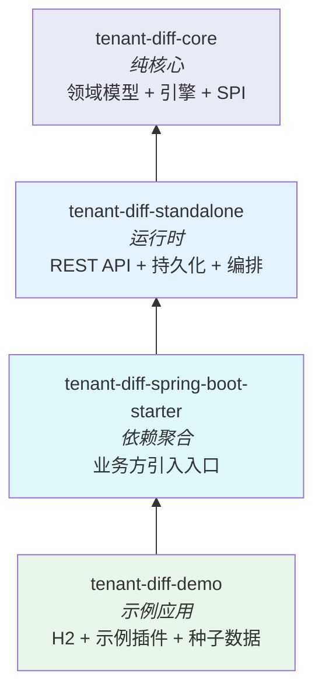
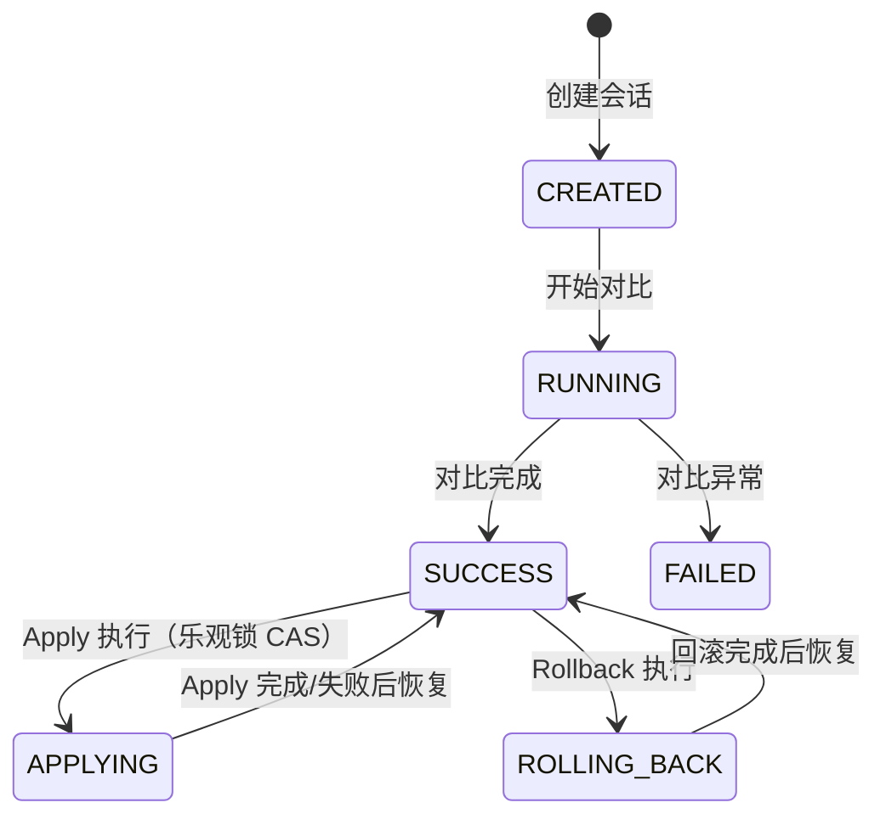
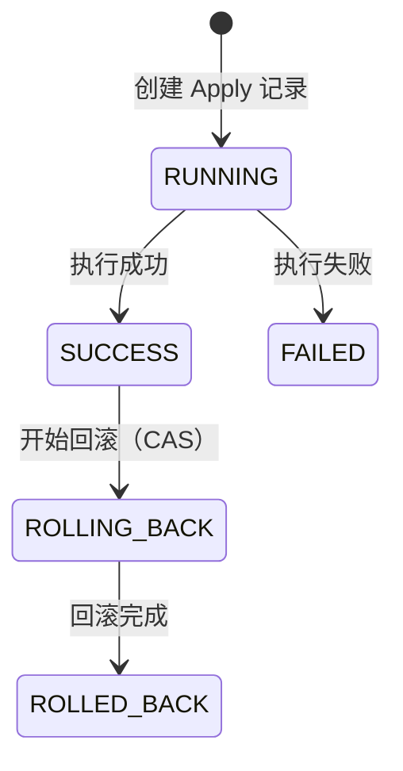
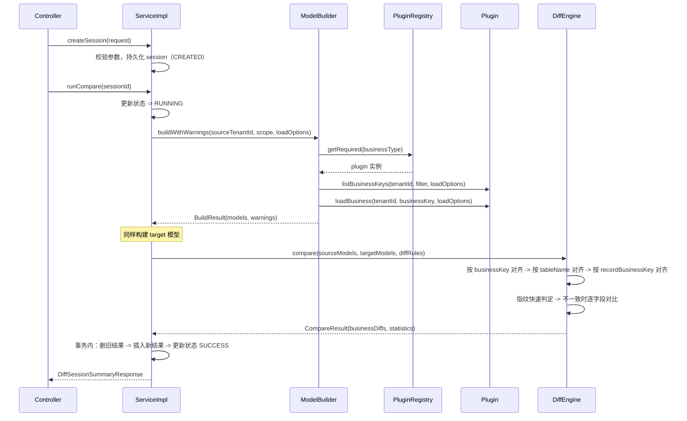
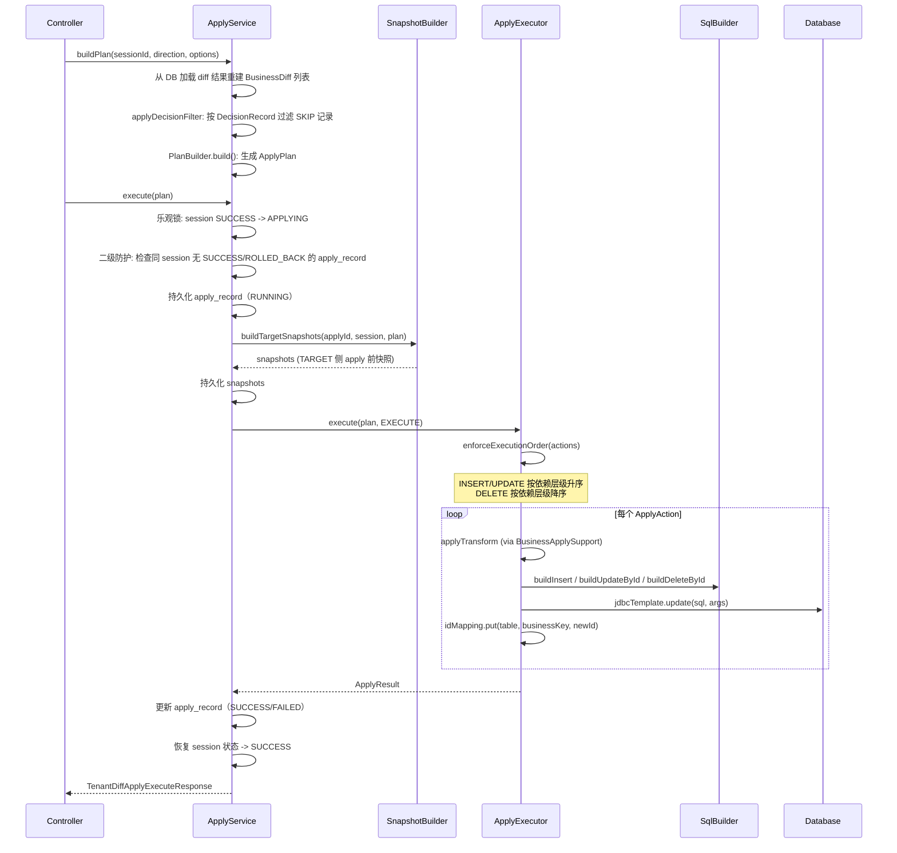
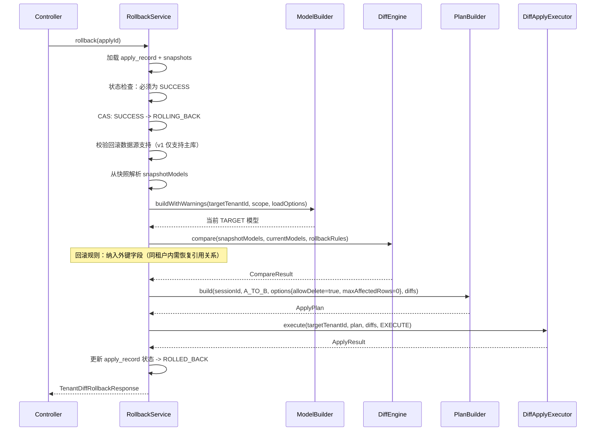
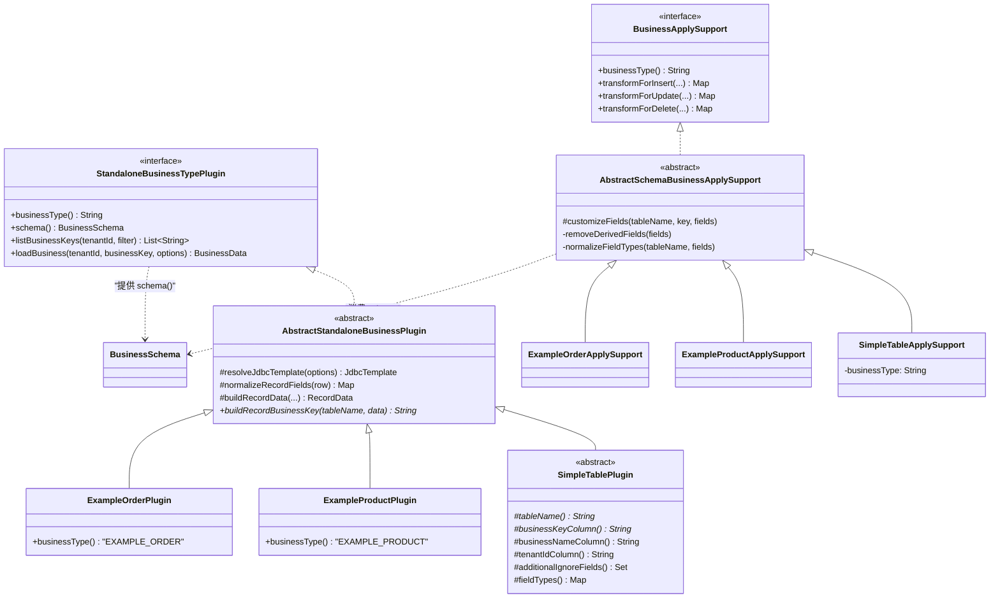
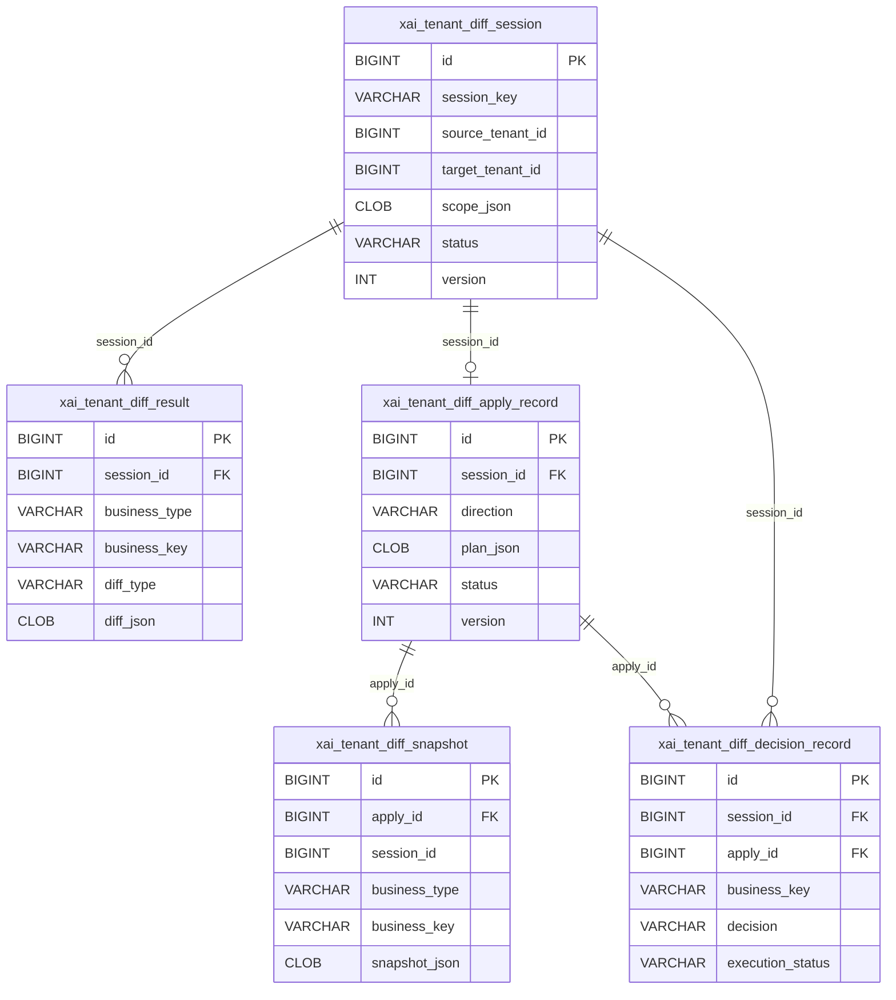
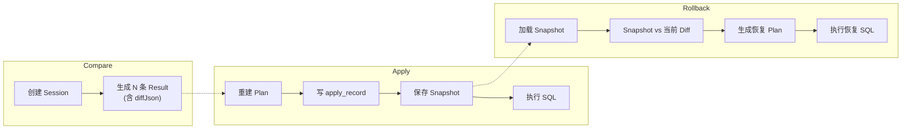

# Tenant Diff 开发设计文档

> SSOT 版本 | 最后更新：2026-03-16
> 本文档为开发设计唯一权威源，整合了架构、设计、插件开发的所有内容。

---

## 1. 项目概览

### 1.1 定位与边界

**Tenant Diff 组件**是一个同库跨租户数据差异对比与同步引擎。

**解决的问题**：在多租户 SaaS 架构下，将"标准租户"（模板）的业务配置数据复制/同步到"客户租户"，支持差异预览、选择性同步和回滚。

**不解决的问题**：
- 不处理运行时业务数据（订单、库存等）的同步
- 不替代数据库级别的主从复制
- 不提供分布式事务保障

**跨数据源能力边界**：Compare 和 Apply 已支持按 `LoadOptions.dataSourceKey` 路由到不同数据源（通过 `DiffDataSourceRegistry`）；Apply 对外部数据源使用 `DataSourceTransactionManager` 手动事务管理。**Rollback v1 仅支持 target=primary**，外部数据源回滚会被拒绝。

### 1.2 技术栈

| 技术 | 版本 | 用途 |
|------|------|------|
| Java | 17+ | 运行时 |
| Spring Boot | 3.5.3 | 应用框架 |
| MyBatis-Plus | 3.5.9 | ORM 持久化 |
| H2 | - | Demo 嵌入式数据库 |
| JaCoCo | 0.8.12 | 覆盖率 |
| SpotBugs | 4.8.6.6 | 静态分析 |
| Maven | - | 构建工具（含 `./mvnw` wrapper） |

---

## 2. 模块架构

### 2.1 四模块结构

| 模块 | artifactId | 角色 | 主要内容 |
|------|-----------|------|----------|
| `tenant-diff-core` | tenant-diff-core | 纯核心 | 领域模型、对比引擎、Apply 计划构建、SPI 合同 |
| `tenant-diff-standalone` | tenant-diff-standalone | 运行时 | 自动配置、数据源、持久化、REST API、Apply/Rollback 编排 |
| `tenant-diff-spring-boot-starter` | tenant-diff-spring-boot-starter | 依赖聚合 | 依赖 standalone，业务方仅需引入此 starter 即可接入 |
| `tenant-diff-demo` | tenant-diff-demo | 示例应用 | H2 Demo、示例插件（Product/Order）、种子数据、可执行 Spring Boot 应用 |

**模块依赖关系**：



模块启用方式：

```properties
tenant-diff.standalone.enabled=true
```

配置类：`TenantDiffStandaloneConfiguration`
条件注解：`@ConditionalOnProperty(prefix = "tenant-diff.standalone", name = "enabled", havingValue = "true")`

### 2.2 分层架构图

```
+-------------------------------------------------------------+
|                      REST API Layer                          |
|  TenantDiffStandaloneSessionController  (Session + Compare)  |
|  TenantDiffStandaloneApplyController    (Apply + Rollback)   |
|  TenantDiffStandaloneDecisionController (Decision CRUD)      |
+-------------------------------------------------------------+
|                      Service Layer                           |
|  TenantDiffStandaloneServiceImpl        (会话 + 对比编排)     |
|  TenantDiffStandaloneApplyServiceImpl   (Apply 审计 + 快照)   |
|  TenantDiffStandaloneRollbackServiceImpl(快照恢复回滚)        |
|  DecisionRecordServiceImpl              (决策记录持久化)      |
+-------------------------------------------------------------+
|                      Core Engine                             |
|  TenantDiffEngine    (纯 Java 对比引擎)                      |
|  PlanBuilder         (Diff -> ApplyPlan 转换)                |
+-------------------------------------------------------------+
|                      SPI / Plugin                            |
|  StandaloneBusinessTypePlugin  (业务类型插件)                 |
|  BusinessApplySupport          (Apply 字段变换)               |
|  StandalonePluginRegistry / BusinessApplySupportRegistry     |
+-------------------------------------------------------------+
|                      Persistence (MyBatis-Plus)              |
|  TenantDiffSessionPo / TenantDiffResultPo / ...             |
|  TenantDiffSessionMapper / TenantDiffResultMapper / ...      |
+-------------------------------------------------------------+
|                      Infrastructure                          |
|  DiffDataSourceRegistry  (多数据源路由)                       |
|  StandaloneSqlBuilder    (SQL 语句构建)                       |
+-------------------------------------------------------------+
```

### 2.3 包结构与职责

**tenant-diff-core**

| 包 | 职责 |
|---|------|
| `com.diff.core.engine` | 核心对比算法（`TenantDiffEngine`、`DiffRules`、`DiffDefaults`），纯 Java 无 Spring 运行时耦合 |
| `com.diff.core.apply` | Apply 计划构建（`PlanBuilder`、`IdMapping`） |
| `com.diff.core.util` | 工具类（`TypeConversionUtil`） |
| `com.diff.core.domain.diff` | 差异领域模型（`BusinessDiff` -> `TableDiff` -> `RecordDiff` -> `FieldDiff`、`DiffSessionOptions`） |
| `com.diff.core.domain.apply` | Apply 领域模型（`ApplyPlan`、`ApplyAction`、`ApplyResult`、`ApplyOptions`） |
| `com.diff.core.domain.model` | 标准化业务模型（`BusinessData` -> `TableData` -> `RecordData`） |
| `com.diff.core.domain.schema` | 业务 Schema 元数据（`BusinessSchema`、`BusinessSchema.TableRelation`） |
| `com.diff.core.domain.scope` | 范围与加载选项（`TenantModelScope`、`ScopeFilter`、`LoadOptions`） |
| `com.diff.core.domain.exception` | 领域异常（`TenantDiffException`、`ApplyExecutionException`、`ErrorCode`） |
| `com.diff.core.spi.apply` | Apply 扩展点合同（`BusinessApplySupport`） |

**tenant-diff-standalone**

| 包 | 职责 |
|---|------|
| `com.diff.standalone.plugin` | 业务类型插件系统（`StandaloneBusinessTypePlugin` 接口、`AbstractStandaloneBusinessPlugin` 基类、`SimpleTablePlugin` 单表快捷基类、`StandalonePluginRegistry` 注册表） |
| `com.diff.standalone.apply` | Apply 执行器实现（`ApplyExecutorCore`、`SessionBasedApplyExecutor`、`InMemoryApplyExecutor`、`StandaloneSqlBuilder`、`BusinessApplySupportRegistry`） |
| `com.diff.standalone.apply.support` | Apply 支持基类（`AbstractSchemaBusinessApplySupport`、`SimpleTableApplySupport`） |
| `com.diff.standalone.service` | 服务编排层接口（含 `DecisionRecordService`） |
| `com.diff.standalone.service.impl` | 服务编排层实现 |
| `com.diff.standalone.service.support` | 视图辅助（`DiffViewFilter` 过滤/投影工具、`DiffDetailView` 视图模式枚举） |
| `com.diff.standalone.persistence.entity` | MyBatis-Plus PO 实体 |
| `com.diff.standalone.persistence.mapper` | MyBatis-Plus Mapper 接口 |
| `com.diff.standalone.web.controller` | REST Controller |
| `com.diff.standalone.web.dto` | 请求/响应 DTO |
| `com.diff.standalone.web` | 通用响应包装（`ApiResponse`） |
| `com.diff.standalone.datasource` | 多数据源支持（`DiffDataSourceRegistry`、`DiffDataSourceProperties`、`DiffDataSourceAutoConfiguration`） |
| `com.diff.standalone.config` | Spring Bean 装配（`TenantDiffStandaloneConfiguration`、`TenantDiffProperties`） |
| `com.diff.standalone.model` | 租户模型构建器（`StandaloneTenantModelBuilder`） |
| `com.diff.standalone.snapshot` | Apply 前快照构建（`StandaloneSnapshotBuilder`） |
| `com.diff.standalone.util` | 工具类（`StandaloneLoadOptionsResolver`） |

**tenant-diff-demo**

| 包 | 职责 |
|---|------|
| `com.diff.demo.plugin` | 示例插件（`ExampleProductPlugin`、`ExampleOrderPlugin`、对应的 ApplySupport、`ExamplePluginConfiguration`） |

---

## 3. 领域模型

### 3.1 输入模型（BusinessData -> TableData -> RecordData）

```
BusinessData                     -- 标准化业务数据容器
  |-- businessType: String       -- 业务类型标识（如 "EXAMPLE_PRODUCT"）
  |-- businessTable: String      -- 主表表名
  |-- businessId: Long           -- 业务对象物理 ID
  |-- businessKey: String        -- 业务键（如 product_code）
  |-- businessName: String       -- 业务名称（可读标识）
  |-- tenantId: Long             -- 租户 ID
  +-- tables: List<TableData>
        |-- tableName: String
        |-- dependencyLevel: Integer   -- 0=主表, 1=子表, 2=孙表
        +-- records: List<RecordData>
              |-- id: Long               -- 物理主键（执行阶段定位用）
              |-- businessKey: String    -- 记录级业务键（跨租户对齐用）
              |-- businessNote: String   -- 可读备注
              |-- publicFlag: boolean    -- 公开标记
              |-- fields: Map<String, Object>  -- 全字段 KV
              |-- fingerprint: String    -- 可选预计算指纹
              +-- modifyTime: LocalDateTime
```

### 3.2 差异模型（BusinessDiff -> TableDiff -> RecordDiff -> FieldDiff）

```
BusinessDiff                     -- 业务级差异
  |-- businessType: String
  |-- businessTable: String
  |-- businessKey: String
  |-- businessName: String
  |-- diffType: DiffType         -- BUSINESS_INSERT / BUSINESS_DELETE / null(有子变化)
  |-- statistics: DiffStatistics -- 聚合统计
  +-- tableDiffs: List<TableDiff>
        |-- tableName: String
        |-- dependencyLevel: Integer
        |-- diffType: DiffType   -- TABLE_INSERT / TABLE_DELETE / null
        |-- counts: TableDiffCounts  -- insert/update/delete/noop 计数
        +-- recordDiffs: List<RecordDiff>
              |-- recordBusinessKey: String
              |-- diffType: DiffType     -- INSERT / UPDATE / DELETE / NOOP
              |-- decision: DecisionType -- ACCEPT / SKIP
              |-- decisionReason: String
              |-- decisionTime: LocalDateTime
              |-- sourceFields: Map<String, Object>
              |-- targetFields: Map<String, Object>
              |-- showFields: Map<String, Object>  -- 前端展示用（可选）
              |-- warnings: List<String>
              +-- fieldDiffs: List<FieldDiff>
                    |-- fieldName: String
                    |-- sourceValue: Object
                    |-- targetValue: Object
                    +-- changeDescription: String
```

### 3.3 Apply 模型（ApplyPlan -> ApplyAction -> ApplyResult）

```
ApplyPlan
  |-- planId: String             -- 32 位 hex（UUID 去横线）
  |-- sessionId: Long
  |-- direction: ApplyDirection  -- A_TO_B / B_TO_A
  |-- options: ApplyOptions
  |     |-- mode: ApplyMode      -- DRY_RUN / EXECUTE
  |     |-- allowDelete: boolean -- 默认 false
  |     |-- maxAffectedRows: int -- 默认 1000
  |     |-- businessKeys: List<String>  -- 白名单（空=不过滤）
  |     |-- businessTypes: List<String> -- 白名单（空=不过滤）
  |     |-- diffTypes: List<DiffType>   -- 白名单（空=不过滤）
  |     |-- selectionMode: SelectionMode -- ALL（默认）/ PARTIAL
  |     |-- selectedActionIds: Set<String> -- PARTIAL 模式下用户勾选的 actionId 集合
  |     |-- previewToken: String  -- preview 返回的一致性令牌，PARTIAL 时必须回传
  |     +-- clientRequestId: String -- 客户端请求标识（仅审计日志，不做服务端幂等）
  |-- actions: List<ApplyAction>
  |     |-- actionId: String     -- 确定性唯一标识（v1:escape(businessType):escape(businessKey):escape(tableName):escape(recordBusinessKey)）
  |     |-- businessType: String
  |     |-- businessKey: String
  |     |-- tableName: String
  |     |-- dependencyLevel: Integer
  |     |-- recordBusinessKey: String
  |     |-- diffType: DiffType   -- INSERT / UPDATE / DELETE
  |     +-- payload: Map<String, Object>  -- v1 预留扩展
  +-- statistics: ApplyStatistics

ApplyResult
  |-- success: boolean
  |-- message: String            -- "EXECUTE" / "EXECUTE_WITH_WARNINGS" / "DRY_RUN"
  |-- affectedRows: Integer      -- EXECUTE 模式实际影响行数
  |-- estimatedAffectedRows: Integer  -- DRY_RUN 模式预估行数
  |-- errors: List<String>
  |-- actionErrors: List<ApplyActionError>
  +-- idMapping: IdMapping       -- table#businessKey -> newId
```

### 3.4 枚举定义

**DiffType**（`com.diff.core.domain.diff.DiffType`）

| 值 | 层级 | 说明 |
|---|------|------|
| `BUSINESS_INSERT` | 业务级 | source 有、target 无 |
| `BUSINESS_DELETE` | 业务级 | source 无、target 有 |
| `TABLE_INSERT` | 表级 | source 有该表、target 无 |
| `TABLE_DELETE` | 表级 | source 无该表、target 有 |
| `INSERT` | 记录级 | source 有该记录、target 无 |
| `UPDATE` | 记录级 | 两侧都有但内容不同 |
| `DELETE` | 记录级 | source 无该记录、target 有 |
| `NOOP` | 记录级 | 两侧内容一致（无变化） |

**SessionStatus**（`com.diff.core.domain.diff.SessionStatus`）

| 值 | 说明 |
|---|------|
| `CREATED` | 会话已创建 |
| `RUNNING` | 对比执行中 |
| `SUCCESS` | 对比成功 |
| `FAILED` | 对比失败 |
| `APPLYING` | Apply 执行中 |
| `ROLLING_BACK` | 回滚执行中 |

**ApplyMode**（`com.diff.core.domain.apply.ApplyMode`）

| 值 | 说明 |
|---|------|
| `DRY_RUN` | 不执行 SQL，仅返回预估影响行数 |
| `EXECUTE` | 真实执行 SQL |

**ApplyDirection**（`com.diff.core.domain.apply.ApplyDirection`）

| 值 | 说明 |
|---|------|
| `A_TO_B` | 从 source(A) 同步到 target(B) |
| `B_TO_A` | 从 target(B) 同步到 source(A)，INSERT/DELETE 语义反转 |

**ApplyRecordStatus**（`com.diff.core.domain.apply.ApplyRecordStatus`）

| 值 | 说明 |
|---|------|
| `RUNNING` | 执行中 |
| `SUCCESS` | 执行成功 |
| `FAILED` | 执行失败 |
| `ROLLED_BACK` | 已回滚 |
| `ROLLING_BACK` | 回滚执行中 |

**SelectionMode**（`com.diff.core.domain.apply.SelectionMode`）

| 值 | 说明 |
|---|------|
| `ALL` | 全量执行（向后兼容默认值） |
| `PARTIAL` | 仅执行 selectedActionIds 指定项（V1 仅支持主表动作，dependencyLevel=0） |

**DecisionType**（`com.diff.core.domain.diff.DecisionType`）

| 值 | 说明 |
|---|------|
| `ACCEPT` | 接受变更 |
| `SKIP` | 跳过变更 |

**DecisionExecutionStatus**（`com.diff.core.domain.diff.DecisionExecutionStatus`）

| 值 | 说明 |
|---|------|
| `PENDING` | 待执行 |
| `SKIPPED` | 已跳过 |
| `SUCCESS` | 执行成功 |
| `FAILED` | 执行失败 |

**CompareDirection**（`com.diff.core.domain.diff.CompareDirection`）

| 值 | 说明 |
|---|------|
| `A_TO_B` | A 到 B |
| `B_TO_A` | B 到 A |

### 3.5 状态机

#### SessionStatus 状态流转



#### ApplyRecordStatus 状态流转



---

## 4. 核心流程

### 4.1 对比流程（Compare）



**关键设计决策**：

1. **业务键对齐而非物理 ID**：跨租户的物理 ID 不同，用 `businessKey`（如 `product_code`）做逻辑对齐。对比引擎通过 `compositeBusinessKey` 对齐业务对象（格式为长度前缀编码 `len:businessType|len:businessTable|len:businessKey`，避免分隔符碰撞），通过 `RecordData.businessKey` 对齐记录。
   _代码位置_：`TenantDiffEngine#compareRecords(...)`、`TenantDiffEngine#compositeBusinessKey(...)`

2. **MD5 指纹优化**：对 record 字段集合（排除 ignoreFields）按 key 排序后拼接为 `key=value;` 格式，计算 MD5 作为指纹。指纹一致时跳过字段级对比，对大量"无变化"记录有显著性能提升。
   _代码位置_：`TenantDiffEngine#fingerprintOrCompute(...)`、`TenantDiffEngine#computeMd5Fingerprint(...)`

3. **结果可重跑**：同一 session 重跑 compare 时先删旧结果再插入，保证幂等。
   _代码位置_：`TenantDiffStandaloneServiceImpl#runCompare(Long)`

4. **容错不阻断**：单个 businessKey 加载失败不影响全局，异常收集为 warnings 并记录日志（但 warnings 会导致结果不完整）。
   _代码位置_：`StandaloneTenantModelBuilder#buildWithWarnings(...)`

### 4.2 Apply 流程



**关键设计决策**：

1. **依赖层级排序**：INSERT/UPDATE 先父后子（dependencyLevel 升序），DELETE 先子后父（降序），避免外键约束冲突。
   _代码位置_：`PlanBuilder#actionComparator()`

2. **IdMapping 传递**：INSERT 生成的新 ID 通过 `IdMapping` 传给后续子表的 `BusinessApplySupport#transformForInsert()`，实现外键替换。
   _代码位置_：`AbstractSchemaBusinessApplySupport#transformForInsert(...)`

3. **审计可追溯**：每次 Apply 写入 `xai_tenant_diff_apply_record`（含完整 planJson），便于审计与回滚定位。
   _代码位置_：`TenantDiffStandaloneApplyServiceImpl#execute(ApplyPlan)`

4. **部分失败追踪**：执行中断时通过 `ApplyExecutionException` 携带 `partialResult`，记录已执行的行数和错误明细。

5. **并发控制**：Apply 使用乐观锁（session.version）做 `SUCCESS -> APPLYING` 的 CAS 状态转换，防止同一 session 并发 Apply。同时有二级防护：检查同 session 不存在 SUCCESS/ROLLED_BACK 状态的 apply_record。
   _代码位置_：`TenantDiffStandaloneApplyServiceImpl#doExecute(...)`

6. **Apply 失败的可观测性**：整个 execute 方法包在 `@Transactional(rollbackFor=Exception.class)` 内，失败时全部回滚（包括 apply_record 和 snapshot），保证数据一致性。**排查主信号应为应用 ERROR 日志**，而非数据库 apply_record 状态。
   _代码位置_：`TenantDiffStandaloneApplyServiceImpl#execute(...)`

7. **Decision 过滤**：Apply `buildPlan` 阶段，如果 `DecisionRecordService` Bean 存在，会在 `PlanBuilder.build()` 之前调用 `applyDecisionFilter` 方法，从 diff 结果中移除 `DecisionType.SKIP` 的记录。过滤粒度为 `tableName|recordBusinessKey` 组合，不修改原始 diff 数据。
   _代码位置_：`TenantDiffStandaloneApplyServiceImpl#applyDecisionFilter(...)`

8. **Selection（选择性执行）**：支持"先 preview 再勾选执行"的交互模式。preview 返回全量 actions（含 actionId）和 previewToken，用户在前端勾选后 execute 传入 `selectionMode=PARTIAL` + `selectedActionIds` + `previewToken`，PlanBuilder 校验 token 一致性并过滤为用户选中的子集。V1 仅支持选择主表（dependencyLevel=0）动作。
   _代码位置_：`PlanBuilder#build(...)` PARTIAL 分支、`PlanBuilder#computePreviewToken(...)`、`PlanBuilder#validateSelectedIdsExist(...)`

### 4.3 回滚流程（Rollback）



**回滚策略**（v1 实现）：
- Apply 前保存 TARGET 的业务快照（`TenantDiffSnapshotPo.snapshotJson` = BusinessData JSON）
- 回滚时将"快照（source）"与"当前 TARGET（target）"再次 diff
- 生成恢复计划并执行，将 TARGET 恢复到 apply 前状态
- 回滚的 diff 规则特殊处理：从 Plugin schema 动态获取外键字段并从忽略集合中移除，因为同租户内需要恢复正确的引用关系
- 回滚的 scope 合并了快照 scope 和原始 plan scope，确保覆盖所有涉及的业务键
- 回滚也使用乐观锁做 CAS（`SUCCESS -> ROLLING_BACK`），防止并发回滚

_代码位置_：`TenantDiffStandaloneRollbackServiceImpl#rollback(Long)`、`#rollbackDiffRules(...)`、`#collectFkFieldsFromPlugins(...)`

**已知限制**：
- v1 回滚仅支持 target=主库方向，外部数据源回滚会被拒绝
- 回滚不保存自身的快照（不可"回滚的回滚"）
- 如果 apply 后 target 数据被外部修改，回滚结果可能不精确

_代码位置_：`TenantDiffStandaloneRollbackServiceImpl#validateRollbackDataSourceSupport(...)`

---

## 5. SPI 扩展点

### 5.0 插件类关系总览



> **Plugin** 负责数据加载（读），**ApplySupport** 负责字段变换（写）。两者通过 `BusinessSchema` 共享元数据。开发新业务类型时，单表场景优先使用 `SimpleTablePlugin` + `SimpleTableApplySupport`（15 行代码即可接入）；多表场景继承 `Abstract*` 基类。

### 5.1 StandaloneBusinessTypePlugin 接口

```java
// com.diff.standalone.plugin.StandaloneBusinessTypePlugin
public interface StandaloneBusinessTypePlugin {

    /** 返回业务类型标识（全局唯一） */
    String businessType();

    /** 返回 Schema 元数据（表依赖、外键关系、忽略字段、类型提示） */
    BusinessSchema schema();

    /** 列出指定租户下该业务类型的所有业务键 */
    List<String> listBusinessKeys(Long tenantId, ScopeFilter filter);

    /** 列出业务键（支持 LoadOptions 传递 dataSourceKey），默认委托到不含 LoadOptions 的重载 */
    default List<String> listBusinessKeys(Long tenantId, ScopeFilter filter, LoadOptions options) {
        return listBusinessKeys(tenantId, filter);
    }

    /** 按业务键加载完整的业务数据并组装为标准化 BusinessData */
    BusinessData loadBusiness(Long tenantId, String businessKey, LoadOptions options);
}
```

各方法职责：

| 方法 | 职责 |
|------|------|
| `businessType()` | 返回唯一的业务类型标识字符串，框架通过此标识路由到对应插件 |
| `schema()` | 提供表依赖层级、表间外键关系、按表忽略字段、字段类型提示、按表展示字段（`showFieldsByTable`）等元数据 |
| `listBusinessKeys(...)` | 在指定租户下列出所有业务键，支持 ScopeFilter 收敛范围 |
| `loadBusiness(...)` | 按业务键加载完整业务数据，组装为 BusinessData/TableData/RecordData 层次结构 |

### 5.2 BusinessApplySupport 接口

```java
// com.diff.core.spi.apply.BusinessApplySupport
public interface BusinessApplySupport {

    String businessType();

    Map<String, Object> transformForInsert(
        String tableName,
        String recordBusinessKey,
        Map<String, Object> fields,
        Long targetTenantId,
        IdMapping idMapping
    );

    default Map<String, Object> transformForUpdate(
        String tableName,
        String recordBusinessKey,
        Map<String, Object> fields,
        Long targetTenantId,
        IdMapping idMapping
    ) {
        return transformForInsert(tableName, recordBusinessKey, fields, targetTenantId, idMapping);
    }

    default Map<String, Object> transformForDelete(
        String tableName,
        String recordBusinessKey,
        Map<String, Object> fields,
        Long targetTenantId,
        IdMapping idMapping
    ) {
        return fields;
    }

    default Long locateTargetId(
        String tableName, String recordBusinessKey, Long targetTenantId
    ) {
        return null;
    }
}
```

各方法职责：

| 方法 | 职责 |
|------|------|
| `businessType()` | 返回业务类型标识，必须与 Plugin 的 businessType 一致 |
| `transformForInsert(...)` | INSERT 前的字段变换：移除派生字段、替换外键、类型归一化 |
| `transformForUpdate(...)` | UPDATE 前的字段变换，默认复用 insert 逻辑 |
| `transformForDelete(...)` | DELETE 前的可选钩子，默认透传字段 |
| `locateTargetId(...)` | v2 预留：当 diffJson 中缺少 target.id 时按 businessKey 定位目标物理 id |

### 5.3 AbstractStandaloneBusinessPlugin 基类

`com.diff.standalone.plugin.AbstractStandaloneBusinessPlugin` 提供的通用能力：

| 方法 | 说明 |
|------|------|
| `resolveJdbcTemplate(LoadOptions)` | 根据 LoadOptions.dataSourceKey 从 DiffDataSourceRegistry 解析 JdbcTemplate |
| `normalizeRecordFields(Map, String...)` | 字段规范化：列名小写化、指定字段 JSON 格式化、byte[] 转 UTF-8 字符串 |
| `buildRecordData(String, Map, boolean, String)` | 构建标准化的 RecordData（含 id/businessKey/modifyTime 解析） |
| `buildRecordDataByTable(String, Map, boolean, String)` | 根据表名委托 buildRecordBusinessKey 后构建 RecordData |
| `attachMainBusinessKey(List, String)` | 为记录列表附加 main_business_key 派生字段 |
| `attachParentBusinessKey(List, Map, String)` | 为子表记录附加 parent_business_key（通过父表 id->businessKey 映射） |
| `buildInPlaceholders(int)` | 生成 IN 子句占位符字符串（如 "?, ?, ?"） |
| `convertJsonFieldToString(Object)` | JSON 字段值转标准化字符串 |
| `parseLong(Object)` / `parseLocalDateTime(Object)` | 类型安全的值转换 |

子类需实现的抽象方法：`buildRecordBusinessKey(String tableName, Map<String, Object> recordData)`

### 5.4 AbstractSchemaBusinessApplySupport 基类

`com.diff.standalone.apply.support.AbstractSchemaBusinessApplySupport` 自动处理：

| 能力 | 说明 |
|------|------|
| 设置 tenantsid | 强制将 tenantsid 设为目标租户 ID |
| 外键替换 | 根据 BusinessSchema.relations 和 IdMapping，自动将子表的外键字段替换为新插入的父记录 ID |
| 移除派生字段 | 自动移除 main_business_key、parent_business_key、所有 base* 开头字段、version、data_modify_time |
| 类型归一化 | 根据 BusinessSchema.fieldTypesByTable 的类型提示（bigint/int/decimal/datetime/json）自动转换 |
| 子类钩子 | `customizeFields(tableName, recordBusinessKey, fields)` 可覆盖以添加业务特定处理 |

处理流程（`transformForInsert`）：
1. 复制原始字段到结果 Map
2. 设置 tenantsid 为目标租户 ID
3. 根据表关系替换外键字段
4. 移除派生字段
5. 调用子类 `customizeFields` 钩子
6. 根据 Schema 类型提示进行类型归一化

_代码位置_：`AbstractSchemaBusinessApplySupport#transformForInsert(...)`、`#removeDerivedFields(...)`、`#normalizeFieldTypes(...)`

---

## 6. 插件开发指南（Step-by-Step）

### 6.1 前置条件与 Maven 依赖

前置条件：
- JDK 17+
- Maven（或使用仓库自带的 `./mvnw`）
- 熟悉 Spring Boot 和 JDBC
- 了解 tenant-diff 的基本概念（Session、Compare、Apply、Rollback）

Maven 依赖：

```xml
<dependency>
    <groupId>com.diff</groupId>
    <artifactId>tenant-diff-core</artifactId>
</dependency>
<dependency>
    <groupId>com.diff</groupId>
    <artifactId>tenant-diff-standalone</artifactId>
</dependency>
```

### 6.2 Step 1: 定义业务表

为你的业务类型创建数据库表。关键约定：

- `tenantsid`（BIGINT）：租户标识字段，框架通过该字段区分不同租户的数据
- `id`（BIGINT AUTO_INCREMENT）：物理主键，Apply 阶段用于定位记录
- 业务键字段（如 `product_code`）：跨租户唯一标识业务对象，不依赖自增 ID
- `version`（INT）：乐观锁版本号（可选）
- `data_modify_time`（TIMESTAMP）：数据修改时间（可选）

示例 DDL：

```sql
CREATE TABLE example_product (
    id              BIGINT AUTO_INCREMENT PRIMARY KEY,
    tenantsid       BIGINT       NOT NULL COMMENT '租户 ID',
    product_code    VARCHAR(64)  NOT NULL COMMENT '产品编码（业务键）',
    product_name    VARCHAR(128) COMMENT '产品名称',
    price           DECIMAL(10,2),
    status          VARCHAR(32) DEFAULT 'ACTIVE',
    version         INT DEFAULT 0,
    data_modify_time TIMESTAMP DEFAULT CURRENT_TIMESTAMP
);
```

### 6.3 Step 2: 实现 Plugin

#### 单表快捷方式（推荐：SimpleTablePlugin）

对于仅涉及一张表的业务类型，继承 `SimpleTablePlugin` 可将 200+ 行样板代码降至 15 行：

```java
@Component
public class ContractPlugin extends SimpleTablePlugin {

    public ContractPlugin(ObjectMapper om, DiffDataSourceRegistry ds) {
        super(om, ds);
    }

    @Override
    public String businessType() { return "CONTRACT"; }

    @Override
    protected String tableName() { return "biz_contract"; }

    @Override
    protected String businessKeyColumn() { return "contract_code"; }

    // 可选覆盖：
    // protected String businessNameColumn()        { return "contract_name"; }
    // protected String tenantIdColumn()            { return "tenantsid"; }  // 默认值
    // protected Set<String> additionalIgnoreFields() { return Set.of("internal_field"); }
    // protected Map<String, String> fieldTypes()   { return Map.of("config_json", "json"); }
}
```

配套 ApplySupport 同样简化，使用 `SimpleTableApplySupport`：

```java
@Bean
public BusinessApplySupport contractApply(ContractPlugin plugin, ObjectMapper om) {
    return new SimpleTableApplySupport(plugin.businessType(), om, plugin.schema());
}
```

`SimpleTablePlugin` 自动处理：`schema()` 构建、`listBusinessKeys()` 查询、`loadBusiness()` 加载、`buildRecordBusinessKey()` 解析。子类只需声明表名和业务键列名。

#### 单表完整实现方式（ExampleProductPlugin 完整代码）

```java
package com.diff.demo.plugin;

import com.diff.core.domain.model.BusinessData;
import com.diff.core.domain.model.RecordData;
import com.diff.core.domain.model.TableData;
import com.diff.core.domain.schema.BusinessSchema;
import com.diff.core.domain.scope.LoadOptions;
import com.diff.core.domain.scope.ScopeFilter;
import com.diff.standalone.datasource.DiffDataSourceRegistry;
import com.diff.standalone.plugin.AbstractStandaloneBusinessPlugin;
import com.fasterxml.jackson.databind.ObjectMapper;
import org.springframework.jdbc.core.JdbcTemplate;

import java.util.ArrayList;
import java.util.Collections;
import java.util.List;
import java.util.Map;
import java.util.Set;

public class ExampleProductPlugin extends AbstractStandaloneBusinessPlugin {

    private static final String BUSINESS_TYPE = "EXAMPLE_PRODUCT";
    private static final String TABLE_NAME = "example_product";
    private static final String PRODUCT_CODE = "product_code";
    private static final String PRODUCT_NAME = "product_name";

    public ExampleProductPlugin(ObjectMapper objectMapper,
                                DiffDataSourceRegistry dataSourceRegistry) {
        super(objectMapper, dataSourceRegistry);
    }

    @Override
    public String businessType() {
        return BUSINESS_TYPE;
    }

    @Override
    public BusinessSchema schema() {
        return BusinessSchema.builder()
            .tables(Map.of(TABLE_NAME, 0))
            .relations(Collections.emptyList())
            .ignoreFieldsByTable(Map.of(
                TABLE_NAME, Set.of("id", "tenantsid", "version", "data_modify_time")
            ))
            .build();
    }

    @Override
    public List<String> listBusinessKeys(Long tenantId, ScopeFilter filter) {
        if (filter != null && filter.getBusinessKeys() != null
                && !filter.getBusinessKeys().isEmpty()) {
            return filter.getBusinessKeys();
        }
        JdbcTemplate jdbc = resolveJdbcTemplate(null);
        return jdbc.queryForList(
            "SELECT product_code FROM example_product WHERE tenantsid = ?",
            String.class, tenantId
        );
    }

    @Override
    public BusinessData loadBusiness(Long tenantId, String businessKey,
                                     LoadOptions options) {
        JdbcTemplate jdbc = resolveJdbcTemplate(options);
        List<Map<String, Object>> rows = jdbc.queryForList(
            "SELECT * FROM example_product WHERE tenantsid = ? AND product_code = ?",
            tenantId, businessKey
        );

        List<RecordData> records = new ArrayList<>();
        for (Map<String, Object> row : rows) {
            Map<String, Object> fields = normalizeRecordFields(row);
            String recordBusinessKey = asString(fields.get(PRODUCT_CODE));
            String businessName = asString(fields.get(PRODUCT_NAME));
            records.add(buildRecordData(recordBusinessKey, fields, true, businessName));
        }

        TableData tableData = TableData.builder()
            .tableName(TABLE_NAME)
            .dependencyLevel(0)
            .records(records)
            .build();

        String businessName = records.isEmpty() ? businessKey
            : records.get(0).getBusinessNote();

        return BusinessData.builder()
            .businessType(BUSINESS_TYPE)
            .businessTable(TABLE_NAME)
            .businessKey(businessKey)
            .businessName(businessName)
            .tenantId(tenantId)
            .tables(List.of(tableData))
            .build();
    }

    @Override
    public String buildRecordBusinessKey(String tableName,
                                         Map<String, Object> recordData) {
        return asString(recordData.get(PRODUCT_CODE));
    }

    private static String asString(Object value) {
        return value == null ? null : String.valueOf(value);
    }
}
```

#### 多表场景（ExampleOrderPlugin 完整代码）

```java
package com.diff.demo.plugin;

import com.diff.core.domain.model.BusinessData;
import com.diff.core.domain.model.RecordData;
import com.diff.core.domain.model.TableData;
import com.diff.core.domain.schema.BusinessSchema;
import com.diff.core.domain.scope.LoadOptions;
import com.diff.core.domain.scope.ScopeFilter;
import com.diff.standalone.datasource.DiffDataSourceRegistry;
import com.diff.standalone.plugin.AbstractStandaloneBusinessPlugin;
import com.fasterxml.jackson.databind.ObjectMapper;
import org.springframework.jdbc.core.JdbcTemplate;

import java.util.*;

public class ExampleOrderPlugin extends AbstractStandaloneBusinessPlugin {

    private static final String BUSINESS_TYPE = "EXAMPLE_ORDER";
    private static final String TABLE_ORDER = "example_order";
    private static final String TABLE_ORDER_ITEM = "example_order_item";
    private static final String TABLE_ORDER_ITEM_DETAIL = "example_order_item_detail";
    private static final String ORDER_CODE = "order_code";
    private static final String ITEM_CODE = "item_code";
    private static final String DETAIL_CODE = "detail_code";
    private static final String FK_ORDER_ID = "order_id";
    private static final String FK_ORDER_ITEM_ID = "order_item_id";

    public ExampleOrderPlugin(ObjectMapper objectMapper,
                              DiffDataSourceRegistry dataSourceRegistry) {
        super(objectMapper, dataSourceRegistry);
    }

    @Override
    public String businessType() {
        return BUSINESS_TYPE;
    }

    @Override
    public BusinessSchema schema() {
        return BusinessSchema.builder()
            .tables(Map.of(
                TABLE_ORDER, 0,            // 主表 level=0
                TABLE_ORDER_ITEM, 1,       // 子表 level=1
                TABLE_ORDER_ITEM_DETAIL, 2 // 孙表 level=2
            ))
            .relations(List.of(
                BusinessSchema.TableRelation.builder()
                    .childTable(TABLE_ORDER_ITEM)
                    .fkColumn(FK_ORDER_ID)
                    .parentTable(TABLE_ORDER)
                    .build(),
                BusinessSchema.TableRelation.builder()
                    .childTable(TABLE_ORDER_ITEM_DETAIL)
                    .fkColumn(FK_ORDER_ITEM_ID)
                    .parentTable(TABLE_ORDER_ITEM)
                    .build()
            ))
            .ignoreFieldsByTable(Map.of(
                TABLE_ORDER, Set.of("id", "tenantsid", "version", "data_modify_time"),
                TABLE_ORDER_ITEM, Set.of("id", "tenantsid", "version",
                    "data_modify_time", FK_ORDER_ID),
                TABLE_ORDER_ITEM_DETAIL, Set.of("id", "tenantsid", "version",
                    "data_modify_time", FK_ORDER_ITEM_ID)
            ))
            .build();
    }

    @Override
    public List<String> listBusinessKeys(Long tenantId, ScopeFilter filter) {
        if (filter != null && filter.getBusinessKeys() != null
                && !filter.getBusinessKeys().isEmpty()) {
            return filter.getBusinessKeys();
        }
        JdbcTemplate jdbc = resolveJdbcTemplate(null);
        return jdbc.queryForList(
            "SELECT order_code FROM example_order WHERE tenantsid = ?",
            String.class, tenantId
        );
    }

    @Override
    public BusinessData loadBusiness(Long tenantId, String businessKey,
                                     LoadOptions options) {
        JdbcTemplate jdbc = resolveJdbcTemplate(options);

        // 1. 加载主表
        List<Map<String, Object>> orderRows = jdbc.queryForList(
            "SELECT * FROM example_order WHERE tenantsid = ? AND order_code = ?",
            tenantId, businessKey
        );

        if (orderRows.isEmpty()) {
            return BusinessData.builder()
                .businessType(BUSINESS_TYPE)
                .businessTable(TABLE_ORDER)
                .businessKey(businessKey)
                .businessName(businessKey)
                .tenantId(tenantId)
                .tables(List.of(
                    emptyTable(TABLE_ORDER, 0),
                    emptyTable(TABLE_ORDER_ITEM, 1),
                    emptyTable(TABLE_ORDER_ITEM_DETAIL, 2)
                ))
                .build();
        }

        // 2. 构建主表 RecordData，同时建立 id->businessKey 映射
        List<RecordData> orderRecords = new ArrayList<>();
        Map<Long, String> orderIdToKeyMap = new HashMap<>();
        String businessName = businessKey;

        for (Map<String, Object> row : orderRows) {
            Map<String, Object> fields = normalizeRecordFields(row);
            String recordKey = asString(fields.get(ORDER_CODE));
            String name = asString(fields.get("order_name"));
            if (name != null) { businessName = name; }

            Long orderId = parseLong(fields.get("id"));
            if (orderId != null && recordKey != null) {
                orderIdToKeyMap.put(orderId, recordKey);
            }

            attachMainBusinessKey(List.of(fields), businessKey);
            orderRecords.add(buildRecordData(recordKey, fields, true, name));
        }

        // 3. 加载子表：通过主表 ID 查询关联的子表行
        List<Long> orderIds = new ArrayList<>(orderIdToKeyMap.keySet());
        List<RecordData> itemRecords = new ArrayList<>();
        List<Map<String, Object>> normalizedItems = new ArrayList<>();

        if (!orderIds.isEmpty()) {
            String placeholders = buildInPlaceholders(orderIds.size());
            Object[] params = new Object[orderIds.size() + 1];
            params[0] = tenantId;
            for (int i = 0; i < orderIds.size(); i++) {
                params[i + 1] = orderIds.get(i);
            }
            List<Map<String, Object>> itemRows = jdbc.queryForList(
                "SELECT * FROM example_order_item WHERE tenantsid = ? AND order_id IN ("
                + placeholders + ")", params
            );

            for (Map<String, Object> row : itemRows) {
                normalizedItems.add(normalizeRecordFields(row));
            }
            attachMainBusinessKey(normalizedItems, businessKey);
            attachParentBusinessKey(normalizedItems, orderIdToKeyMap, FK_ORDER_ID);

            for (Map<String, Object> fields : normalizedItems) {
                String recordKey = asString(fields.get(ITEM_CODE));
                String name = asString(fields.get("product_name"));
                itemRecords.add(buildRecordData(recordKey, fields, true, name));
            }
        }

        // 4. 加载第3层子表
        Map<Long, String> itemIdToKeyMap = new HashMap<>();
        for (Map<String, Object> fields : normalizedItems) {
            Long itemId = parseLong(fields.get("id"));
            String itemKey = asString(fields.get(ITEM_CODE));
            if (itemId != null && itemKey != null) {
                itemIdToKeyMap.put(itemId, itemKey);
            }
        }

        List<RecordData> detailRecords = new ArrayList<>();
        List<Long> itemIds = new ArrayList<>(itemIdToKeyMap.keySet());
        if (!itemIds.isEmpty()) {
            String detailPlaceholders = buildInPlaceholders(itemIds.size());
            Object[] detailParams = new Object[itemIds.size() + 1];
            detailParams[0] = tenantId;
            for (int i = 0; i < itemIds.size(); i++) {
                detailParams[i + 1] = itemIds.get(i);
            }
            List<Map<String, Object>> detailRows = jdbc.queryForList(
                "SELECT * FROM example_order_item_detail WHERE tenantsid = ? "
                + "AND order_item_id IN (" + detailPlaceholders + ")", detailParams
            );

            List<Map<String, Object>> normalizedDetails = new ArrayList<>();
            for (Map<String, Object> row : detailRows) {
                normalizedDetails.add(normalizeRecordFields(row));
            }
            attachMainBusinessKey(normalizedDetails, businessKey);
            attachParentBusinessKey(normalizedDetails, itemIdToKeyMap, FK_ORDER_ITEM_ID);

            for (Map<String, Object> fields : normalizedDetails) {
                String recordKey = asString(fields.get(DETAIL_CODE));
                String name = asString(fields.get("detail_name"));
                detailRecords.add(buildRecordData(recordKey, fields, true, name));
            }
        }

        // 5. 组装 BusinessData
        return BusinessData.builder()
            .businessType(BUSINESS_TYPE)
            .businessTable(TABLE_ORDER)
            .businessKey(businessKey)
            .businessName(businessName)
            .tenantId(tenantId)
            .tables(List.of(
                TableData.builder().tableName(TABLE_ORDER)
                    .dependencyLevel(0).records(orderRecords).build(),
                TableData.builder().tableName(TABLE_ORDER_ITEM)
                    .dependencyLevel(1).records(itemRecords).build(),
                TableData.builder().tableName(TABLE_ORDER_ITEM_DETAIL)
                    .dependencyLevel(2).records(detailRecords).build()
            ))
            .build();
    }

    @Override
    public String buildRecordBusinessKey(String tableName,
                                         Map<String, Object> recordData) {
        if (recordData == null) return null;
        if (TABLE_ORDER.equals(tableName)) return asString(recordData.get(ORDER_CODE));
        if (TABLE_ORDER_ITEM.equals(tableName)) return asString(recordData.get(ITEM_CODE));
        if (TABLE_ORDER_ITEM_DETAIL.equals(tableName))
            return asString(recordData.get(DETAIL_CODE));
        return null;
    }

    private static String asString(Object value) {
        return value == null ? null : String.valueOf(value);
    }
}
```

### 6.4 Step 3: 实现 ApplySupport

#### 基础实现（ExampleProductApplySupport）

```java
package com.diff.demo.plugin;

import com.diff.core.domain.schema.BusinessSchema;
import com.diff.standalone.apply.support.AbstractSchemaBusinessApplySupport;
import com.fasterxml.jackson.databind.ObjectMapper;

public class ExampleProductApplySupport extends AbstractSchemaBusinessApplySupport {

    private static final String BUSINESS_TYPE = "EXAMPLE_PRODUCT";

    public ExampleProductApplySupport(ObjectMapper objectMapper,
                                      BusinessSchema schema) {
        super(objectMapper, schema);
    }

    @Override
    public String businessType() {
        return BUSINESS_TYPE;
    }
}
```

#### 多表外键实现（ExampleOrderApplySupport）

```java
package com.diff.demo.plugin;

import com.diff.core.domain.schema.BusinessSchema;
import com.diff.standalone.apply.support.AbstractSchemaBusinessApplySupport;
import com.fasterxml.jackson.databind.ObjectMapper;

public class ExampleOrderApplySupport extends AbstractSchemaBusinessApplySupport {

    private static final String BUSINESS_TYPE = "EXAMPLE_ORDER";

    public ExampleOrderApplySupport(ObjectMapper objectMapper,
                                    BusinessSchema schema) {
        super(objectMapper, schema);
    }

    @Override
    public String businessType() {
        return BUSINESS_TYPE;
    }
}
```

多表场景下，`AbstractSchemaBusinessApplySupport` 会根据 `BusinessSchema.relations` 自动完成外键替换（如 `example_order_item.order_id` 替换为新插入的主表 ID），无需子类额外处理。

如需业务特定的字段处理，可覆盖 `customizeFields` 钩子：

```java
@Override
protected void customizeFields(String tableName, String recordBusinessKey,
                                Map<String, Object> fields) {
    if ("my_table".equals(tableName)) {
        fields.remove("internal_only_field");
    }
}
```

### 6.5 Step 4: Spring 配置注册

```java
package com.diff.demo.plugin;

import com.diff.standalone.datasource.DiffDataSourceRegistry;
import com.diff.core.spi.apply.BusinessApplySupport;
import com.fasterxml.jackson.databind.ObjectMapper;
import org.springframework.context.annotation.Bean;
import org.springframework.context.annotation.Configuration;

@Configuration
public class ExamplePluginConfiguration {

    @Bean
    public ExampleProductPlugin exampleProductPlugin(
            ObjectMapper objectMapper,
            DiffDataSourceRegistry dataSourceRegistry) {
        return new ExampleProductPlugin(objectMapper, dataSourceRegistry);
    }

    @Bean
    public BusinessApplySupport exampleProductApplySupport(
            ObjectMapper objectMapper,
            ExampleProductPlugin plugin) {
        return new ExampleProductApplySupport(objectMapper, plugin.schema());
    }

    @Bean
    public ExampleOrderPlugin exampleOrderPlugin(
            ObjectMapper objectMapper,
            DiffDataSourceRegistry dataSourceRegistry) {
        return new ExampleOrderPlugin(objectMapper, dataSourceRegistry);
    }

    @Bean
    public BusinessApplySupport exampleOrderApplySupport(
            ObjectMapper objectMapper,
            ExampleOrderPlugin plugin) {
        return new ExampleOrderApplySupport(objectMapper, plugin.schema());
    }
}
```

注意事项：
- Plugin Bean 的类型为具体实现类（如 `ExampleProductPlugin`），`StandalonePluginRegistry` 通过 `List<StandaloneBusinessTypePlugin>` 自动发现
- ApplySupport Bean 的声明类型为 `BusinessApplySupport` 接口，`BusinessApplySupportRegistry` 通过 `List<BusinessApplySupport>` 自动发现
- ApplySupport 的 `schema` 参数直接从 Plugin 获取（`plugin.schema()`），保证两者一致

### 6.6 Step 5: 端到端验证

启动应用：

```bash
./scripts/demo/start-demo.sh
```

创建对比会话：

```bash
curl -X POST 'http://localhost:8080/api/tenantDiff/standalone/session/create' \
  -H 'Content-Type: application/json' \
  -d '{
    "sourceTenantId": 1,
    "targetTenantId": 2,
    "scope": {
      "businessTypes": ["EXAMPLE_PRODUCT"]
    }
  }'
```

查看对比结果：

```bash
# 会话汇总
curl 'http://localhost:8080/api/tenantDiff/standalone/session/get?sessionId=1'

# 业务摘要列表
curl 'http://localhost:8080/api/tenantDiff/standalone/session/listBusiness?sessionId=1&pageNo=1&pageSize=20'

# 单个业务明细
curl 'http://localhost:8080/api/tenantDiff/standalone/session/getBusinessDetail?sessionId=1&businessType=EXAMPLE_PRODUCT&businessKey=PROD-002'
```

预览 Apply 影响范围：

```bash
curl -X POST 'http://localhost:8080/api/tenantDiff/standalone/apply/preview' \
  -H 'Content-Type: application/json' \
  -d '{
    "sessionId": 1,
    "direction": "A_TO_B",
    "options": {
      "allowDelete": false,
      "maxAffectedRows": 10,
      "businessTypes": ["EXAMPLE_PRODUCT"],
      "diffTypes": ["INSERT", "UPDATE"]
    }
  }'
```

执行 Apply：

```bash
curl -X POST 'http://localhost:8080/api/tenantDiff/standalone/apply/execute' \
  -H 'Content-Type: application/json' \
  -d '{
    "sessionId": 1,
    "direction": "A_TO_B",
    "options": {
      "allowDelete": false,
      "maxAffectedRows": 10,
      "businessTypes": ["EXAMPLE_PRODUCT"],
      "diffTypes": ["INSERT", "UPDATE"]
    }
  }'
```

回滚：

```bash
curl -X POST 'http://localhost:8080/api/tenantDiff/standalone/apply/rollback' \
  -H 'Content-Type: application/json' \
  -d '{"applyId": 1}'
```

### 6.7 最佳实践与常见问题

**业务键选择**：
- 使用稳定的业务标识（如编码、UUID），不要使用自增 ID 作为业务键
- 业务键在同一租户内应唯一
- 业务键跨租户保持一致，框架通过业务键匹配同一业务对象

**ignoreFieldsByTable 配置**：
- 建议忽略：`id`（物理主键）、`tenantsid`（租户 ID）、`version`（乐观锁版本号）、`data_modify_time`（修改时间戳）
- 子表外键字段（如 `order_id`）也应忽略，引用关系通过业务键维护

**字段类型提示**：

```java
.fieldTypesByTable(Map.of(
    "my_table", Map.of(
        "config_json", "json",
        "amount", "decimal",
        "parent_id", "bigint"
    )
))
```

支持的类型提示：`bigint`、`int`、`tinyint`、`decimal`、`datetime`、`json`

**多数据源支持**：覆盖带 `LoadOptions` 参数的 `listBusinessKeys` 方法即可。

**何时不需要新插件**：如果只是换个字段名、调整少量过滤条件、增加 Demo 示例，优先复用既有插件或通过配置解决。

---

## 7. 数据库设计

### 7.1 核心表

| PO 类 | 实际表名 | 用途 |
|--------|---------|------|
| `TenantDiffSessionPo` | `xai_tenant_diff_session` | 对比会话 |
| `TenantDiffResultPo` | `xai_tenant_diff_result` | 对比结果 |
| `TenantDiffApplyRecordPo` | `xai_tenant_diff_apply_record` | Apply 审计 |
| `TenantDiffSnapshotPo` | `xai_tenant_diff_snapshot` | Apply 前快照 |
| `TenantDiffDecisionRecordPo` | `xai_tenant_diff_decision_record` | 决策记录 |

### 7.2 DDL

```sql
CREATE TABLE IF NOT EXISTS xai_tenant_diff_session (
    id               BIGINT AUTO_INCREMENT PRIMARY KEY,
    session_key      VARCHAR(64),
    source_tenant_id BIGINT,
    target_tenant_id BIGINT,
    scope_json       CLOB,
    options_json     CLOB,
    status           VARCHAR(32),
    error_msg        CLOB,
    version          INT DEFAULT 0,
    created_at       TIMESTAMP,
    finished_at      TIMESTAMP
);

CREATE TABLE IF NOT EXISTS xai_tenant_diff_result (
    id              BIGINT AUTO_INCREMENT PRIMARY KEY,
    session_id      BIGINT,
    business_type   VARCHAR(64),
    business_table  VARCHAR(128),
    business_key    VARCHAR(255),
    business_name   VARCHAR(255),
    diff_type       VARCHAR(32),
    statistics_json CLOB,
    diff_json       CLOB,
    created_at      TIMESTAMP
);

CREATE TABLE IF NOT EXISTS xai_tenant_diff_apply_record (
    id          BIGINT AUTO_INCREMENT PRIMARY KEY,
    apply_key   VARCHAR(64),
    session_id  BIGINT,
    direction   VARCHAR(32),
    plan_json   CLOB,
    status      VARCHAR(32),
    error_msg   CLOB,
    version     INT DEFAULT 0,
    started_at  TIMESTAMP,
    finished_at TIMESTAMP
);

CREATE TABLE IF NOT EXISTS xai_tenant_diff_snapshot (
    id              BIGINT AUTO_INCREMENT PRIMARY KEY,
    apply_id        BIGINT,
    session_id      BIGINT,
    side            VARCHAR(16),
    business_type   VARCHAR(64),
    business_table  VARCHAR(128),
    business_key    VARCHAR(255),
    snapshot_json   CLOB,
    created_at      TIMESTAMP
);

CREATE TABLE IF NOT EXISTS xai_tenant_diff_decision_record (
    id                  BIGINT AUTO_INCREMENT PRIMARY KEY,
    session_id          BIGINT,
    business_type       VARCHAR(64),
    business_key        VARCHAR(255),
    table_name          VARCHAR(128),
    record_business_key VARCHAR(255),
    diff_type           VARCHAR(32),
    decision            VARCHAR(32),
    decision_reason     CLOB,
    decision_time       TIMESTAMP,
    execution_status    VARCHAR(32),
    execution_time      TIMESTAMP,
    error_msg           CLOB,
    apply_id            BIGINT,
    created_at          TIMESTAMP,
    updated_at          TIMESTAMP
);
```

### 7.3 表关系 ER 图



### 7.4 数据流向



---

## 8. 安全设计

### 8.1 DELETE 保护

默认 `ApplyOptions.allowDelete = false`，计划中含 DELETE 时该 action 会被跳过（不会进入 plan）。调用方必须显式设置 `allowDelete = true` 才能执行删除操作。

_代码位置_：`PlanBuilder#build(...)` -- `type == DiffType.DELETE && !allowDelete` 时跳过

### 8.2 影响行数保护

`ApplyOptions.maxAffectedRows` 默认值为 **1000**，以 `actions.size()` 作为预估影响行数。**该校验仅在 `PlanBuilder#build(...)` 阶段执行**；执行器不会二次校验行数阈值。设为 0 或负数可禁用此保护。

重要：`/api/tenantDiff/standalone/apply/execute` 入口使用 `ApplyService#buildPlan(...)` 服务端重建 plan（从 DB 加载 diff 结果），因此 maxAffectedRows 保护会生效。但如果调用方绕过 PlanBuilder 直接构造 ApplyPlan，执行端不会二次校验。

_代码位置_：`PlanBuilder#build(...)`、`ApplyOptions#maxAffectedRows`

### 8.3 DRY_RUN 模式

`ApplyMode.DRY_RUN` 不执行 SQL，仅返回预估影响行数。通过 `/api/tenantDiff/standalone/apply/preview` 端点可预览影响范围。

### 8.6 Selection 防篡改

`selectionMode=PARTIAL` 时，PlanBuilder 执行以下校验链：

1. `previewToken` 必填校验
2. `selectedActionIds` 非空校验 + 数量上限（5000）+ 格式校验（`v1:` 前缀）+ 单条长度上限（512）
3. `previewToken` 一致性校验：服务端从 DB 重建全量 actions 后重新计算 token，与客户端回传的 token 比较；若 diff 数据或过滤条件发生变化，token 必然不匹配
4. `selectedActionIds` 存在性校验：每个 id 必须在当前 plan 的 actions 中
5. 主表限制校验：V1 仅允许选择 `dependencyLevel=0` 的主表动作

`actionId` 由服务端按业务维度确定性计算（`v1:escape(businessType):escape(businessKey):escape(tableName):escape(recordBusinessKey)`），客户端无法伪造有效 id 来执行不在 preview 中展示的动作。

**已知限制**：`selectionMode=ALL` 可直接跳过 preview 调用 execute，不要求 previewToken。若业务要求"必须先确认再执行"，需在上层（Controller 或前端）强制 preview-before-execute 流程。

_代码位置_：`PlanBuilder#build(...)` PARTIAL 分支、`ApplyAction#computeActionId(...)`

### 8.7 Preview 大小保护

`previewActionLimit` 配置（默认 5000）限制 preview 返回的 action 数量。超过时抛出 `PREVIEW_TOO_LARGE`（`DIFF_E_2014`），防止大量数据传输到前端。

配置项：`tenant-diff.apply.preview-action-limit`（默认值 5000）

_代码位置_：`TenantDiffStandaloneApplyServiceImpl#preview(...)`

### 8.4 租户隔离

- **业务表写操作**：通过 `StandaloneSqlBuilder` 强制带 `tenantsid + id` 双条件（前提：目标表包含这些列），以降低跨租户误写风险
  - INSERT：强制设置 tenantsid，过滤 id 字段（由数据库自增）
  - UPDATE：WHERE 条件强制包含 `tenantsid = ? AND id = ?`
  - DELETE：WHERE 条件强制包含 `tenantsid = ? AND id = ?`
- **业务表读操作**：由各业务插件在 SQL 中显式带 `tenantsid = ?` 条件
- **内部审计表**：session/result/apply_record/snapshot/decision_record 不使用 tenantsid，通过 `sourceTenantId/targetTenantId/sessionId/applyId` 等字段关联

_代码位置_：`StandaloneSqlBuilder#buildInsert(...)`、`#buildUpdateById(...)`、`#buildDeleteById(...)`

### 8.5 SQL 注入防护

所有 SQL 操作均使用 JdbcTemplate 的参数化查询（`?` 占位符），列名按字典序排列保证 SQL 稳定可预测。`StandaloneSqlBuilder` 内部使用参数绑定，不做字符串拼接值。

---

## 9. 性能设计

### 9.1 指纹快速判定

对比引擎为每条记录计算 MD5 指纹。算法：将字段按 key 排序（TreeMap），排除 ignoreFields 后拼接为 `key=value;` 格式，计算 MD5。指纹一致的记录直接判定为 NOOP，跳过字段级对比。对大量"无变化"记录的场景有显著性能提升。

如果记录预先提供了 `RecordData.fingerprint`，则直接使用，不再重新计算。

_代码位置_：`TenantDiffEngine#fingerprintOrCompute(...)`、`TenantDiffEngine#computeMd5Fingerprint(...)`

### 9.2 忽略字段

通过 `DiffRules` 配置忽略字段，减少对比噪声。默认集合由 `DiffDefaults.DEFAULT_IGNORE_FIELDS` 提供：

```
id, tenantsid, version, data_modify_time,
xai_instruction_id, xai_instr_recommended_id, xai_enumeration_id,
xai_operation_id, xai_ocr_template_id,
baseinstructionid, baseparamid, basedisplayid, baserecommendedid,
baseenumid, baseenumvalueid, baseconditionid, baseoperationid, basepromptid
```

可通过配置 `tenant-diff.standalone.default-ignore-fields` 覆盖此默认值，也可通过 `DiffRules.ignoreFieldsByTable` 按表维度追加（与默认集合取并集）。

### 9.3 显式分页

分页查询使用显式 `LIMIT/OFFSET`，避免依赖 MyBatis-Plus 分页拦截器，提升模块可移植性。`pageSize` 有服务端硬上限 `MAX_PAGE_SIZE = 200`，超过时自动截断；`offset` 使用 `long` 类型计算防止大页码整数溢出。

_代码位置_：`TenantDiffStandaloneServiceImpl#listBusinessSummaries(...)`

---

## 10. 配置参考

### 10.1 必须配置

```properties
tenant-diff.standalone.enabled=true
```

### 10.2 多数据源配置（可选）

通过 `DiffDataSourceProperties`（`@ConfigurationProperties(prefix = "tenant-diff")`）+ `DiffDataSourceAutoConfiguration` 配置额外数据源。插件通过 `LoadOptions.dataSourceKey` 指定读取哪个数据源。

```properties
tenant-diff.datasources.<key>.url=jdbc:mysql://...
tenant-diff.datasources.<key>.username=...
tenant-diff.datasources.<key>.password=...
```

`DiffDataSourceRegistry` 的 `primary` 为保留 key，始终指向 Spring 主 DataSource，不可注册。

### 10.3 Apply 配置（可选）

| 配置项 | 类型 | 默认值 | 说明 |
|--------|------|--------|------|
| `tenant-diff.apply.preview-action-limit` | int | `5000` | Preview 返回的 action 数量上限，超过时抛出 `PREVIEW_TOO_LARGE` |

### 10.4 DiffSessionOptions（可选）

创建 session 时通过 `options` 字段传入 `DiffSessionOptions`，完整结构：

| 字段 | 类型 | 说明 |
|------|------|------|
| `loadOptions` | LoadOptions | 默认加载选项（未区分源/目标时使用） |
| `sourceLoadOptions` | LoadOptions | 源租户加载选项（优先级高于 `loadOptions`，为空时回退） |
| `targetLoadOptions` | LoadOptions | 目标租户加载选项（优先级高于 `loadOptions`，为空时回退） |
| `diffRules` | DiffRules | 对比规则（忽略字段配置） |

_代码位置_：`com.diff.core.domain.diff.DiffSessionOptions`

**DiffRules 字段说明**：
- `defaultIgnoreFields`：全局忽略字段集合（覆盖 `DiffDefaults.DEFAULT_IGNORE_FIELDS`）
- `ignoreFieldsByTable`：按表名追加忽略字段（与默认集合取并集）

也可通过 `tenant-diff.standalone.default-ignore-fields` 配置属性全局覆盖默认忽略字段集合。

### 10.5 Schema 初始化配置（可选）

| 配置项 | 类型 | 默认值 | 说明 |
|--------|------|--------|------|
| `tenant-diff.standalone.schema.init-mode` | String | `none` | 内部表 DDL 初始化模式：`none`（不自动建表）、`always`（每次启动执行 DDL）、`embedded-only`（仅嵌入式数据库时执行） |
| `tenant-diff.standalone.schema.table-prefix` | String | `xai_tenant_diff_` | 内部表名前缀（通过 `DynamicTableNameInnerInterceptor` 动态替换） |

_代码位置_：`TenantDiffProperties`、`TenantDiffSchemaInitializer`、`TenantDiffSchemaInitConfiguration`

---

## 11. 已知限制与演进方向

### 11.1 当前限制

| 限制 | 说明 | 规划 |
|------|------|------|
| Rollback 数据源限制 | Compare/Apply 已支持多数据源；Rollback v1 仅支持 target=primary | 二期通过 apply_record 持久化 targetDataSourceKey |
| 同步执行 | 对比和 Apply 均为同步调用，大数据量可能超时 | 建议上层改造异步 |
| 无并发控制（跨 session） | 同一租户不同 session 并发 Apply 可能冲突 | 建议上层加分布式锁 |
| Apply 失败审计可能丢失 | Apply 失败时 `@Transactional` 回滚可能导致 apply_record/snapshot 丢失 | 二期考虑将审计写入独立事务 |
| 非分布式事务 | 主库与外部数据源的写入不保证原子性 | 运维需关注跨库一致性 |
| 回滚不可链式 | 回滚自身不保存快照，不支持"回滚的回滚" | 如需反复操作建议重新 Apply |
| Selection V1 仅支持主表 | `selectionMode=PARTIAL` 仅允许选择 `dependencyLevel=0` 的主表动作，子表动作被静默排除且无显式反馈 | 二期支持子表联动选择 |
| ALL 模式无 preview 强制 | `selectionMode=ALL` 无需 previewToken，可绕过"先预览再确认"流程 | 需在上层（Controller/前端）强制 |
| previewToken 无过期时间 | 只要 diff 数据未变，token 永久有效 | 二期可在 token 中编入时间维度 |

### 11.2 ADR 缺口建议

| ADR 标题 | 简述 | 状态 |
|---|---|---|
| ADR-001 错误响应规范 | `ApiResponse` 与 Spring 默认错误响应并存，校验/解析异常未统一 | Proposed |
| ADR-002 Apply 失败审计策略 | 失败会整体回滚导致审计记录丢失，需决策是否引入独立事务审计 | Proposed |
| ADR-003 Apply 安全阈值强制点 | maxAffectedRows 仅 PlanBuilder 阶段校验，需决定是否在执行端补强 | Proposed |
| ADR-004 多数据源回滚演进 | Rollback v1 限 primary，需定义外部数据源回滚语义与风险控制 | Proposed |
| ADR-005 端点访问控制 | diff 接口无内置鉴权，依赖外部前置条件，需明确最小权限策略 | Proposed |

---

## 12. 类索引

| 类 | 模块 | 职责 |
|---|------|------|
| `TenantDiffEngine` | core | 纯 Java 对比引擎，四层对齐（business -> table -> record -> field） |
| `TenantDiffEngine#compare(...)` | core | 对比入口，接受两侧模型列表和规则 |
| `TenantDiffEngine#compareRecords(...)` | core | 按 recordBusinessKey 对齐记录 |
| `TenantDiffEngine#fingerprintOrCompute(...)` | core | MD5 指纹快速判定 |
| `TenantDiffEngine#computeMd5Fingerprint(...)` | core | 字段集合 MD5 计算 |
| `PlanBuilder` | core | Diff 结果 -> ApplyPlan 转换，方向反转，白名单过滤，Selection 校验与过滤 |
| `PlanBuilder#build(...)` | core | 构建 Apply 计划，含安全阈值校验与 PARTIAL selection 过滤 |
| `PlanBuilder#computePreviewToken(...)` | core | 计算 preview 一致性令牌（`pt_v1_` + SHA-256 前 32 位 hex） |
| `PlanBuilder#actionComparator()` | core | Apply 动作排序策略（依赖层级 + 类型分组） |
| `PlanBuilder#resolveOpType(...)` | core | 根据 ApplyDirection 反转 INSERT/DELETE |
| `IdMapping` | core | Apply 阶段 INSERT 新 ID 映射表（table#businessKey -> newId） |
| `DiffRules` | core | 对比规则（默认忽略字段 + 按表忽略字段） |
| `DiffRules#ignoreFieldsForTable(...)` | core | 获取某表的完整忽略字段集合（默认并集） |
| `DiffDefaults` | core | 默认对比规则常量（DEFAULT_IGNORE_FIELDS） |
| `BusinessApplySupport` | core(spi) | Apply 字段变换 SPI 接口 |
| `BusinessSchema` | core | 业务 Schema 元数据（表依赖、关系、忽略字段、类型提示） |
| `BusinessSchema.TableRelation` | core | 表间外键关系描述 |
| `StandaloneBusinessTypePlugin` | standalone | 业务类型插件 SPI 接口 |
| `AbstractStandaloneBusinessPlugin` | standalone | 插件基类（字段规范化、派生字段、SQL 查询辅助） |
| `AbstractStandaloneBusinessPlugin#resolveJdbcTemplate(...)` | standalone | 多数据源 JdbcTemplate 解析 |
| `AbstractStandaloneBusinessPlugin#normalizeRecordFields(...)` | standalone | 字段规范化 |
| `AbstractStandaloneBusinessPlugin#attachParentBusinessKey(...)` | standalone | 子表关联父表业务键 |
| `StandalonePluginRegistry` | standalone | 插件注册表（按 businessType 路由） |
| `BusinessApplySupportRegistry` | standalone | ApplySupport 注册表（按 businessType 路由） |
| `AbstractSchemaBusinessApplySupport` | standalone | 基于 Schema 的通用 Apply 支持基类 |
| `AbstractSchemaBusinessApplySupport#transformForInsert(...)` | standalone | 通用 INSERT 字段变换流程 |
| `AbstractSchemaBusinessApplySupport#removeDerivedFields(...)` | standalone | 移除派生字段 |
| `AbstractSchemaBusinessApplySupport#normalizeFieldTypes(...)` | standalone | 类型归一化 |
| `ApplyExecutorCore` | standalone | Standalone Apply 执行核心：统一执行流程与 SQL 写入逻辑（供 SessionBased/InMemory 共用） |
| `SessionBasedApplyExecutor` | standalone | 基于 session 的 Apply 执行器（从 DB 加载 diff） |
| `InMemoryApplyExecutor` | standalone | 直接接收 BusinessDiff 的 Apply 执行器（回滚专用） |
| `StandaloneSqlBuilder` | standalone | SQL INSERT/UPDATE/DELETE 语句构建（强制 tenantsid） |
| `StandaloneSqlBuilder#buildInsert(...)` | standalone | 构建 INSERT 语句 |
| `StandaloneSqlBuilder#buildUpdateById(...)` | standalone | 构建 UPDATE 语句（tenantsid + id 双条件） |
| `StandaloneSqlBuilder#buildDeleteById(...)` | standalone | 构建 DELETE 语句（tenantsid + id 双条件） |
| `TenantDiffStandaloneServiceImpl` | standalone | 会话管理 + 对比编排 |
| `TenantDiffStandaloneServiceImpl#createSession(...)` | standalone | 创建对比会话 |
| `TenantDiffStandaloneServiceImpl#runCompare(...)` | standalone | 执行对比 |
| `TenantDiffStandaloneApplyServiceImpl` | standalone | Apply 审计 + 快照 + 执行委托 |
| `TenantDiffStandaloneApplyServiceImpl#buildPlan(...)` | standalone | 从 DB 重建 ApplyPlan |
| `TenantDiffStandaloneApplyServiceImpl#execute(...)` | standalone | Apply 执行编排 |
| `TenantDiffStandaloneRollbackServiceImpl` | standalone | 快照恢复回滚 |
| `TenantDiffStandaloneRollbackServiceImpl#rollback(...)` | standalone | 回滚执行编排 |
| `TenantDiffStandaloneRollbackServiceImpl#validateRollbackDataSourceSupport(...)` | standalone | v1 回滚数据源校验 |
| `TenantDiffStandaloneRollbackServiceImpl#rollbackDiffRules(...)` | standalone | 回滚专用 DiffRules（纳入外键字段） |
| `StandaloneTenantModelBuilder` | standalone | 租户模型构建器（路由到插件） |
| `StandaloneSnapshotBuilder` | standalone | Apply 前快照构建 |
| `DiffDataSourceRegistry` | standalone | 多数据源路由（primary + 命名数据源） |
| `TenantDiffStandaloneConfiguration` | standalone | Spring Bean 装配（条件启用） |
| `TenantDiffStandaloneSessionController` | standalone | Session REST API（`/api/tenantDiff/standalone/session`） |
| `TenantDiffStandaloneApplyController` | standalone | Apply/Rollback REST API（`/api/tenantDiff/standalone/apply`） |
| `TenantDiffStandaloneDecisionController` | standalone | Decision REST API（`/api/tenant-diff/decision`，`@ConditionalOnBean(DecisionRecordService.class)`） |
| `DecisionRecordServiceImpl` | standalone | 决策记录持久化（upsert 语义保存 ACCEPT/SKIP） |
| `DiffViewFilter` | standalone | Diff 视图过滤工具（NOOP 过滤、showFields 投影、大字段裁剪） |
| `DiffDetailView` | standalone | 视图模式枚举（FULL / FILTERED / COMPACT） |
| `SimpleTablePlugin` | standalone | 单表业务声明式 Plugin 基类（子类仅需声明 tableName + businessKeyColumn） |
| `SimpleTableApplySupport` | standalone | 与 SimpleTablePlugin 配对的通用 Apply 支持 |
| `TenantDiffVersionUtil` | standalone | 版本号规范化工具（null/空白 → null，其余 trim） |
| `ExampleProductPlugin` | demo | 示例产品插件（单表） |
| `ExampleOrderPlugin` | demo | 示例订单插件（三层多表 + 外键） |
| `ExampleProductApplySupport` | demo | 示例产品 Apply 支持 |
| `ExampleOrderApplySupport` | demo | 示例订单 Apply 支持（多表外键自动替换） |
| `ExamplePluginConfiguration` | demo | 示例插件 Spring 注册配置 |
