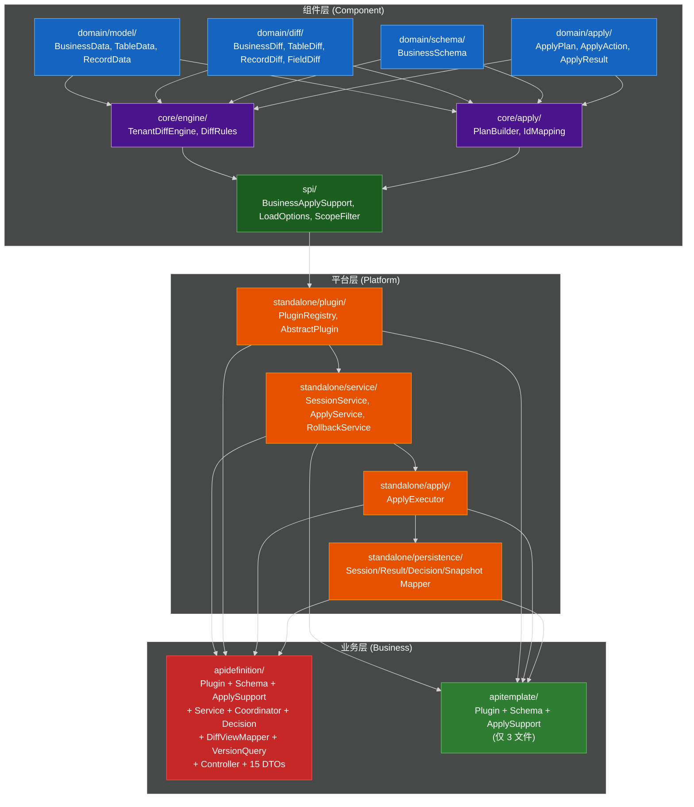
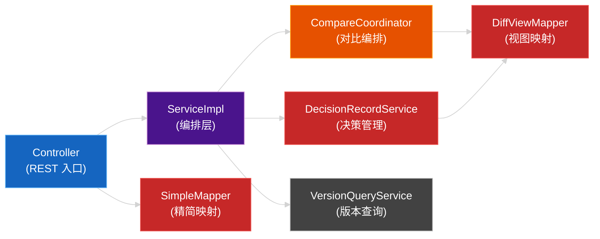
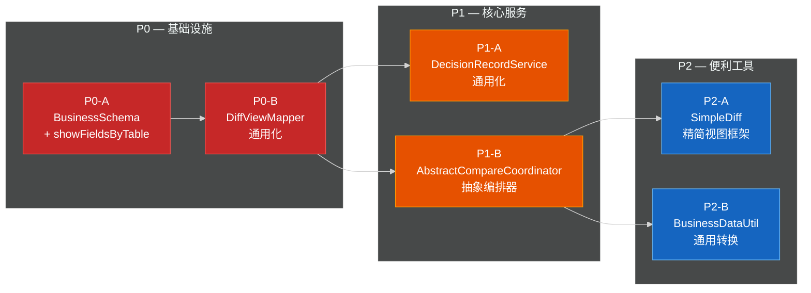

# Tenant Diff 组件能力下沉设计方案

> 版本：v1.0 | 作者：AI-assisted | 日期：2026-03-16
> 代码路径：`xaigendoc/src/main/java/com/digiwin/xai/gendoc/component/diff/`
> 前置文档：[Tenant Diff 组件 - 设计文档](./design-doc.md)

> 文档说明：本文同时包含“现状事实（已由源码验证）”“目标设计（拟实施）”“实施建议（推荐步骤）”三类内容。
> 其中代码量/工时/收益相关数字均为**估算值**，不应视为已落地结果。
> 另外，当前 working tree 还存在 Apply / SPI / Session / Web 层的伴随改动；若这些改动与本方案一并交付，需要补充独立说明，本文不展开其详细设计。

---

## 目录

1. [背景与动机](#1-背景与动机)
2. [现状分析](#2-现状分析)
3. [方案总览](#3-方案总览)
4. [详细设计](#4-详细设计)
   - 4.1 [P0-A: BusinessSchema 增加 showFieldsByTable](#41-p0-a-businessschema-增加-showfieldsbytable)
   - 4.2 [P0-B: DiffViewMapper 通用化](#42-p0-b-diffviewmapper-通用化)
   - 4.3 [P1-A: DecisionRecordService 通用化](#43-p1-a-decisionrecordservice-通用化)
   - 4.4 [P1-B: AbstractCompareCoordinator 抽象编排器](#44-p1-b-abstractcomparecoordinator-抽象编排器)
   - 4.5 [P2-A: SimpleDiff 精简视图框架](#45-p2-a-simplediff-精简视图框架)
   - 4.6 [P2-B: BusinessDataUtil 通用转换工具](#46-p2-b-businessdatautil-通用转换工具)
5. [基础设施兼容性分析](#5-基础设施兼容性分析)
6. [验证策略](#6-验证策略)
7. [收益量化](#7-收益量化)
8. [风险评估与缓解](#8-风险评估与缓解)
9. [实施计划与里程碑](#9-实施计划与里程碑)
10. [回滚方案](#10-回滚方案)
11. [评审检查清单](#11-评审检查清单)

---

## 1. 背景与动机

### 1.1 问题陈述

当前 Tenant Diff 组件的架构分为三个层次：

```
组件层 (domain/ + core/ + spi/)          → 纯领域模型 + 引擎 + 扩展点
平台层 (standalone/service|apply|plugin/) → 会话 + 对比编排 + Apply 执行
业务层 (standalone/business/*)            → 各业务类型的具体实现
```

在 `apidefinition` 业务类型的实现过程中，沉淀出了一组**存在较高复用潜力、但仍被锁定在业务包内**的能力：

| 能力 | 当前位置 | 业务耦合度 |
|------|----------|-----------|
| DiffViewMapper（NOOP 过滤、showFields 投影、统计重算） | `standalone/business/apidefinition/service/impl/` | **低**（核心映射几乎通用，但类内仍有 `ApiDefinitionDecisionItem` 相关逻辑） |
| DecisionRecordService（决策 CRUD、种子生成、过滤、执行态回写） | `standalone/business/apidefinition/service/impl/` | **中低**（主体流程可复用，但仍依赖业务 DTO 与业务 mapper） |
| CompareCoordinator（query/compare/session 编排） | `standalone/business/apidefinition/service/impl/` | **中**（存在标准骨架，但 `query/DTO/版本标准化` 仍强绑定业务） |
| SimpleDiff 映射（精简视图转换） | `standalone/business/apidefinition/web/dto/simple/` | **中**（含业务特定谓词） |

对比两个已有业务类型的实现规模差距明显：

```
apitemplate:    3 文件 (Plugin + Schema + ApplySupport)    → 无服务层
apidefinition: 28 文件 (Plugin + Schema + ApplySupport     → 有完整服务层
                        + Service + Coordinator + Decision
                        + DiffViewMapper + VersionQuery
                        + Controller + 15 个 DTO)
```

**核心问题**：以当前 `apidefinition` 的完整实现为基准，当第三个业务类型（如 INSTRUCTION、FIELD_LIBRARY）需要同等级的 compare → decision → apply 能力时，极有可能需要复制/改写约 700~900 行服务侧与 DTO 代码（粗略估算），从而带来"**分叉漂移**"风险。

### 1.2 驱动因素

| 因素 | 说明 |
|------|------|
| **新业务接入成本** | 按 `apidefinition` 当前实现粗估，接入完整 compare→decision→apply 链路需要新增约 700~900 行服务侧与 DTO 代码，其中存在较高比例的可复用逻辑 |
| **分叉漂移风险** | 复制的代码在各业务包内独立演进，Bug 修复无法统一传播 |
| **API 一致性** | 各业务类型的前端接口（NOOP 过滤规则、showFields 约定、决策管理 API）缺乏统一约束 |
| **测试效率** | 通用逻辑在每个业务包内重复测试，无法收敛到单一测试套件 |

### 1.3 非目标

- **不主动抽象现有 Compare/Apply/Rollback 核心流程**：本文聚焦 `apidefinition` 内部可复用能力（DiffView / Decision / Compare 编排 / Simple 视图 / DataUtil）的下沉设计；引擎层（`TenantDiffEngine`、`PlanBuilder`）不在本文详细设计范围内
- **不直接变更数据库 Schema**：`xai_tenant_diff_decision_record` 等表结构不变
- **不改变 `apidefinition` 现有 REST 契约**：已有 Controller 路径、request/response DTO 以兼容为前提
- **不处理 `VersionQueryService` 的通用化**：该服务强绑定 `xai_api_structure_node` 表与版本语义，继续保留在业务层
- **不把当前 working tree 的所有伴随修改都视为本文已覆盖**：若同一交付包含 `LoadOptions`、`StandaloneBusinessTypePlugin`、`AbstractStandaloneBusinessPlugin`、`StandaloneApplyExecutor*`、`TenantDiffStandaloneApplyServiceImpl`、`TenantDiffStandaloneRollbackServiceImpl`、`StandaloneSnapshotBuilder`、`ApiResponse`、Session/Apply Controller 等修改，需单独补文档说明

---

## 2. 现状分析

### 2.1 组件架构全景



### 2.2 apidefinition 内部协作关系



> **红色节点**：候选复用点，表示从源码上看“存在明显抽取价值”；不代表这些模式已经被第二个完整业务稳定验证。
> **灰色节点**（VersionQueryService）：强业务绑定，不在抽取范围内。

### 2.3 各类的业务耦合点精确分析

| 类 | 总代码行 | 业务耦合点 | 耦合点详情 | 通用化难度 |
|-----|---------|-----------|-----------|-----------|
| `ApiDefinitionDiffViewMapper` | 273 | 核心映射逻辑耦合低，但类级别并非纯通用 | `filter/rebuild` 系列主要依赖 `ApiDefinitionSchema.getShowFields(tableName)`；同类内 `buildDecisionItems()` 返回 `ApiDefinitionDecisionItem` | 低（建议拆成“通用映射 + 业务 DTO 适配”） |
| `ApiDefinitionDecisionRecordService` | 345 | 不仅有 `BUSINESS_TYPE`，还依赖业务 DTO 与业务 mapper | `ApiDefinitionStandalonePlugin.BUSINESS_TYPE`、`List<ApiDefinitionDecisionItem>`、`ApiDefinitionDiffViewMapper` | 中低 |
| `ApiDefinitionCompareCoordinator` | 249 | 对请求/响应 DTO、版本标准化、数据转换均有绑定 | `ApiDefinitionBusinessQueryRequest/Response`、`RequestContext`、`TenantDiffVersionUtil.normalize(...)`、`toTenantData()` | 中 |
| `ApiDefinitionCompareSimpleMapper` | 297 | 业务提示词判定和业务 Simple DTO 均为强耦合 | `resolveOnlyPromptDiff()`、`ApiDefinitionCompareSimple*` DTO | 中高 |

---

## 3. 方案总览

### 3.1 抽取策略

采用**渐进式下沉**策略：从耦合度最低、收益最高的能力开始，逐步向上。每个 Phase 独立可交付，不依赖后续 Phase。



### 3.2 包结构变更

```
diff/
├── domain/schema/
│   └── BusinessSchema.java              ← [P0-A] 增加 showFieldsByTable 字段
├── standalone/
│   ├── service/
│   │   ├── support/
│   │   │   ├── DiffViewMapper.java      ← [P0-B] 从 apidefinition 提取
│   │   │   ├── DecisionRecordService.java ← [P1-A] 从 apidefinition 提取
│   │   │   └── DecisionItem.java        ← [P1-A] 通用决策条目
│   │   └── coordinator/
│   │       └── AbstractCompareCoordinator.java ← [P1-B] 抽象编排器
│   ├── web/dto/simple/
│   │   ├── SimpleDiff.java              ← [P2-A] 通用精简差异模型
│   │   ├── SimpleTableDiff.java         ← [P2-A]
│   │   ├── SimpleRecordDiff.java        ← [P2-A]
│   │   ├── SimpleFieldDiff.java         ← [P2-A]
│   │   └── SimpleDiffMapper.java        ← [P2-A] 通用映射器
│   └── util/
│       └── BusinessDataUtil.java        ← [P2-B] 通用转换工具
└── standalone/business/
    ├── apidefinition/
    │   ├── service/impl/
    │   │   ├── ApiDefinitionDiffViewMapper.java        ← [P0-B] 重构为委托模式
    │   │   ├── ApiDefinitionDecisionRecordService.java  ← [P1-A] 重构为委托模式
    │   │   └── ApiDefinitionCompareCoordinator.java     ← [P1-B] 继承抽象类
    │   └── web/dto/simple/
    │       └── ApiDefinitionCompareSimpleMapper.java     ← [P2-A] 复用框架
    └── apitemplate/
        └── (不变)
```

### 3.3 设计原则

| 原则 | 说明 |
|------|------|
| **接口不变** | apidefinition 的所有 REST 端点入参、出参不变 |
| **行为等价优先** | 目标是保持关键链路行为等价；在 golden/契约/E2E 验证完成前，不直接宣称“100% 等价” |
| **委托优先** | 业务类优先使用委托（组合）而非继承来复用通用能力 |
| **最少惊讶** | `BusinessSchema` 的新增字段使用 `@Builder.Default` 默认空，现有构建代码无需修改 |
| **渐进落地** | P0 可直接推进；P1/P2 需在第二个完整业务场景中继续验证抽象边界 |

---

## 4. 详细设计

### 4.1 P0-A: BusinessSchema 增加 showFieldsByTable

#### 4.1.1 变更说明

**为什么做**：`showFieldsByTable` 是"前端要展示哪些字段"的 schema 元数据，与 `ignoreFieldsByTable`（对比时忽略哪些字段）和 `fieldTypesByTable`（类型归一化）是同一层次的配置。当前被硬编码在 `ApiDefinitionSchema` 的静态方法中，导致 `DiffViewMapper` 无法脱离业务包复用。

**影响范围**：P0-A 的核心新增点在 `BusinessSchema.java`，同时需要由 `standalone/business/apidefinition/schema/ApiDefinitionSchema.java` 完成一处 schema 适配。

#### 4.1.2 代码变更

**`domain/schema/BusinessSchema.java`** — 新增字段：

```java
@Data
@Builder
@NoArgsConstructor
@AllArgsConstructor
public class BusinessSchema {
    // ... 现有字段保持不变 ...

    /**
     * 按表配置前端展示字段：diff 返回时从 sourceFields/targetFields 投影到 showFields。
     *
     * <p>
     * key = 表名，value = 前端展示字段名列表（顺序保证）。
     * 未配置的表不进行 showFields 投影。
     * </p>
     */
    @Builder.Default
    private Map<String, List<String>> showFieldsByTable = Collections.emptyMap();
}
```

**`standalone/business/apidefinition/schema/ApiDefinitionSchema.java`** — 将 `SHOW_FIELDS_BY_TABLE` 纳入 schema：

```java
public static BusinessSchema schema() {
    // ... 现有构建逻辑不变 ...

    return BusinessSchema.builder()
        .tables(tables)
        .relations(relations)
        .ignoreFieldsByTable(ignoreFieldsByTable)
        .fieldTypesByTable(fieldTypesByTable)
        .showFieldsByTable(SHOW_FIELDS_BY_TABLE)   // ← 仅新增此行
        .build();
}
```

#### 4.1.3 兼容性保障

- `showFieldsByTable` 默认值为 `Collections.emptyMap()`，**所有现有 `BusinessSchema.builder()...build()` 调用无需修改**
- `ApiTemplateSchema.schema()` 无需改动，其 showFieldsByTable 自然为空 Map（不投影 showFields）
- 当前未发现 `BusinessSchema` 的 JSON 持久化路径；现有 `snapshotJson` 存储的是 `BusinessData`（见 `StandaloneSnapshotBuilder#buildTargetSnapshots(...)`），因此本阶段无需为 `BusinessSchema` 增加 Jackson 兼容性承诺

---

### 4.2 P0-B: DiffViewMapper 通用化

#### 4.2.1 变更说明

**为什么做**：`ApiDefinitionDiffViewMapper` 中的 `filterNoopRecordDiffs()`、`rebuildTableDiff()`、`rebuildBusinessDiff()` 等核心能力几乎只依赖 `ApiDefinitionSchema.getShowFields(tableName)` 这一处业务配置；但同类仍包含 `buildDecisionItems()` 这类业务 DTO 逻辑。因此更合理的下沉方式是：先抽取纯映射能力，再保留业务 DTO 适配层。

**目标**：将通用逻辑提取到 `standalone/service/support/DiffViewMapper.java`，业务层零重复。

#### 4.2.2 通用 DiffViewMapper 设计

**包路径**：`com.digiwin.xai.gendoc.component.diff.standalone.service.support`

```java
/**
 * 差异视图映射器（通用）。
 *
 * <p>
 * 提供 NOOP 过滤、showFields 投影、统计重算等标准视图映射能力，
 * 由 {@link BusinessSchema#getShowFieldsByTable()} 驱动 showFields 投影。
 * </p>
 */
public class DiffViewMapper {
    private final Map<String, List<String>> showFieldsByTable;

    /**
     * 以 schema 的 showFieldsByTable 构建映射器。
     *
     * @param schema 业务 schema（可为 null，此时不进行 showFields 投影）
     */
    public DiffViewMapper(BusinessSchema schema) {
        this.showFieldsByTable = (schema != null && schema.getShowFieldsByTable() != null)
            ? schema.getShowFieldsByTable()
            : Collections.emptyMap();
    }

    /** 过滤 NOOP 记录，补全 showFields 投影，重算统计。 */
    public BusinessDiff filterNoopRecordDiffs(BusinessDiff diff) { /* 原逻辑不变 */ }

    /** 按给定记录列表重建表差异，重算表级 counts。 */
    public TableDiff rebuildTableDiff(TableDiff source, List<RecordDiff> recordDiffs) { /* 原逻辑不变 */ }

    /** 按给定表列表重建业务差异，重算业务级统计。 */
    public BusinessDiff rebuildBusinessDiff(BusinessDiff source, List<TableDiff> tableDiffs) { /* 原逻辑不变 */ }
}
```

**关键设计决策**：

1. **构造函数接受 `BusinessSchema`** 而非 `Map<String, List<String>>`：保持与 schema 系统的语义一致性，避免调用方拆解 schema
2. **不使用接口/抽象类**：这是工具类，不需要多态；组合优于继承
3. **null-safe**：schema 为 null 或 showFieldsByTable 为空时，跳过投影，返回 `showFields = null`

#### 4.2.3 apidefinition 适配

`ApiDefinitionDiffViewMapper` 重构为**薄委托层**：

```java
/**
 * API_DEFINITION 差异视图映射器（委托实现）。
 *
 * <p>保持原接口不变，内部委托通用 {@link DiffViewMapper}。</p>
 */
public class ApiDefinitionDiffViewMapper {
    private final DiffViewMapper delegate;

    public ApiDefinitionDiffViewMapper(DiffViewMapper delegate) {
        this.delegate = delegate;
    }

    public BusinessDiff filterNoopRecordDiffs(BusinessDiff diff) {
        return delegate.filterNoopRecordDiffs(diff);
    }

    public List<ApiDefinitionDecisionItem> buildDecisionItems(BusinessDiff diff) {
        // 此方法返回 ApiDefinitionDecisionItem（业务 DTO），保留在业务层
        // 但内部可复用通用 DecisionItem 转换（见 P1-A）
    }

    public TableDiff rebuildTableDiff(TableDiff source, List<RecordDiff> recordDiffs) {
        return delegate.rebuildTableDiff(source, recordDiffs);
    }

    public BusinessDiff rebuildBusinessDiff(BusinessDiff source, List<TableDiff> tableDiffs) {
        return delegate.rebuildBusinessDiff(source, tableDiffs);
    }
}
```

#### 4.2.4 迁移后方法归属

| 方法 | 原位置 | 新位置 | 原因 |
|------|--------|--------|------|
| `filterNoopRecordDiffs()` | 业务层 | **通用 DiffViewMapper** | 零业务耦合 |
| `rebuildTableDiff()` | 业务层 | **通用 DiffViewMapper** | 零业务耦合 |
| `rebuildBusinessDiff()` | 业务层 | **通用 DiffViewMapper** | 零业务耦合 |
| `buildShowFields()` (private) | 业务层 | **通用 DiffViewMapper** (private) | 仅依赖 showFieldsByTable |
| `countRecords()` (private) | 业务层 | **通用 DiffViewMapper** (private) | 纯算法 |
| `buildStatistics()` (private) | 业务层 | **通用 DiffViewMapper** (private) | 纯算法 |
| `resolveBusinessDiffType()` (private) | 业务层 | **通用 DiffViewMapper** (private) | 纯算法 |
| `buildDecisionItems()` | 业务层 | **保留业务层** | 返回 `ApiDefinitionDecisionItem` |

---

### 4.3 P1-A: DecisionRecordService 通用化

#### 4.3.1 变更说明

**为什么做**：`ApiDefinitionDecisionRecordService` 的“决策种子生成、保存、过滤、执行态回写”主体逻辑具备明显复用价值；但当前类并不只依赖 `businessType`，还直接接收 `ApiDefinitionDecisionItem` 并依赖 `ApiDefinitionDiffViewMapper`。因此该阶段不宜把现有类整体下沉，而应先抽象通用 `DecisionItem` 与 DTO 适配边界，再迁移公共逻辑。

#### 4.3.2 通用 DecisionItem 设计

**包路径**：`com.digiwin.xai.gendoc.component.diff.standalone.service.support`

```java
/**
 * 通用决策条目。
 *
 * <p>用于在业务层与通用决策服务之间传递决策信息，不绑定任何特定业务类型。</p>
 */
public record DecisionItem(
    String tableName,
    String recordBusinessKey,
    DiffType diffType,
    DecisionType decision,
    String decisionReason
) {
    /** 从 RecordDiff 构建默认 ACCEPT 决策条目。 */
    public static DecisionItem fromRecordDiff(String tableName, RecordDiff recordDiff) {
        DecisionType decision = recordDiff.getDecision() == null
            ? DecisionType.ACCEPT : recordDiff.getDecision();
        return new DecisionItem(
            tableName,
            recordDiff.getRecordBusinessKey(),
            recordDiff.getDiffType(),
            decision,
            recordDiff.getDecisionReason()
        );
    }
}
```

#### 4.3.3 通用 DecisionRecordService 设计

**包路径**：`com.digiwin.xai.gendoc.component.diff.standalone.service.support`

```java
/**
 * 通用决策记录服务。
 *
 * <p>
 * 负责决策记录的种子生成、保存、筛选与执行态回写，不绑定任何特定业务类型。
 * 通过构造参数 {@code businessType} 隔离不同业务的决策数据。
 * </p>
 */
public class DecisionRecordService {
    private final String businessType;
    private final TenantDiffDecisionRecordMapper decisionRecordMapper;
    private final DiffViewMapper diffViewMapper;

    public DecisionRecordService(
        String businessType,
        TenantDiffDecisionRecordMapper decisionRecordMapper,
        DiffViewMapper diffViewMapper
    ) { ... }

    /** 保存决策项。 */
    public void saveDecisions(Long sessionId, String businessKey,
                              List<DecisionItem> decisions, BusinessDiff diff) { ... }

    /** 生成默认决策（ACCEPT）。 */
    public void seedDefaultDecisions(Long sessionId, BusinessDiff diff) { ... }

    /** 查询决策记录映射。 */
    public Map<String, TenantDiffDecisionRecordPo> listDecisionRecordMap(
        Long sessionId, String businessKey) { ... }

    /** 依据决策过滤待执行差异。 */
    public FilteredDecisionResult filterAcceptedDiffs(
        BusinessDiff diff,
        Map<String, TenantDiffDecisionRecordPo> decisions) { ... }

    /** 更新决策执行状态。 */
    public void updateDecisionRecords(
        List<TenantDiffDecisionRecordPo> records,
        DecisionExecutionStatus status,
        Long applyId, String errorMsg, LocalDateTime executionTime) { ... }

    public record FilteredDecisionResult(
        BusinessDiff acceptedDiff,
        List<TenantDiffDecisionRecordPo> acceptedRecords,
        List<TenantDiffDecisionRecordPo> skippedRecords
    ) {}
}
```

#### 4.3.4 apidefinition 适配

`ApiDefinitionDecisionRecordService` 重构为薄委托：

```java
public class ApiDefinitionDecisionRecordService {
    private final DecisionRecordService delegate;

    public ApiDefinitionDecisionRecordService(
        TenantDiffDecisionRecordMapper mapper, DiffViewMapper diffViewMapper
    ) {
        this.delegate = new DecisionRecordService(
            ApiDefinitionStandalonePlugin.BUSINESS_TYPE, mapper, diffViewMapper
        );
    }

    // 业务 DTO 转换层：ApiDefinitionDecisionItem → DecisionItem
    public void saveDecisions(Long sessionId, String businessKey,
                              List<ApiDefinitionDecisionItem> decisions, BusinessDiff diff) {
        List<DecisionItem> items = decisions.stream()
            .map(d -> new DecisionItem(d.getTableName(), d.getRecordBusinessKey(),
                                       d.getDiffType(), d.getDecision(), d.getDecisionReason()))
            .toList();
        delegate.saveDecisions(sessionId, businessKey, items, diff);
    }

    // 其余方法直接委托...
}
```

#### 4.3.5 与 `buildDecisionItems()` 的关系

`DiffViewMapper.buildDecisionItems()` 当前返回 `ApiDefinitionDecisionItem`。更稳妥的顺序是：

- **P0 阶段先不下沉 `buildDecisionItems()`**，仅抽取纯 `diff -> view` 的通用映射能力
- **P1-A 再评估** 是否补充 `buildDecisionItems(BusinessDiff) -> List<DecisionItem>` 的通用接口
- 业务层若需要 `ApiDefinitionDecisionItem`，仍保留一层 DTO 映射，避免在第一阶段扩大抽象范围

---

### 4.4 P1-B: AbstractCompareCoordinator 抽象编排器

#### 4.4.1 变更说明

**为什么做**：`ApiDefinitionCompareCoordinator` 展示出较清晰的标准编排骨架：

```
请求 → 解析参数 → 加载 source/target → diff 引擎对比 → 过滤 NOOP → 返回
            ↳ 创建 session → 运行对比 → 读取结果 → 返回
```

当前可以确认 compare / createSessionAndCompare / getBusinessDiffRequired 这几段编排逻辑具有较高复用潜力；但 `query()`、`buildDecisionRequest()`、`toTenantData()` 仍深度绑定业务 DTO 与版本标准化逻辑，因此不建议在第一轮抽象中“一次性做成全通用基类”。

#### 4.4.2 抽象类设计

**包路径**：`com.digiwin.xai.gendoc.component.diff.standalone.service.coordinator`

```java
/**
 * 对比编排器基类。
 *
 * <p>
 * 固化 query/compare/session compare 的标准流程，子类仅需定义：
 * <ul>
 *     <li>{@link #businessType()} — 业务类型标识</li>
 *     <li>{@link #extractRequestContext(Object)} — 从请求中提取参数</li>
 *     <li>{@link #getDiffRules()} — 获取对比规则</li>
 * </ul>
 * </p>
 *
 * @param <REQ> 请求类型
 */
public abstract class AbstractCompareCoordinator<REQ> {

    protected final TenantDiffStandaloneService sessionService;
    protected final StandalonePluginRegistry pluginRegistry;
    protected final TenantDiffEngine diffEngine;
    protected final DiffViewMapper diffViewMapper;

    // --- 子类必须实现 ---

    /** 业务类型标识。 */
    protected abstract String businessType();

    /** 从请求中提取标准参数。 */
    protected abstract CompareRequestContext extractRequestContext(REQ request);

    /** 获取该业务类型的对比规则。 */
    protected abstract DiffRules getDiffRules();

    // --- 固化编排逻辑（final 防止覆写） ---

    /** 加载 source/target 数据快照。 */
    public final CompareQueryResult query(REQ request) { ... }

    /** 无会话对比。 */
    public final BusinessDiff compare(REQ request) { ... }

    /** 创建会话并对比。 */
    public final SessionCompareResult createSessionAndCompare(REQ request) { ... }

    /** 从会话结果中读取业务差异。 */
    public final BusinessDiff getBusinessDiffRequired(Long sessionId, String businessKey) { ... }

    // --- 标准参数容器 ---

    public record CompareRequestContext(
        String businessKey,
        Long sourceTenantId,
        Long targetTenantId,
        LoadOptions sourceLoadOptions,
        LoadOptions targetLoadOptions
    ) {}

    public record CompareQueryResult(
        Long sourceTenantId,
        Map<String, List<Map<String, Object>>> sourceData,
        Long targetTenantId,
        Map<String, List<Map<String, Object>>> targetData
    ) {}

    public record SessionCompareResult(Long sessionId, BusinessDiff diff) {}
}
```

#### 4.4.3 apidefinition 适配

```java
public class ApiDefinitionCompareCoordinator
    extends AbstractCompareCoordinator<ApiDefinitionBusinessQueryRequest> {

    @Override
    protected String businessType() {
        return ApiDefinitionStandalonePlugin.BUSINESS_TYPE;
    }

    @Override
    protected CompareRequestContext extractRequestContext(ApiDefinitionBusinessQueryRequest request) {
        // 参数校验 + 版本号标准化
        String sourceVersion = TenantDiffVersionUtil.normalize(request.getSourceVersion());
        String targetVersion = TenantDiffVersionUtil.normalize(request.getTargetVersion());
        return new CompareRequestContext(
            request.getBusinessKey(),
            request.getSourceTenantId(),
            request.getTargetTenantId(),
            LoadOptions.builder().apiDefinitionVersion(sourceVersion).build(),
            LoadOptions.builder().apiDefinitionVersion(targetVersion).build()
        );
    }

    @Override
    protected DiffRules getDiffRules() {
        return DiffRules.builder()
            .ignoreFieldsByTable(ApiDefinitionSchema.schema().getIgnoreFieldsByTable())
            .build();
    }

    // 业务特有方法（如 toTenantData）保留
    public ApiDefinitionBusinessQueryResponse queryApiDefinition(
            ApiDefinitionBusinessQueryRequest request) {
        CompareQueryResult result = query(request);
        return mapToApiDefinitionResponse(result);
    }
}
```

#### 4.4.4 `CompareQueryResult` 的通用数据格式

`CompareQueryResult.sourceData` / `targetData` 使用 `Map<String, List<Map<String, Object>>>`（表名 → 行列表）通用格式，而非业务特定的 `ApiDefinitionTenantData`。

业务层负责将通用格式映射为业务 DTO（`ApiDefinitionTenantData` 等），此处利用 P2-B 的 `BusinessDataUtil.toCleanTableRowMap()`。

> 建议：若实施顺序需要继续保守，可先抽 `compare()` / `createSessionAndCompare()` / `getBusinessDiffRequired()` 三段骨架，把 `query()` 和 DTO 转换继续留在业务层。

---

### 4.5 P2-A: SimpleDiff 精简视图框架

#### 4.5.1 变更说明

**为什么做**：前端需要精简格式（去除 sourceFields/targetFields 等大字段）是常见需求；但当前仓库中只有 `apidefinition` 完整落地了 `Simple DTO + Mapper`，`apitemplate` 尚未形成对照实现。因此 P2-A 更适合作为“第二阶段候选抽象”，在第二个完整业务出现后再冻结通用模型。

#### 4.5.2 通用模型设计

**包路径**：`com.digiwin.xai.gendoc.component.diff.standalone.web.dto.simple`

```java
// 通用精简差异模型（全部使用 record）
public record SimpleDiff(
    String businessType, String businessTable, String businessKey,
    String businessName, DiffType diffType, DiffStatistics statistics,
    List<SimpleTableDiff> tableDiffs
) {}

public record SimpleTableDiff(
    String tableName, Integer dependencyLevel, DiffType diffType,
    TableDiff.TableDiffCounts counts, List<SimpleRecordDiff> recordDiffs
) {}

public record SimpleRecordDiff(
    String recordBusinessKey, DiffType diffType,
    DecisionType decision, String decisionReason,
    Map<String, Object> showFields,
    List<SimpleFieldDiff> fieldDiffs, List<String> warnings
) {}

public record SimpleFieldDiff(String fieldName, String changeDescription) {}
```

#### 4.5.3 通用映射器设计

```java
/**
 * 通用精简差异映射器。
 *
 * <p>
 * 提供 {@link BusinessDiff} → {@link SimpleDiff} 的标准映射，
 * 包含按 diffType 排序（INSERT → UPDATE → DELETE → 其他）。
 * </p>
 */
public final class SimpleDiffMapper {
    private SimpleDiffMapper() {}

    /** 将完整差异转为精简格式。 */
    public static SimpleDiff toSimple(BusinessDiff diff) { ... }

    /** diffType 排序权重：INSERT=0, UPDATE=1, DELETE=2, other=3。 */
    public static int diffTypeOrder(RecordDiff recordDiff) { ... }
}
```

#### 4.5.4 apidefinition 适配

`ApiDefinitionCompareSimpleMapper` 保留业务特定逻辑（`resolveOnlyPromptDiff()`），通用映射委托给 `SimpleDiffMapper`：

```java
public static ApiDefinitionCompareSimpleResponse toSimple(ApiDefinitionCompareResponse response) {
    // 通用映射
    SimpleDiff simpleDiff = SimpleDiffMapper.toSimple(response.getDiff());

    return ApiDefinitionCompareSimpleResponse.builder()
        .sessionId(response.getSessionId())
        .onlyPromptDiff(resolveOnlyPromptDiff(response.getDiff()))  // 业务特有
        .diff(toApiDefinitionSimpleDiff(simpleDiff))  // 类型转换（如有必要）
        .build();
}
```

> **设计决策**：`resolveOnlyPromptDiff()` 是纯业务逻辑（提示词字段判断），不适合抽取到通用层。保留在业务层是正确的选择。

---

### 4.6 P2-B: BusinessDataUtil 通用转换工具

#### 4.6.1 变更说明

**为什么做**：`CompareCoordinator.toRowList()` 和 `toTenantData()` 中的"BusinessData → 清洁行列表"转换在每个业务的 query 接口中都需要。

#### 4.6.2 工具类设计

**包路径**：`com.digiwin.xai.gendoc.component.diff.standalone.util`

```java
/**
 * {@link BusinessData} 通用转换工具。
 */
public final class BusinessDataUtil {
    private BusinessDataUtil() {}

    /**
     * 将 BusinessData 转为清洁的表行映射。
     *
     * <p>自动移除派生字段（{@link DerivedFieldNames}），返回 tableName → rows 映射。</p>
     *
     * @param data 业务数据（可为 null）
     * @return 表名 → 行数据列表（不含派生字段）
     */
    public static Map<String, List<Map<String, Object>>> toCleanTableRowMap(BusinessData data) {
        if (data == null || data.getTables() == null) {
            return Collections.emptyMap();
        }
        Map<String, List<Map<String, Object>>> result = new LinkedHashMap<>();
        for (TableData table : data.getTables()) {
            if (table == null || table.getTableName() == null) continue;
            result.put(table.getTableName(), toCleanRowList(table));
        }
        return result;
    }

    /**
     * 将 TableData 的 records 转为清洁行列表（移除派生字段）。
     */
    public static List<Map<String, Object>> toCleanRowList(TableData table) {
        if (table == null || table.getRecords() == null) {
            return Collections.emptyList();
        }
        List<Map<String, Object>> rows = new ArrayList<>();
        for (RecordData record : table.getRecords()) {
            if (record == null || record.getFields() == null) continue;
            Map<String, Object> cleaned = new LinkedHashMap<>(record.getFields());
            cleaned.remove(DerivedFieldNames.MAIN_BUSINESS_KEY);
            cleaned.remove(DerivedFieldNames.PARENT_BUSINESS_KEY);
            rows.add(cleaned);
        }
        return rows;
    }
}
```

---

## 5. 基础设施兼容性分析

> 说明：本节讨论的是“按本文目标设计单独实施”时的影响面，不等同于当前 working tree 的完整变更集。若同一次交付还包含 `LoadOptions`、`StandaloneBusinessTypePlugin`、`AbstractStandaloneBusinessPlugin`、`StandaloneTenantModelBuilder`、`StandaloneApplyExecutor*`、`TenantDiffStandaloneApplyServiceImpl`、`TenantDiffStandaloneRollbackServiceImpl`、`StandaloneSnapshotBuilder`、`ApiResponse`、Session/Apply Controller 等修改，需要补充独立设计或在本文增补专章。

### 5.1 与现有 SPI 体系的兼容

| SPI | 影响 | 说明 |
|-----|------|------|
| `StandaloneBusinessTypePlugin` | **无影响** | Plugin 接口不变，仅 `BusinessSchema` 增加可选字段 |
| `BusinessApplySupport` | **无影响** | Apply 扩展点不在本次范围内 |
| `StandalonePluginRegistry` | **无影响** | 注册机制不变 |
| `StandaloneApplySupportRegistry` | **无影响** | 注册机制不变 |

### 5.2 与 Configuration 的兼容

| Bean | 影响 | 说明 |
|------|------|------|
| `TenantDiffStandaloneConfiguration` | **微小调整** | `tenantDiffStandaloneApiDefinitionService` Bean 构建方式不变，内部 new 的对象替换为通用版 |
| `@ConditionalOnProperty` | **无影响** | 启用/禁用逻辑不变 |
| `@MapperScan` | **无影响** | Mapper 扫描路径不变 |

**实例装配与构造细节**：

```java
// 当前：顶层 Bean 由 TenantDiffStandaloneConfiguration 创建，协作对象在
// TenantDiffStandaloneApiDefinitionServiceImpl 构造器内部组装
this.diffViewMapper = new ApiDefinitionDiffViewMapper();

// 目标：由外部先创建通用 DiffViewMapper，再传入业务层适配器
DiffViewMapper genericMapper = new DiffViewMapper(ApiDefinitionSchema.schema());
this.diffViewMapper = new ApiDefinitionDiffViewMapper(genericMapper);
```

> 注意：上面的 `this.diffViewMapper = ...` 代码片段位于 `TenantDiffStandaloneApiDefinitionServiceImpl` 的构造器中，用于说明协作对象如何被组装；`TenantDiffStandaloneConfiguration` 本身仍主要负责创建顶层 Service Bean。
> 所有新增类都通过构造函数 new 实例化（非 Spring Bean），**不影响 Spring 容器和 Bean 生命周期**。这与当前 `ApiDefinitionDiffViewMapper` 的使用模式一致。
> 另：当前真实实现中，`TenantDiffStandaloneConfiguration#tenantDiffStandaloneApiDefinitionService(...)` 还会注入 `ExtraDataSourceRegistry` 与 `DictionaryService` 以构造 `ApiDefinitionVersionQueryService`；这部分依赖保留在业务层，不属于本文抽取目标。

### 5.3 与持久化层的兼容

| 表 | 影响 | 说明 |
|-----|------|------|
| `xai_tenant_diff_decision_record` | **无影响** | PO 结构不变，SQL 查询逻辑完全复用 |
| `xai_tenant_diff_session` | **无影响** | 不涉及 |
| `xai_tenant_diff_result` | **无影响** | 不涉及 |

### 5.4 与序列化的兼容

| 场景 | 影响 | 说明 |
|------|------|------|
| `BusinessSchema` JSON 持久化 | **当前未发现路径** | 代码审查未发现 `BusinessSchema` 被写入 JSON；当前 `snapshotJson` 存储的是 `BusinessData`（见 `StandaloneSnapshotBuilder#buildTargetSnapshots(...)`） |
| `diffJson` / `snapshotJson` 存储 | **无直接影响** | 本设计仅为 `BusinessSchema` 增加元数据字段，不改变 `BusinessDiff` / `BusinessData` 的已有 JSON 结构 |
| REST API 响应 | **无影响** | 本设计不改变现有 request/response DTO 结构 |

### 5.5 与测试体系的兼容

| 测试类 | 影响 | 说明 |
|--------|------|------|
| `TenantDiffStandaloneServiceImplTest` | **无影响** | 测试平台层 Service，不涉及业务层 |
| `TenantDiffStandaloneApplyServiceImplTest` | **无影响** | 测试 Apply 流程 |
| `ApiTemplateStandaloneE2ETest` | **无影响** | apitemplate 不受此重构影响 |
| `ApiTemplateServiceLayerE2ETest` | **无影响** | 同上 |

补充说明：当前仓库中已存在 `ApiDefinitionDiffViewMapperTest`、`ApiDefinitionCompareSimpleMapperTest`、`TenantDiffStandaloneApiDefinitionServiceImplTest`，但它们只能作为**部分回归基线**；文中新增的 `DiffViewMapperTest` / `DecisionRecordServiceTest` 等属于目标测试，而非现状。

---

## 6. 验证策略

### 6.1 单元测试

**现有基线测试**：

| 测试类 | 当前用途 |
|--------|---------|
| `ApiDefinitionDiffViewMapperTest` | 当前主要覆盖 `rebuildTableDiff()` / `rebuildBusinessDiff()` 的 diffType 推导逻辑 |
| `ApiDefinitionCompareSimpleMapperTest` | 当前重点覆盖 `onlyPromptDiff` 判定，以及 `toSimple(null)` / `diff=null` 等基础行为 |
| `TenantDiffStandaloneApiDefinitionServiceImplTest` | 当前覆盖 service 层的主要编排行为，可作为后续扩展测试的入口 |

**建议新增的通用层测试**：

| 测试类 | 覆盖范围 | 验证要点 |
|--------|---------|---------|
| `DiffViewMapperTest` | P0-B | 1) NOOP 过滤正确性；2) showFields 投影（有/无配置）；3) 统计重算；4) null-safe；5) 空 diff 处理 |
| `DecisionRecordServiceTest` | P1-A | 1) 种子生成幂等性；2) 保存校验（diffType mismatch）；3) 过滤 ACCEPT/SKIP；4) 执行态回写；5) businessType 隔离 |
| `SimpleDiffMapperTest` | P2-A | 1) 映射完整性；2) diffType 排序；3) null-safe |
| `BusinessDataUtilTest` | P2-B | 1) 派生字段移除；2) 空输入处理；3) 顺序保持 |

### 6.2 等价性验证（关键）

**目标**：尽可能证明重构后的 `apidefinition` 在关键输入下与重构前保持行为等价。

**方法**：

```
1. 重构前：保留现有基线测试，并为关键入口补充 golden / contract 数据
2. 重构后：以相同 request 与 golden 数据回放，对比返回值 JSON
3. 若差异仅为无关字段顺序或空值表现，需要明确记录并人工判定是否接受
```

**具体步骤**：

1. 在重构前，先保留并扩展现有 `ApiDefinition*` 测试，再为以下方法补充参数化测试或 golden 数据：
   - `DiffViewMapper.filterNoopRecordDiffs()`
   - `DecisionRecordService.seedDefaultDecisions()`
   - `DecisionRecordService.filterAcceptedDiffs()`
2. 重构后运行同一测试套件，确保全部通过
3. 若有 E2E 测试环境，执行完整的 compare→decision→apply 链路验证

> 说明：当前仓库尚未发现现成的 golden 测试基础设施，因此该能力需要先补齐后，才能把“行为等价”从目标提升为结论。

### 6.3 集成验证

| 场景 | 验证步骤 | 预期结果 |
|------|---------|---------|
| apidefinition compare | 调用 `TenantDiffStandaloneApiDefinitionController#compareApiDefinition -> POST /api/tenantDiff/standalone/session/compareApiDefinition` | 响应结构和数据与重构前一致 |
| apidefinition compareDecision | 调用 `TenantDiffStandaloneApiDefinitionController#compareApiDefinitionDecision -> POST /api/tenantDiff/standalone/session/compareApiDefinitionDecision` | 决策记录正确写入 DB |
| apidefinition compareDecisionSimple | 调用 `TenantDiffStandaloneApiDefinitionController#compareApiDefinitionDecisionSimple -> POST /api/tenantDiff/standalone/session/compareApiDefinitionDecisionSimple` | 决策流与 Simple 映射同时保持兼容 |
| apidefinition executeApplyDecision | 调用 `TenantDiffStandaloneApiDefinitionController#executeApiDefinitionDecision -> POST /api/tenantDiff/standalone/apply/executeApiDefinitionDecision` 完整链路 | Apply 执行成功，决策状态更新 |
| apitemplate compare | 调用 apitemplate 对比流程 | 不受影响，行为不变 |
| apidefinition compareSimple | 调用 `TenantDiffStandaloneApiDefinitionController#compareApiDefinitionSimple -> POST /api/tenantDiff/standalone/session/compareApiDefinitionSimple` | `onlyPromptDiff` 判断正确 |

### 6.4 编译验证

```bash
# 确保全量编译通过（含所有模块）
./mvnw clean compile

# 确保测试通过
./mvnw -pl xaigendoc -am test -Dsurefire.failIfNoSpecifiedTests=false
```

---

## 7. 收益量化

> 说明：本节均为**设计估算**，不是已验证结果。当前仅能确认包规模差异：`apidefinition` 约 28 个 Java 文件 / 3461 行，`apitemplate` 约 3 个 Java 文件 / 351 行；下表用于说明下沉价值方向，而非作为发布承诺。

### 7.1 代码量收益

| 指标 | P0 | P1 | P2 | 总计 |
|------|-----|-----|-----|------|
| 新增通用代码 | ~50 行 | ~100 行 | ~100 行 | **~250 行** |
| apidefinition 删减 | ~250 行 | ~330 行 | ~200 行 | **~780 行** |
| 每个新业务节省 | ~270 行 | ~345 行 | ~230 行 | **~845 行** |

### 7.2 新业务接入成本对比

**重构前**（接入一个类似 apidefinition 的完整业务类型）：

| 工作项 | 估算代码量 | 估算工时 |
|--------|-----------|---------|
| Plugin + Schema + ApplySupport | ~350 行 | 0.5 天 |
| DiffViewMapper (复制 + 改) | ~270 行 | 0.5 天 |
| DecisionRecordService (复制 + 改) | ~345 行 | 0.5 天 |
| CompareCoordinator (复制 + 改) | ~250 行 | 0.5 天 |
| SimpleMapper (复制 + 改) | ~200 行 | 0.3 天 |
| Service + Controller + DTO | ~300 行 | 0.5 天 |
| **总计** | **~1715 行** | **~2.8 天** |

**重构后**：

| 工作项 | 估算代码量 | 估算工时 |
|--------|-----------|---------|
| Plugin + Schema + ApplySupport | ~350 行 | 0.5 天 |
| CompareCoordinator (继承 + 3 个方法) | ~50 行 | 0.2 天 |
| Service + Controller + DTO | ~300 行 | 0.5 天 |
| DiffViewMapper / Decision / Simple | **0 行** | **0 天** |
| **总计** | **~700 行** | **~1.2 天** |

按当前估算，理论上可显著降低重复代码与接入工时；正式 ROI 建议在第二个完整业务接入后复盘确认。

### 7.3 维护成本收益

| 场景 | 重构前 | 重构后 |
|------|--------|--------|
| DiffViewMapper Bug 修复 | 需修 N 个业务包 | 修 1 处，全局生效 |
| 决策管理逻辑增强 | 需改 N 个业务包 | 改 1 处，全局生效 |
| 统计算法优化 | 需改 N 个业务包 | 改 1 处，全局生效 |
| showFields 新需求 | 各业务自行实现 | schema 配置即可 |

---

## 8. 风险评估与缓解

### 8.1 风险矩阵

| 风险 | 概率 | 影响 | 缓解措施 |
|------|------|------|---------|
| **R1**: 重构引入回归 Bug | 中 | 高 | 等价性测试（6.2）+ 现有 E2E 测试覆盖 |
| **R2**: 通用化过度抽象 | 中 | 中 | P0 基于现有源码可直接推进；P1/P2 当前仅在 `apidefinition` 完整落地，应在第二个完整业务验证后再冻结抽象边界 |
| **R3**: 性能影响 | 极低 | 低 | 仅增加 1 层委托调用（方法调用开销可忽略），无额外 IO/DB 操作 |
| **R4**: 合并冲突 | 中 | 低 | 按 Phase 独立提交，每个 Phase 是可编译、可运行的完整状态 |
| **R5**: 未来引入 Schema JSON 读写时出现兼容问题 | 低 | 中 | 当前未发现 `BusinessSchema` JSON 持久化路径；若未来引入，需要补 Jackson/序列化专项测试 |

### 8.2 R1 的详细缓解方案

```
Step 1: 在重构前为所有被移动的方法编写 golden 测试
Step 2: 移动代码（不改逻辑）
Step 3: 运行 golden 测试验证等价
Step 4: 重构委托（不改逻辑）
Step 5: 再次运行 golden 测试
Step 6: 运行全量测试套件
```

### 8.3 R5 的详细分析

`BusinessSchema` 在以下场景被序列化/反序列化：

1. **Schema 构建**：代码内硬编码调用 `BusinessSchema.builder().build()`，不经过 JSON
2. **传递给引擎**：内存传参，不经过 JSON
3. **快照 JSON**（`snapshotJson`）：不包含 schema，仅包含 `BusinessData`

**结论**：`BusinessSchema` 目前不参与 JSON 持久化，新增字段无反序列化风险。

---

## 9. 实施计划与里程碑

### 9.1 Phase 分拆与依赖

```
Phase 0 (P0): BusinessSchema 增强 + DiffViewMapper 通用化
  ├── P0-A: BusinessSchema.showFieldsByTable (独立)
  └── P0-B: DiffViewMapper (依赖 P0-A)

Phase 1 (P1): 核心服务通用化 (依赖 P0-B)
  ├── P1-A: DecisionRecordService (依赖 P0-B 的 DiffViewMapper)
  └── P1-B: AbstractCompareCoordinator (依赖 P0-B 的 DiffViewMapper)

Phase 2 (P2): 便利工具 (独立于 P1，依赖 P0)
  ├── P2-A: SimpleDiff 框架 (独立)
  └── P2-B: BusinessDataUtil (独立)
```

### 9.2 推荐执行顺序

| 步骤 | Phase | 内容 | 前置 | 估算工时 | 交付物 |
|------|-------|------|------|---------|--------|
| 1 | P0-A | `BusinessSchema` 增加 `showFieldsByTable` | 无 | 0.5h | 1 文件修改 + 1 文件适配 |
| 2 | P0-B | 提取 `DiffViewMapper` 到通用包 | P0-A | 2h | 1 新文件 + 1 文件重构 + 单元测试 |
| 3 | P1-A | 提取 `DecisionRecordService` + `DecisionItem` | P0-B | 3h | 2 新文件 + 1 文件重构 + 单元测试 |
| 4 | P1-B | 提取 `AbstractCompareCoordinator` | P0-B | 3h | 1 新文件 + 1 文件重构 + 单元测试 |
| 5 | P2-A | 提取 `SimpleDiff` 模型 + `SimpleDiffMapper` | P0 | 2h | 5 新文件 + 1 文件重构 |
| 6 | P2-B | 提取 `BusinessDataUtil` | 无 | 1h | 1 新文件 + 单元测试 |
| 7 | - | 集成测试 + 等价性验证 | 全部 | 2h | 测试报告 |
| **总计** | | | | **~13.5h** | |

### 9.3 分支与提交策略

若当前分支还包含 Apply / SPI / Session / Web 伴随修改，建议优先拆成独立 commit 或独立方案，避免把“能力下沉”与“外围改动”混成一次不可审阅的大提交。

```
feature/diff-capability-extraction
  ├── commit 1: P0-A BusinessSchema showFieldsByTable
  ├── commit 2: P0-B DiffViewMapper 通用化
  ├── commit 3: P1-A DecisionRecordService 通用化
  ├── commit 4: P1-B AbstractCompareCoordinator
  ├── commit 5: P2-A SimpleDiff 框架
  ├── commit 6: P2-B BusinessDataUtil
  └── commit 7: 测试补充 + 文档更新
```

每个 commit 保证：
- 编译通过 (`./mvnw clean compile`)
- 现有测试通过 (`./mvnw -pl xaigendoc -am test`)
- apidefinition 对外行为不变

---

## 10. 回滚方案

### 10.1 Phase 级回滚

每个 Phase 独立可回滚。由于采用**委托模式**（组合而非继承），回滚操作为：

1. 恢复业务层原始类（git revert 对应 commit）
2. 通用层的新增文件可保留或删除（不影响业务层）

### 10.2 全量回滚

```bash
git revert --no-commit HEAD~7..HEAD
git commit -m "revert: 回滚 diff 组件能力下沉"
```

回滚后：
- 所有 REST API 行为完全恢复
- 通用层新增的文件成为"死代码"，可安全保留（不被任何代码引用）
- 无数据库 Schema 变更，无数据迁移需要

### 10.3 回滚触发条件

| 条件 | 动作 |
|------|------|
| 编译失败 | 回滚到上一个绿色 commit |
| 单元测试失败 | 修复或回滚当前 Phase |
| 等价性测试失败 | 分析差异来源，修复或回滚 |
| 生产环境异常 | 全量回滚 + 发布 hotfix |

---

## 11. 评审检查清单

### 11.1 架构评审

- [ ] 新增类的包路径是否遵循现有分层约定？
- [ ] `DiffViewMapper` 是否应该放在 `core/` 而非 `standalone/service/support/`？（考量：它依赖 `BusinessSchema` 这个 domain 类，但 API 语义更偏 standalone 层）
- [ ] 是否应将 `DecisionItem` 放到 `domain/diff/` 而非 `standalone/service/support/`？（考量：它不含持久化语义，但决策管理是 standalone 特有流程）
- [ ] `AbstractCompareCoordinator` 的泛型 `<REQ>` 是否过度设计？（考量：所有请求都需要 businessKey + tenantIds + loadOptions，泛型可确保类型安全）

### 11.2 兼容性评审

- [ ] `BusinessSchema` 新增字段的默认值是否安全？
- [ ] 现有 `BusinessSchema.builder()...build()` 调用是否全部兼容？
- [ ] `ApiDefinitionCompareCoordinator` 重构后，`TenantDiffStandaloneConfiguration` 的 Bean 装配是否正确？
- [ ] 通用 `DecisionRecordService` 的 `businessType` 隔离是否充分？（同一 session 下多个 businessType 的决策不会混淆？）

### 11.3 测试评审

- [ ] 等价性测试的 golden 数据是否覆盖所有边界情况？
- [ ] 是否需要为通用层新增独立的测试模块/包？
- [ ] 现有 E2E 测试是否足以覆盖集成链路？

### 11.4 工程纪律

- [ ] 是否存在"先验性抽象"（基于猜测而非实际需求的通用化）？
- [ ] P1/P2 的抽象是否已经被第二个**完整业务**验证？若没有，是否应先只落地 P0？
- [ ] `VersionQueryService` 不抽取的决策是否正确？（强绑定 `xai_api_structure_node` 表）

---

## 附录

### A. 目标文件变更清单（按本文设计，非当前 working tree 实况）

> 注意：下表表示“若按本文方案实施，建议涉及的目标文件”。它**不等同于**当前 working tree 的完整变更集。
> 若实际提交还包含 `LoadOptions`、`StandaloneBusinessTypePlugin`、`AbstractStandaloneBusinessPlugin`、`StandaloneTenantModelBuilder`、`StandaloneApplyExecutorCore`、`StandaloneApplyExecutorImpl`、`StandaloneBusinessDiffApplyExecutorImpl`、`TenantDiffStandaloneApplyServiceImpl`、`TenantDiffStandaloneRollbackServiceImpl`、`StandaloneSnapshotBuilder`、`ApiResponse`、`TenantDiffStandaloneApplyController`、`TenantDiffStandaloneSessionController` 等修改，需要另补文档或增补本文。

| 文件 | 操作 | Phase |
|------|------|-------|
| `domain/schema/BusinessSchema.java` | 修改（+1 字段） | P0-A |
| `standalone/business/apidefinition/schema/ApiDefinitionSchema.java` | 修改（schema() 构建增加 showFieldsByTable） | P0-A |
| `standalone/service/support/DiffViewMapper.java` | **新增** | P0-B |
| `standalone/business/apidefinition/service/impl/ApiDefinitionDiffViewMapper.java` | 修改（委托通用 DiffViewMapper） | P0-B |
| `standalone/service/support/DecisionItem.java` | **新增** | P1-A |
| `standalone/service/support/DecisionRecordService.java` | **新增** | P1-A |
| `standalone/business/apidefinition/service/impl/ApiDefinitionDecisionRecordService.java` | 修改（委托通用 DecisionRecordService） | P1-A |
| `standalone/service/coordinator/AbstractCompareCoordinator.java` | **新增** | P1-B |
| `standalone/business/apidefinition/service/impl/ApiDefinitionCompareCoordinator.java` | 修改（继承 AbstractCompareCoordinator） | P1-B |
| `standalone/web/dto/simple/SimpleDiff.java` | **新增** | P2-A |
| `standalone/web/dto/simple/SimpleTableDiff.java` | **新增** | P2-A |
| `standalone/web/dto/simple/SimpleRecordDiff.java` | **新增** | P2-A |
| `standalone/web/dto/simple/SimpleFieldDiff.java` | **新增** | P2-A |
| `standalone/web/dto/simple/SimpleDiffMapper.java` | **新增** | P2-A |
| `standalone/business/apidefinition/web/dto/simple/ApiDefinitionCompareSimpleMapper.java` | 修改（委托通用 SimpleDiffMapper） | P2-A |
| `standalone/util/BusinessDataUtil.java` | **新增** | P2-B |

| 统计 | 数量 |
|------|------|
| 新增文件 | 10 |
| 修改文件 | 6 |
| 删除文件 | 0 |

### B. 关键 API 兼容性约束（设计目标，待实现后验证）

以 `TenantDiffStandaloneApiDefinitionController` 的各端点为例，列出**目标调用链变化**：

**`compareApiDefinition` 端点（`POST /api/tenantDiff/standalone/session/compareApiDefinition`）**：

```
Before: Controller → ServiceImpl → CompareCoordinator → DiffViewMapper
After:  Controller → ServiceImpl → CompareCoordinator(extends Abstract) → DiffViewMapper(delegates to generic)
```

入参：`ApiDefinitionBusinessQueryRequest` → 不变
出参：`BusinessDiff` → 不变（同一引擎产生，同一过滤逻辑）

**`compareApiDefinitionDecision` 端点（`POST /api/tenantDiff/standalone/session/compareApiDefinitionDecision`）**：

```
Before: Controller → ServiceImpl → CompareCoordinator + DecisionRecordService + DiffViewMapper
After:  Controller → ServiceImpl → CompareCoordinator(extends Abstract)
                                 + DecisionRecordService(delegates to generic)
                                 + DiffViewMapper(delegates to generic)
```

入参：`ApiDefinitionBusinessQueryRequest` → 不变
出参：`ApiDefinitionCompareResponse` → 不变

**兼容性目标**：若按本文方案实施，重构应尽量只在调用链中增加委托/抽象层，不改变数据转换、过滤、持久化的关键顺序与语义；该结论需要在实现完成后通过 6.2 的等价性验证补充证据。
