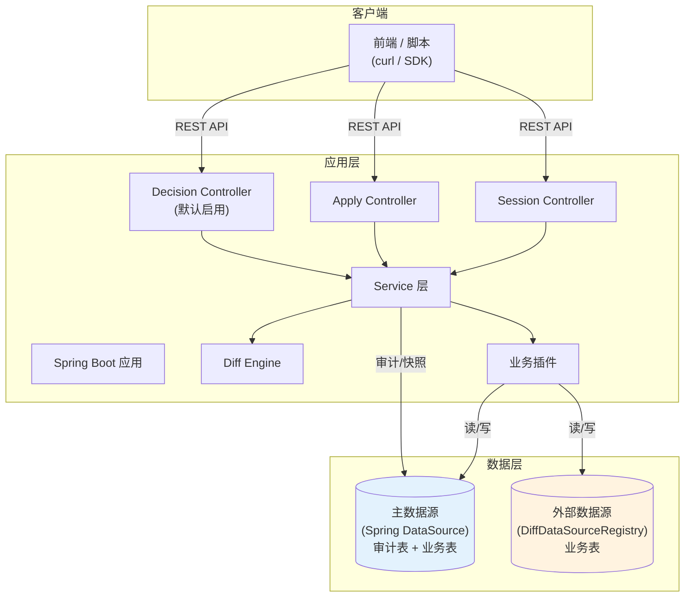
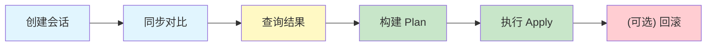
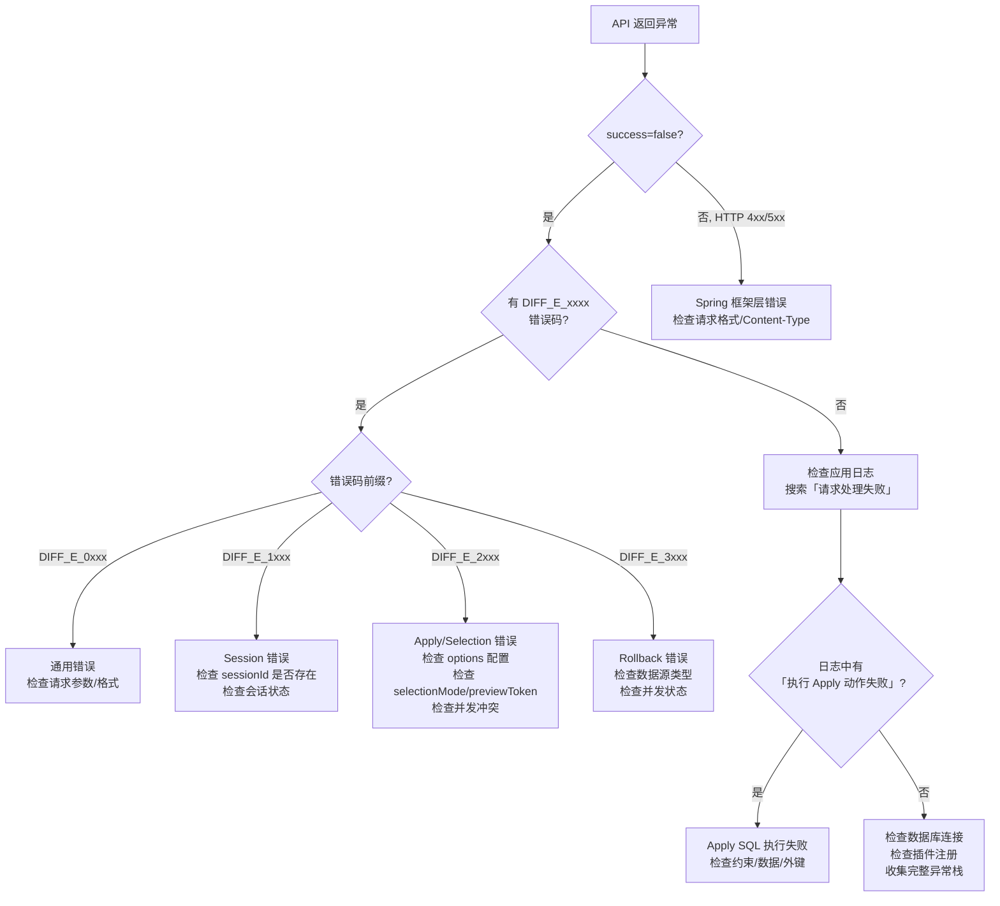
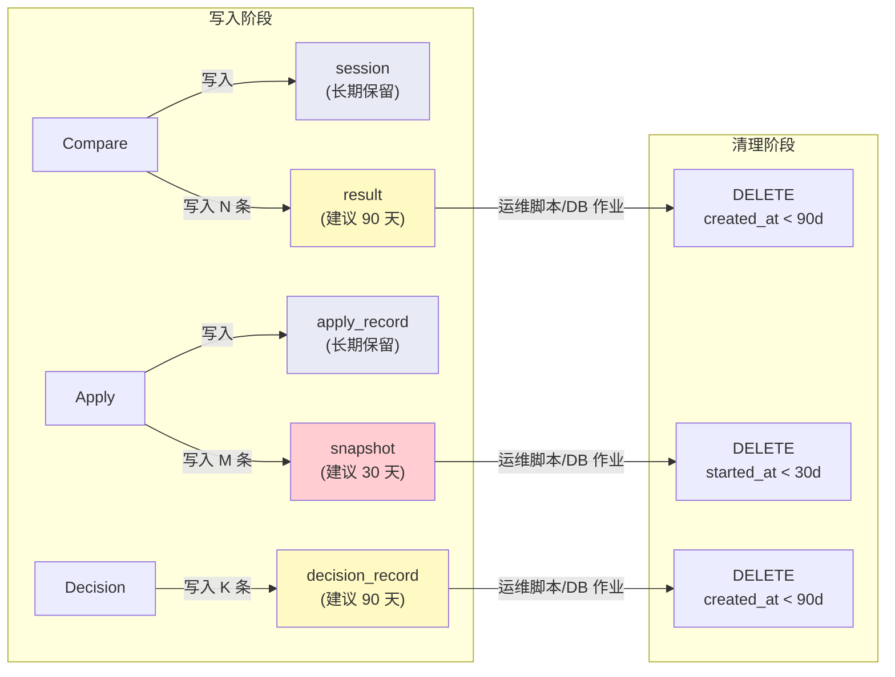

# Tenant Diff 运维手册

> SSOT 版本 | 最后更新：2026-03-22
> 本文档为运维操作唯一权威源，整合了部署、配置、排障、发布、安全的所有内容。

---

## 1. 部署指南

### 1.1 环境要求

| 项目 | 要求 |
|------|------|
| JDK | 17+ |
| 构建工具 | 仓库自带 Maven Wrapper（`./mvnw`） |
| 数据库 | MySQL 5.7+（内置 DDL）/ H2（Demo 与测试，内置 DDL）/ PostgreSQL 10+（需自行准备 DDL，当前发行包未内置 `schema-postgresql.sql`） |
| Spring Boot | 与当前 `pom.xml` 声明版本一致 |
| MyBatis-Plus | 与当前 `pom.xml` 声明版本一致 |

### 1.2 部署架构概览



> **主数据源**：承载审计表（`xai_tenant_diff_*`）+ 业务表（默认场景）
> **外部数据源**：可选，通过 `tenant-diff.datasources.*` 配置，仅承载业务表读写

### 1.3 启用条件

在 `application.properties`（或 `application.yml`、Nacos 等外部配置中心）中设置：

```properties
tenant-diff.standalone.enabled=true
```

该属性控制 `TenantDiffStandaloneConfiguration` 的加载（`@ConditionalOnProperty(prefix = "tenant-diff.standalone", name = "enabled", havingValue = "true")`），该配置类负责装配所有 diff 组件的 Spring Bean，包括：

- `TenantDiffEngine` - 对比引擎
- `PlanBuilder` - Apply 计划构建器
- `StandalonePluginRegistry` - 业务插件注册表
- `StandaloneTenantModelBuilder` - 租户模型构建器
- `StandaloneApplyExecutor` / `StandaloneBusinessDiffApplyExecutor` - Apply 执行器（内部由 `ApplyExecutorCore` 统一驱动）
- `StandaloneSnapshotBuilder` - 快照构建器
- `TenantDiffStandaloneService` / `TenantDiffStandaloneApplyService` / `TenantDiffStandaloneRollbackService` - 业务服务
- `DecisionRecordService` - 决策记录服务
- `TenantDiffStandaloneDecisionController` - Decision REST API（`@ConditionalOnBean(DecisionRecordService.class)`，默认随 standalone 启用；`DecisionRecordService` 由自动配置默认注册）

**验证方式**：调用 `GET /api/tenantDiff/standalone/session/get?sessionId=0`，若返回 **HTTP 404** + `{"success":false,"code":"DIFF_E_1001","message":"会话不存在","data":null}` 说明模块已正常加载。注意：该接口对 `SESSION_NOT_FOUND` 返回 HTTP 404（不是 200），基础设施监控配置需排除此探活路径或按 response body 判断。若全局 Jackson 配置为 `NON_NULL`，`data:null` 可能被省略。也可通过 Actuator beans endpoint 确认 `tenantDiffEngine`、`standalonePluginRegistry` 等 Bean 是否存在。

### 1.4 数据库准备

#### 1.6.1 核心表说明

需要在组件运行所连接的数据库中创建以下表（表名通过 PO 类的 `@TableName` 注解显式指定，前缀为 `xai_`）：

| PO 类 | 实际表名 | 说明 |
|--------|----------|------|
| `TenantDiffSessionPo` | `xai_tenant_diff_session` | 对比会话（含 scopeJson、optionsJson） |
| `TenantDiffResultPo` | `xai_tenant_diff_result` | 对比结果（含 diffJson 大字段） |
| `TenantDiffApplyRecordPo` | `xai_tenant_diff_apply_record` | Apply 审计记录（含 planJson 大字段） |
| `TenantDiffSnapshotPo` | `xai_tenant_diff_snapshot` | Apply 前快照（含 snapshotJson 大字段） |
| `TenantDiffDecisionRecordPo` | `xai_tenant_diff_decision_record` | 决策记录 |
| `TenantDiffApplyLeasePo` | `xai_tenant_diff_apply_lease` | Apply 目标租户互斥租约（跨 session 并发控制） |

#### 1.6.2 DDL 脚本

框架提供两套内置 DDL 脚本（位于 `tenant-diff-standalone/src/main/resources/META-INF/tenant-diff/`）：

| 脚本 | 适用场景 | 说明 |
|------|---------|------|
| `schema-mysql.sql` | MySQL 5.7+ | 包含索引定义（`idx_session_id`、`idx_decision_session_biz` 等） |
| `schema-h2.sql` | H2 内存数据库 | Demo 和测试用，无额外索引 |

可通过配置 `tenant-diff.standalone.schema.init-mode` 控制自动执行（见 §1.5 配置项）。

以下为 H2 版本 DDL（生产环境需使用 MySQL 版本或按目标数据库调整）：

```sql
CREATE TABLE IF NOT EXISTS xai_tenant_diff_session (
    id          BIGINT AUTO_INCREMENT PRIMARY KEY,
    session_key VARCHAR(64),
    source_tenant_id BIGINT,
    target_tenant_id BIGINT,
    scope_json  CLOB,
    options_json CLOB,
    status      VARCHAR(32),
    error_msg   CLOB,
    version     INT DEFAULT 0,
    created_at  TIMESTAMP,
    finished_at TIMESTAMP
);

CREATE TABLE IF NOT EXISTS xai_tenant_diff_result (
    id              BIGINT AUTO_INCREMENT PRIMARY KEY,
    session_id      BIGINT,
    business_type   VARCHAR(64),
    business_table  VARCHAR(128),
    business_key    VARCHAR(255),
    business_name   VARCHAR(255),
    diff_type       VARCHAR(32),
    statistics_json CLOB,
    diff_json       CLOB,
    created_at      TIMESTAMP
);

CREATE TABLE IF NOT EXISTS xai_tenant_diff_apply_record (
    id          BIGINT AUTO_INCREMENT PRIMARY KEY,
    apply_key   VARCHAR(64),
    session_id  BIGINT,
    direction   VARCHAR(32),
    plan_json   CLOB,
    status      VARCHAR(32),
    error_msg   CLOB,
    version     INT DEFAULT 0,
    started_at  TIMESTAMP,
    finished_at TIMESTAMP
);

CREATE TABLE IF NOT EXISTS xai_tenant_diff_snapshot (
    id              BIGINT AUTO_INCREMENT PRIMARY KEY,
    apply_id        BIGINT,
    session_id      BIGINT,
    side            VARCHAR(16),
    business_type   VARCHAR(64),
    business_table  VARCHAR(128),
    business_key    VARCHAR(255),
    snapshot_json   CLOB,
    created_at      TIMESTAMP
);

CREATE TABLE IF NOT EXISTS xai_tenant_diff_decision_record (
    id                  BIGINT AUTO_INCREMENT PRIMARY KEY,
    session_id          BIGINT,
    business_type       VARCHAR(64),
    business_key        VARCHAR(255),
    table_name          VARCHAR(128),
    record_business_key VARCHAR(255),
    diff_type           VARCHAR(32),
    decision            VARCHAR(32),
    decision_reason     CLOB,
    decision_time       TIMESTAMP,
    execution_status    VARCHAR(32),
    execution_time      TIMESTAMP,
    error_msg           CLOB,
    apply_id            BIGINT,
    created_at          TIMESTAMP,
    updated_at          TIMESTAMP
);

CREATE TABLE IF NOT EXISTS xai_tenant_diff_apply_lease (
    id                      BIGINT AUTO_INCREMENT PRIMARY KEY,
    target_tenant_id        BIGINT       NOT NULL,
    target_data_source_key  VARCHAR(64)  NOT NULL,
    session_id              BIGINT       NOT NULL,
    apply_id                BIGINT,
    lease_token             VARCHAR(64)  NOT NULL,
    leased_at               TIMESTAMP    NOT NULL,
    expires_at              TIMESTAMP    NOT NULL,
    CONSTRAINT uk_apply_lease_target UNIQUE (target_tenant_id, target_data_source_key),
    CONSTRAINT uk_apply_lease_token UNIQUE (lease_token)
);
```

**生产环境调整建议**：
- `CLOB` 在 MySQL 中建议使用 `LONGTEXT`，在 PostgreSQL 中使用 `TEXT`
- MySQL 版本 DDL（`META-INF/tenant-diff/schema-mysql.sql`）已包含以下索引，直接使用即可：
  - `xai_tenant_diff_result`: `idx_session_id(session_id)`
  - `xai_tenant_diff_apply_record`: `idx_session_id(session_id)`
  - `xai_tenant_diff_snapshot`: `idx_session_apply(session_id, apply_id)`
  - `xai_tenant_diff_decision_record`: `idx_session_id(session_id)`、`idx_decision_session_biz(session_id, business_type, business_key)`
- MySQL 版本的大字段使用 `LONGTEXT`（diff_json、snapshot_json）或 `TEXT`（其余），已做生产优化
- H2 版本使用 `CLOB`，无索引定义，仅适用于 Demo/测试

**生产环境推荐方式**：

方式一（开发/测试推荐）：配置 `tenant-diff.standalone.schema.init-mode=always`，应用启动时自动执行对应方言的 DDL（`CREATE TABLE IF NOT EXISTS`，不会删除已有数据）。

方式二（生产推荐）：由 DBA 或外部迁移工具执行 MySQL 版本 DDL（`META-INF/tenant-diff/schema-mysql.sql`），配置 `init-mode=none`。

#### 1.4.3 大字段建议

| 字段 | 所在表 | 说明 |
|------|--------|------|
| `diff_json` | `xai_tenant_diff_result` | 含全量字段快照，可能达到 MB 级 |
| `snapshot_json` | `xai_tenant_diff_snapshot` | 含完整业务数据快照，可能达到 MB 级 |
| `plan_json` | `xai_tenant_diff_apply_record` | Apply 计划 JSON，KB 到 MB 级 |
| `scope_json` / `options_json` | `xai_tenant_diff_session` | 通常 KB 级 |

> **apply_lease 表**：`xai_tenant_diff_apply_lease` 为轻量级互斥控制表，无大字段，通过唯一约束实现跨 session 的目标租户互斥。过期租约在 acquire 时自动清理。

生产环境务必使用 `LONGTEXT`（MySQL）或 `TEXT`（PostgreSQL），避免使用 `VARCHAR` 导致截断。

### 1.5 配置项参考

#### 1.5.1 必须配置

| 配置项 | 说明 | 必须 |
|--------|------|------|
| `tenant-diff.standalone.enabled` | 是否启用 standalone 模块 | 是 |
| `spring.datasource.*` | 主数据源配置 | 是 |

#### 1.5.2 Standalone 模块配置

配置前缀：`tenant-diff.standalone.*`（来自 `TenantDiffProperties`）

| 配置项 | 类型 | 默认值 | 说明 |
|--------|------|--------|------|
| `enabled` | boolean | `false` | 是否启用 standalone 模块 |
| `default-ignore-fields` | Set\<String\> | `id, tenantsid, version, data_modify_time, xai_instruction_id, xai_instr_recommended_id, xai_enumeration_id, xai_operation_id, xai_ocr_template_id, baseinstructionid, baseparamid, basedisplayid, baserecommendedid, baseenumid, baseenumvalueid, baseconditionid, baseoperationid, basepromptid` | 默认忽略字段集合（用于 record 内容对比） |
| `main-business-key-field` | String | `main_business_key` | 主业务键的派生字段名 |
| `parent-business-key-field` | String | `parent_business_key` | 父业务键的派生字段名 |

#### 1.5.3 Schema 初始化配置

| 配置项 | 类型 | 默认值 | 说明 |
|--------|------|--------|------|
| `tenant-diff.standalone.schema.init-mode` | String | `none` | DDL 自动执行模式 |
| `tenant-diff.standalone.schema.table-prefix` | String | `xai_tenant_diff_` | 内部表名前缀（通过 MyBatis-Plus `DynamicTableNameInnerInterceptor` 动态替换） |

**init-mode 取值**：

| 值 | 行为 |
|---|------|
| `none` | 不自动建表（生产推荐，由 DBA 手动执行 DDL） |
| `always` | 每次启动自动执行 DDL（`CREATE TABLE IF NOT EXISTS`，不会删除已有数据） |
| `embedded-only` | 仅嵌入式数据库（H2 等）时自动执行 |

**数据库方言识别**：`TenantDiffSchemaInitializer` 通过 JDBC URL 自动识别数据库类型，加载对应的 `META-INF/tenant-diff/schema-{dialect}.sql`。当前支持 `mysql` 和 `h2`；`postgresql` 方言已被识别但尚未提供 DDL 脚本（需自行准备或参照 MySQL 版本调整）。

_代码位置_：`TenantDiffSchemaInitConfiguration`、`TenantDiffSchemaInitializer`

#### 1.5.4 Apply 配置

| 配置项 | 类型 | 默认值 | 说明 |
|--------|------|--------|------|
| `tenant-diff.apply.preview-action-limit` | int | `5000` | Preview 返回的 action 数量上限，超过时返回 `DIFF_E_2014` |
| `tenant-diff.apply.preview-token-ttl` | Duration | `PT30M` | PARTIAL previewToken 的有效期；超过后 execute 返回 `DIFF_E_2015` |
| `tenant-diff.apply.max-compare-age` | Duration | `PT30M` | compare 结果最大可执行年龄；超过后 execute 返回 `DIFF_E_2016` |

#### 1.5.5 多数据源配置

配置前缀：`tenant-diff.datasources.*`（来自 `DiffDataSourceProperties`）

通过 `DiffDataSourceAutoConfiguration` 配置额外数据源，`"primary"` 为保留 key，自动绑定 Spring 主 DataSource，无需手动配置。

```yaml
tenant-diff:
  datasources:
    erp-prod:
      url: jdbc:mysql://host:3306/erp_db
      username: xxx
      password: xxx
      driver-class-name: com.mysql.cj.jdbc.Driver  # 默认值
      maximum-pool-size: 3        # 默认值，低频操作够用
      minimum-idle: 1             # 默认值
      connection-timeout-ms: 30000  # 默认值
      max-lifetime-ms: 1800000    # 默认值（30分钟）
      idle-timeout-ms: 600000     # 默认值（10分钟）
      read-only: true             # source 端建议设为 true
```

| 配置项 | 类型 | 默认值 | 说明 |
|--------|------|--------|------|
| `url` | String | - | JDBC URL |
| `username` | String | - | 用户名 |
| `password` | String | - | 密码 |
| `driver-class-name` | String | `com.mysql.cj.jdbc.Driver` | JDBC 驱动类 |
| `maximum-pool-size` | int | `3` | HikariCP 最大连接数 |
| `minimum-idle` | int | `1` | 最小空闲连接 |
| `connection-timeout-ms` | long | `30000` | 连接超时（ms） |
| `max-lifetime-ms` | long | `1800000` | 连接最大存活时间（ms），跨网段时需低于防火墙/LB 限制 |
| `idle-timeout-ms` | long | `600000` | 空闲连接超时（ms） |
| `read-only` | boolean | `false` | 是否只读 |

**注意**：启动时对每个外部数据源执行连接验证（fail-fast，`initializationFailTimeout=1`），连接失败会阻止应用启动。

插件通过 `LoadOptions.dataSourceKey` 指定读取哪个数据源。`dataSourceKey=erp-prod` 路由到上述数据源；`null` 或 `"primary"` 路由主数据源。

#### 1.5.6 Demo 默认配置

来自 `tenant-diff-demo/src/main/resources/application.yml`：

```yaml
spring:
  application:
    name: tenant-diff-demo
  datasource:
    url: jdbc:h2:mem:tenant_diff;DB_CLOSE_DELAY=-1;MODE=MYSQL
    driver-class-name: org.h2.Driver
    username: sa
    password:
  h2:
    console:
      enabled: true
      path: /h2-console
  sql:
    init:
      mode: always
      schema-locations: classpath:schema.sql

mybatis-plus:
  configuration:
    map-underscore-to-camel-case: true
  global-config:
    db-config:
      id-type: auto

logging:
  pattern:
    console: "%d{yyyy-MM-dd HH:mm:ss.SSS} [%thread] %-5level [sessionId=%X{sessionId}] [applyId=%X{applyId}] %logger{36} - %msg%n"

tenant-diff:
  standalone:
    enabled: true
```

### 1.6 启动与验证

#### 1.6.1 本地启动

```bash
# 方式一：使用脚本
./scripts/demo/start-demo.sh

# 方式二：手动构建并启动
./mvnw -pl tenant-diff-demo -am package -DskipTests
java -jar tenant-diff-demo/target/tenant-diff-demo-0.0.1-SNAPSHOT.jar
```

#### 1.6.2 探活检查

```bash
# 使用脚本
./scripts/demo/health-check.sh

# 手动探活
curl -sS "http://localhost:8080/api/tenantDiff/standalone/session/get?sessionId=0"
```

期望返回：**HTTP 404** + `{"success":false,"code":"DIFF_E_1001","message":"会话不存在","data":null}`

该返回表示 Controller 已加载并可路由。注意 HTTP 状态码为 404 而非 200。

### 1.7 非目标与部署安全边界（Non-goals / Deployment Safety）

- 本组件不处理运行时业务数据同步，不替代数据库复制，也不提供跨主库与外部数据源的分布式事务保障
- 模块只有在 `tenant-diff.standalone.enabled=true` 时才会装配；生产环境建议将其作为显式开关纳入发布参数管理
- 当前没有专用的 `readiness` / `liveness` 端点；若宿主应用未接入 Actuator，则需自行维护 HTTP 探活或脚本探活
<!-- ssot-lint:disable-next-line BND-1 reason="该条只声明预算归属宿主应用与网关，tenant-diff 本身不固化默认值" -->
- `session/create`、`apply/preview`、`apply/execute`、`apply/rollback` 全是同步接口；框架内自动重试预算为 `0`，运维需与调用方显式约定超时、重试和流量控制，避免把同步请求当异步作业重试风暴使用

---

## 2. 运行时行为

### 2.1 请求流程



当前 Standalone 模式下 `create` API 会同步执行对比，调用方需注意超时设置。

### 2.2 事务策略

#### 2.2.1 主库 Apply 事务

**审计记录**（`apply_record`）通过 `ApplyAuditService` 在 `REQUIRES_NEW` 独立事务中持久化，即使业务事务回滚也不丢失。快照（`snapshot`）保存和 SQL 执行在同一个 `@Transactional(rollbackFor = Exception.class)` 内，失败时快照和业务数据变更一起回滚，但审计记录保留为 `FAILED` 状态。

**来源**：`ApplyAuditServiceImpl#createRunningRecord(...)` 使用 `PROPAGATION_REQUIRES_NEW`；`TenantDiffStandaloneApplyServiceImpl#execute(ApplyPlan)` 标记 `@Transactional(rollbackFor = Exception.class)`。

#### 2.2.2 外部数据源 Apply 事务

审计写主库（在 `@Transactional` 范围内），SQL 写外部库（通过 `DataSourceTransactionManager` 手动事务）。两者**不是分布式事务**，可能出现以下不一致：

- 审计记录回滚但外部 SQL 已提交
- 外部 SQL 回滚但审计记录已提交

#### 2.2.3 Apply 审计耐久性

`apply_record` 通过 `ApplyAuditService`（`REQUIRES_NEW` 独立事务）持久化。即使业务事务回滚，审计记录保留为 `FAILED` 状态，包含错误详情和诊断信息（`diagnostics` JSON），可直接在数据库中查询排查。这解决了此前"失败审计丢失"的问题。

排查 Apply 失败时，可通过以下方式定位：
1. **数据库**：查询 `xai_tenant_diff_apply_record WHERE status = 'FAILED'`，`error_msg` 和诊断 JSON 包含失败详情
2. **应用日志**：搜索 `执行 Apply 动作失败` 关键词，含 actionHint 与异常栈

| 操作 | 事务 | 说明 |
|------|------|------|
| 创建会话 + 执行对比 | `TransactionTemplate` 编程式 | 删旧结果 + 插入新结果在同一事务中 |
| Apply 审计记录 | `REQUIRES_NEW` 独立事务 | `ApplyAuditService` 确保审计不随业务事务回滚而丢失 |
| Apply 执行（主库） | `@Transactional(rollbackFor=Exception.class)` | snapshot + SQL 执行在同一事务管理器；审计在独立事务中 |
| Apply 执行（外部数据源） | `DataSourceTransactionManager` 手动事务 | 审计写主库、SQL 写外部库，非分布式事务 |
| Apply 目标互斥租约 | `REQUIRES_NEW` 独立事务 | `ApplyLeaseService` 确保租约生命周期独立于业务事务 |
| Rollback | `@Transactional(rollbackFor=Exception.class)` | 恢复计划执行（v1 仅支持主库方向） |

### 2.3 关键日志模式

日志格式包含 MDC 上下文：`[sessionId=%X{sessionId}] [applyId=%X{applyId}]`，便于按会话/Apply 过滤日志。

| 日志关键字 | 含义 | 级别 |
|------------|------|------|
| `DiffDataSourceRegistry 初始化完成` | 数据源装配完成，列出已注册的数据源 key | INFO |
| `注册 Diff 数据源: key=X, url=Y` | 外部数据源注册成功 | INFO |
| `开始执行 Apply: applyId=X, sessionId=Y, actions=Z` | Apply 执行开始 | INFO |
| `Apply 执行完成: applyId=X, status=Y, affectedRows=Z` | Apply 执行结束 | INFO |
| `租户差异对比警告: sessionId=X, side=source/target, msg=...` | 模型构建阶段警告（单个 businessKey 加载失败） | WARN |
| `执行 Apply 动作失败: action{...}` | Apply 单条动作执行失败，后续动作不再执行 | ERROR |
| `执行 Apply 警告: ... UPDATE/DELETE 影响行数=0` | SQL 执行成功但影响 0 行（数据可能已变化） | WARN |
| `INSERT KeyHolder 未返回自增 ID` | INSERT 成功但未获取生成 ID，影响后续外键替换 | WARN |
| `更新会话状态失败` / `更新 Apply 执行记录失败` | 状态更新失败（通常是数据库连接问题） | WARN |
| `差异结果 JSON 反序列化失败` / `统计信息 JSON 反序列化失败` | 历史数据格式不兼容或数据损坏 | ERROR |
| `租户差异回滚警告: sessionId=X, phase=rollback.current` | 回滚阶段的模型构建警告 | WARN |
| `参数校验失败` / `方法参数校验失败` / `约束校验失败` | 请求参数不合法 | WARN |
| `请求体解析失败` | JSON 请求体格式错误 | WARN |
| `业务异常 [DIFF_E_xxxx]: ...` | 业务逻辑错误（含 Selection/Decision 校验失败） | WARN |
| `请求处理失败` | 未预期的内部异常（含完整栈） | ERROR |
| `Decision 过滤: sessionId=X, 跳过 N 条 SKIP 记录` | Apply buildPlan 阶段按 Decision 过滤 | DEBUG |
| `Apply 目标租约获取成功` / `Apply 目标租约获取失败` | 租约获取结果，失败时另一个 session 正在操作同一目标 | INFO / WARN |
| `Apply 目标租约已释放` | Apply 执行完毕后释放租约 | DEBUG |
| `回滚漂移检测: applyId=X, 检测到 N 处差异` | 目标数据在 Apply 后被外部修改 | WARN |
| `回滚验证: applyId=X, remainingDiffs=N` | 回滚后残余差异数量 | INFO |

### 2.4 失败模式与降级（Failure Modes）

- Compare 失败：`session/create` 内同步执行 compare，异常时 session 状态更新为 `FAILED`；不会生成半成品 `result` 供后续 Apply 使用
- Apply 失败：`apply_record` 通过独立事务（`ApplyAuditService`）保留为 `FAILED` 状态（含错误详情），可在数据库中查询；快照和业务数据变更回滚保证一致性
- 外部数据源 Apply：主库审计与外部库写入不是分布式事务；出现跨库不一致时，应先停止重试，再按 `applyId`、目标库数据和业务键人工核对
- Preview 超限：`/apply/preview` 超过 `tenant-diff.apply.preview-action-limit` 时返回 `DIFF_E_2014`；降级方式是缩小筛选范围，不是截断返回
- Preview token 过期：`selectionMode=PARTIAL` 且 previewToken 超过 `tenant-diff.apply.preview-token-ttl` 时返回 `DIFF_E_2015`；降级方式是重新 preview，而不是复用旧 token
- Compare 结果过期：`session.finishedAt` 超过 `tenant-diff.apply.max-compare-age` 时 execute 返回 `DIFF_E_2016`；降级方式是重新创建 session 并 compare
- Rollback 边界：Rollback v1 仅支持主库 target，外部数据源场景直接返回 `DIFF_E_3001`

---

## 3. 监控指南

### 3.1 关键指标

| 指标 | 来源 | 告警建议 |
|------|------|---------|
| Apply 失败 | `xai_tenant_diff_apply_record.status = 'FAILED'` + 应用日志 `执行 Apply 动作失败` | 任何出现立即告警。审计记录现已通过独立事务持久化，失败也可在 DB 中查询 |
| session 状态 FAILED 数量 | `xai_tenant_diff_session.status = 'FAILED'` | 连续失败 >3 次告警 |
| Apply 审计 | `xai_tenant_diff_apply_record.status` | 用于审计与定位 applyId，`FAILED` 记录含 error_msg 和诊断详情 |
| 租约占用 | `xai_tenant_diff_apply_lease` 表行数 | 正常应为 0 或极少。过期未清理的租约说明 Apply 异常中断 |
| 单次对比耗时 | `session.finishedAt - session.createdAt` | >60s 预警，>300s 告警 |
| result 表行数增长 | `COUNT(*) FROM xai_tenant_diff_result` | 超过阈值提醒清理 |
| 未预期异常 | 应用日志关键字 `请求处理失败` | 出现即告警 |

### 3.2 健康检查

健康检查分两步（由确定性递增到依赖数据）：

#### 3.2.1 探活（不依赖业务数据）

```bash
# 期望返回 HTTP 404 + success=false, code=DIFF_E_1001, message="会话不存在"
# 表示 Controller 已加载并可路由
curl -s -o /dev/null -w "%{http_code}" "http://<host>/api/tenantDiff/standalone/session/get?sessionId=0"
# 返回 404 即为正常
```

该探活仅验证应用已启动且 diff 模块已装配，不依赖任何业务数据。注意：该端点对不存在的 sessionId 返回 HTTP 404（语义化状态码），基础设施监控需按 response body 中的 `code` 字段判断，或改用其他探活路径。当前模块本身没有内建 `readiness` / `liveness` 端点；若宿主应用单独启用了 Actuator，可直接复用宿主健康检查。

#### 3.2.2 功能 Smoke（依赖数据）

```bash
# 建议通过 scope.filter.product 收敛范围，避免全量对比超时
curl -X POST "http://<host>/api/tenantDiff/standalone/session/create" \
  -H "Content-Type: application/json" \
  -d '{
    "sourceTenantId": 1,
    "targetTenantId": 2,
    "scope": {
      "businessTypes": ["EXAMPLE_PRODUCT"],
      "filter": {"product": "已知存在的产品编号"}
    }
  }'
```

**注意**：statistics 值取决于数据库实际数据，不保证为特定值。探活验证通过即表示模块正常装配。

### 3.3 告警建议

| 告警名称 | 触发条件 | 级别 | 说明 |
|----------|---------|------|------|
| Apply 执行失败 | `apply_record.status = 'FAILED'` 或日志中出现 `执行 Apply 动作失败` | P1 | 审计记录已通过独立事务持久化，可同时从 DB 和日志排查 |
| 内部异常 | 日志中出现 `请求处理失败`（ERROR 级别） | P2 | 未预期的运行时异常 |
| 对比超时 | session 耗时 >300s | P2 | 可能是数据量过大或数据库慢查询 |
| 对比连续失败 | session 状态 FAILED 连续 >3 次 | P2 | 检查插件和数据源 |
| 数据增长 | result 表行数超阈值 | P3 | 提醒执行数据清理 |

---

## 4. 故障排查

### 4.0 故障排查决策树



### 4.1 错误码速查

错误码定义位于 `ErrorCode.java`，格式为 `DIFF_E_xxxx`，按功能域分段。

#### 通用错误

**DIFF_E_0001: 请求参数不合法 (PARAM_INVALID)**

- 触发场景：必填参数缺失（如 `sessionId`、`businessType`、`businessKey` 为空）；参数值不合法（如 `diffType` 传入不存在的枚举值）；`selectionMode=PARTIAL` 时传入了子表 actionId（`dependencyLevel>0`）
- 排查步骤：
  1. 检查请求 URL 中的 query parameter 是否完整
  2. 对照 API 文档确认参数名称拼写
  3. 检查参数值类型（如 `sessionId` 应为数值类型）
- 解决方案：补全缺失参数，修正参数值。`diffType` 合法值为 `DiffType` 枚举全名（`BUSINESS_INSERT`、`BUSINESS_DELETE`、`INSERT`、`UPDATE`、`DELETE`、`NOOP` 等），注意 `listBusiness` API 的 diffType 过滤作用于业务级 diff_type 列，常用值为 `BUSINESS_INSERT` 和 `BUSINESS_DELETE`。若为 PARTIAL 勾选执行，请只回传 preview 返回的主表 actionId

**DIFF_E_0002: 请求体格式错误 (REQUEST_BODY_MALFORMED)**

- 触发场景：POST 请求体不是合法 JSON；JSON 字段名或结构与 DTO 定义不匹配；Content-Type 未设置为 `application/json`
- 排查步骤：
  1. 使用 JSON 校验工具检查请求体
  2. 确认请求头包含 `Content-Type: application/json`
  3. 对照 DTO 定义检查字段名和类型
- 解决方案：修正 JSON 语法错误，确保使用正确的 Content-Type

**DIFF_E_0003: 请求处理失败，请稍后重试 (INTERNAL_ERROR)**

- 触发场景：数据库连接异常；Plugin 加载数据时抛出未预期异常；框架内部逻辑错误
- 排查步骤：
  1. 查看应用日志中的完整异常栈（搜索 `请求处理失败`）
  2. 检查数据库连接是否正常
  3. 确认 Plugin 是否正确注册
- 解决方案：修复数据库连接；检查 Plugin 的 SQL 查询和数据处理逻辑；收集完整异常日志联系维护者

#### Session 错误

**DIFF_E_1001: 会话不存在 (SESSION_NOT_FOUND)**

- 触发场景：查询或操作的 `sessionId` 不存在；Session 已被清理或删除
- 排查步骤：
  1. 确认 `sessionId` 值是否正确（通常为创建会话时返回的数值）
  2. 检查是否使用了其他环境的 `sessionId`
  3. 如果使用内存数据库（如 H2），确认应用未重启（重启后数据丢失）
- 解决方案：重新创建对比会话获取新的 `sessionId`
- 备注：Demo 的 health-check 脚本会主动触发此错误（查询 sessionId=0），这是预期行为

**DIFF_E_1002: 业务明细不存在 (BUSINESS_DETAIL_NOT_FOUND)**

- 触发场景：查询的 `(sessionId, businessType, businessKey)` 组合在对比结果中不存在
- 排查步骤：
  1. 通过 `listBusiness` API 确认该 Session 下有哪些业务记录
  2. 检查 `businessType` 是否正确（区分大小写）
  3. 检查 `businessKey` 是否在对比范围内
- 解决方案：使用 `listBusiness` API 获取正确的 `businessType` 和 `businessKey`

```bash
curl 'http://localhost:8080/api/tenantDiff/standalone/session/listBusiness?sessionId=1&pageNo=1&pageSize=100'
```

**DIFF_E_1003: 会话尚未完成对比，无法执行 Apply (SESSION_NOT_READY)**

- 触发场景：会话状态异常（对比过程中出错）
- 排查步骤：
  1. 通过 `get` API 查看会话状态
  2. 检查应用日志中是否有对比阶段异常
- 解决方案：检查日志定位失败原因，重新创建会话
- 备注：当前 Standalone 模式下 `create` API 会同步执行对比，正常情况下不会出现此错误。如果遇到，通常表示对比过程中发生了异常

**DIFF_E_1004: 该会话已有成功的 Apply 记录，请勿重复执行 (SESSION_ALREADY_APPLIED)**

- 触发场景：对同一个 Session 多次调用 Apply execute API
- 排查步骤：确认是否已经对该 Session 执行过 Apply
- 解决方案：如需回滚使用 rollback API；如需重新对比和 Apply，创建新的 Session

#### Apply 错误

**DIFF_E_2001: 影响行数超过安全阈值 (APPLY_THRESHOLD_EXCEEDED)**

- 触发场景：Apply 计划中的操作行数超过 `maxAffectedRows` 限制
- 排查步骤：
  1. 检查 Apply 请求中 `options.maxAffectedRows` 的设置值
  2. 通过 `preview` API 查看预估影响行数
- 解决方案：提高 `maxAffectedRows` 阈值；通过 `options.businessTypes` 或 `options.businessKeys` 缩小范围；分批执行
- 注意：影响行数保护仅在使用 `PlanBuilder` 构建 `ApplyPlan` 时生效（`maxAffectedRows > 0` 时 `estimatedAffectedRows > maxAffectedRows` 则拒绝生成计划）；设为 `<=0` 可禁用

```bash
# 先预览影响范围
curl -X POST 'http://localhost:8080/api/tenantDiff/standalone/apply/preview' \
  -H 'Content-Type: application/json' \
  -d '{"sessionId":1,"direction":"A_TO_B","options":{"maxAffectedRows":100}}'
```

**DIFF_E_2002: 未授权 DELETE 操作 (APPLY_DELETE_NOT_ALLOWED)**

- 触发场景：Apply 计划包含 DELETE 类型操作，但 `options.allowDelete` 未设置为 `true`
- 排查步骤：确认 `options.allowDelete` 的值；确认 `options.diffTypes` 是否包含了 `DELETE`
- 解决方案：设置 `"allowDelete": true`；或从 `options.diffTypes` 中移除 `DELETE`

```bash
# 仅执行 INSERT 和 UPDATE，跳过 DELETE
curl -X POST 'http://localhost:8080/api/tenantDiff/standalone/apply/execute' \
  -H 'Content-Type: application/json' \
  -d '{"sessionId":1,"direction":"A_TO_B","options":{"allowDelete":false,"diffTypes":["INSERT","UPDATE"]}}'
```

**DIFF_E_2003: Apply 记录不存在 (APPLY_RECORD_NOT_FOUND)**

- 触发场景：回滚时指定的 `applyId` 不存在
- 排查步骤：确认 `applyId` 值是否正确（来自 Apply execute 的返回结果）
- 解决方案：使用正确的 `applyId` 重试

**DIFF_E_2004: Apply 记录状态不是 SUCCESS，无法回滚 (APPLY_NOT_SUCCESS)**

- 触发场景：尝试回滚一个未成功完成的 Apply 记录（RUNNING/FAILED 状态均不允许）
- 排查步骤：检查该 Apply 记录的实际状态
- 解决方案：只有状态为 SUCCESS 的 Apply 记录才能回滚；FAILED 的需手动检查并修复目标租户数据

**DIFF_E_2005: 该 Apply 已被回滚，请勿重复执行 (APPLY_ALREADY_ROLLED_BACK)**

- 触发场景：对同一个 `applyId` 多次调用 rollback API
- 解决方案：一个 Apply 只能回滚一次；如需重新对比和同步，创建新的 Session

**DIFF_E_2006: 并发冲突 - Apply (APPLY_CONCURRENT_CONFLICT)**

- 触发场景：多个请求同时对同一个 Session 执行 Apply；乐观锁检测到会话状态已被其他请求修改
- 排查步骤：检查是否有多个客户端或脚本同时提交了 Apply 请求
- 解决方案：确保同一 Session 的 Apply 操作串行执行；重试请求（框架使用乐观锁，不会产生脏数据）

**DIFF_E_2008: 目标租户正在被其他会话操作 (APPLY_TARGET_BUSY)**

- 触发场景：另一个 Session 正在对同一目标租户 + 数据源执行 Apply，互斥租约尚未释放
- 排查步骤：
  1. 查询 `xai_tenant_diff_apply_lease` 表，确认是否有活跃租约
  2. 检查 `expires_at` 是否已过期（默认 TTL 10 分钟）
  3. 若租约过期但未清理，可能是前次 Apply 异常中断
- 解决方案：等待前一个 Apply 完成后重试；若确认前次 Apply 已异常中断，过期租约会在下次 acquire 时自动清理
- 紧急处理：若需强制解锁，可直接删除 `xai_tenant_diff_apply_lease` 表中对应记录（需确认无其他 Apply 正在执行）

#### Selection 错误

**DIFF_E_2010: 未选择任何记录 (SELECTION_EMPTY)**

- 触发场景：`selectionMode=PARTIAL` 但 `selectedActionIds` 为空集合
- 解决方案：至少选择一条 action 再执行

**DIFF_E_2011: 所选记录标识无效 (SELECTION_INVALID_ID)**

- 触发场景：`selectedActionIds` 中的 actionId 缺少 `v1:` 前缀；或 actionId 在当前 plan 的 actions 中不存在（可能是伪造的 id 或 diff 数据已变化）
- 排查步骤：
  1. 检查传入的 actionId 格式是否为 `v1:...`
  2. 重新调用 preview 获取最新的 actionId 列表
- 解决方案：使用 preview 返回的 actionId 值，不要手动构造

**DIFF_E_2012: 数据已变化，请重新预览 (SELECTION_STALE)**

- 触发场景：execute 时传入的 `previewToken` 与服务端重新计算的 token 不匹配，说明 diff 数据或过滤条件在 preview 和 execute 之间发生了变化
- 排查步骤：
  1. 确认 preview 和 execute 使用了相同的过滤条件（`businessTypes`、`businessKeys`、`diffTypes`、`allowDelete`）
  2. 检查是否在 preview 后重新执行了 compare
- 解决方案：重新调用 preview 获取最新的 token 和 actions

**DIFF_E_2014: 预览结果过大 (PREVIEW_TOO_LARGE)**

- 触发场景：preview 返回的 action 数量超过 `previewActionLimit`（默认 5000）
- 解决方案：通过 `options.businessTypes`、`options.businessKeys` 或 `options.diffTypes` 缩小筛选范围

**DIFF_E_2015: 预览令牌已过期，请重新预览 (PREVIEW_TOKEN_EXPIRED)**

- 触发场景：`selectionMode=PARTIAL` 时，客户端回传的 `previewToken` 已超过 `tenant-diff.apply.preview-token-ttl`
- 排查步骤：
  1. 检查 preview 与 execute 之间的时间间隔
  2. 检查当前环境 `tenant-diff.apply.preview-token-ttl` 配置值
- 解决方案：重新调用 preview 获取新的 token 与 action 列表；必要时适当放宽 TTL

**DIFF_E_2016: 对比结果已过期，请重新创建会话 (APPLY_COMPARE_TOO_OLD)**

- 触发场景：execute 时发现 `session.finishedAt` 距当前时间已超过 `tenant-diff.apply.max-compare-age`
- 排查步骤：
  1. 查询 `xai_tenant_diff_session.finished_at`
  2. 检查当前环境 `tenant-diff.apply.max-compare-age` 配置值
  3. 确认是否把很早之前的 session 复用于当前执行
- 解决方案：重新创建 session 并 compare；如业务允许更长人工确认窗口，可增大 `max-compare-age`

#### Rollback 错误

**DIFF_E_3001: 回滚暂不支持外部数据源 (ROLLBACK_DATASOURCE_UNSUPPORTED)**

- 触发场景：对使用外部数据源（非主数据源）的 Apply 记录执行回滚
- 排查步骤：确认该 Apply 记录对应的数据是否涉及外部数据源
- 解决方案：当前版本 Rollback 仅支持主数据源场景；外部数据源场景需手动回滚

**DIFF_E_3002: 并发冲突 - Rollback (ROLLBACK_CONCURRENT_CONFLICT)**

- 触发场景：多个请求同时对同一个 Apply 记录执行回滚
- 解决方案：确保同一 Apply 的回滚操作串行执行；重试请求

**DIFF_E_3003: 快照不完整 (ROLLBACK_SNAPSHOT_INCOMPLETE)**

- 触发场景：回滚时发现部分受影响的 businessKey 缺少对应的快照记录
- 排查步骤：
  1. 查询 `xai_tenant_diff_snapshot WHERE apply_id = ?` 确认实际快照覆盖范围
  2. 与原始 `apply_record.plan_json` 对比，确认哪些 businessKey 缺失
- 解决方案：此 Apply 无法安全回滚，需按 plan 中的 action 列表手动恢复缺失部分

**DIFF_E_3004: 目标数据已被外部修改 (ROLLBACK_DRIFT_DETECTED)**

- 触发场景：回滚前检测到 Apply 后目标数据被外部操作修改（漂移检测）
- 排查步骤：
  1. 确认是否有其他流程在 Apply 后修改了目标租户数据
  2. 评估漂移范围和影响
- 解决方案：若确认可以覆盖外部修改，在请求中设置 `"acknowledgeDrift": true` 重试回滚；若需保留外部修改，则按业务需求手动处理

### 4.2 对比结果为空

**现象**：创建会话成功但 `statistics` 全为 0。

**排查步骤**：
1. 检查 `scope.businessTypes` 是否包含可运行的业务类型（v1 仅支持 `EXAMPLE_PRODUCT` 等已注册插件对应的类型；传入未注册的类型会在 `StandalonePluginRegistry.getRequired()` 阶段报错）
2. 检查 `sourceTenantId` 和 `targetTenantId` 对应的租户是否有数据
3. 查看日志中 `租户差异对比警告` 是否有业务键加载失败
4. 确认 `StandalonePluginRegistry` 是否注册了对应的插件

### 4.3 Apply 执行失败

**现象**：调用 `/api/tenantDiff/standalone/apply/execute` 返回 `success=false`（或 HTTP 400/500）。

**排查步骤**：
1. **数据库审计**：查询 `xai_tenant_diff_apply_record WHERE status = 'FAILED' AND session_id = ?`，`error_msg` 字段包含失败原因（审计记录通过独立事务持久化，不会因业务回滚丢失）
2. **应用日志**：搜索 `执行 Apply 动作失败` 关键词（含 actionHint 与异常栈）
2. 若报 `estimatedAffectedRows(N) exceeds maxAffectedRows(M)`，说明是在构建 `ApplyPlan` 的阶段触发阈值保护，需要收敛 scope/白名单或调整 `maxAffectedRows`
3. 常见原因：
   - `plan contains DELETE but allowDelete=false`：计划含 DELETE 但未开启删除权限
   - `INSERT affectedRows=0`：INSERT 语句执行但未写入（通常是唯一约束冲突）
   - 外键约束失败：子表 INSERT 引用的父表 ID 不存在（检查 IdMapping 和依赖层级）
4. 复核动作列表与排序请以调用方传入的 `ApplyPlan` 为准

### 4.4 回滚失败

**现象**：回滚接口返回错误。

**排查步骤**：
1. `no snapshots found for applyId`：该 Apply 没有保存快照。常见原因：(a) Apply 计划为空（无 actions），不产生快照；(b) Apply 执行失败，业务事务回滚连同 snapshot 一起丢失（注：`apply_record` 通过独立事务保留为 `FAILED` 状态，可查询确认）
2. `DIFF_E_3001`：原始 Apply 打到了非主库数据源，v1 暂不支持外部数据源回滚
3. `snapshotJson parse failed`：快照数据格式损坏
4. 回滚本质是"快照 vs 当前做 diff 再 apply"，如果当前数据已被其他操作修改，恢复结果可能与预期不完全一致

### 4.5 JSON 反序列化失败

**现象**：查询差异明细或统计信息时报错。

**原因**：通常是代码升级后领域模型发生了不兼容变更（新增/删除字段且未加 `@JsonIgnoreProperties(ignoreUnknown = true)`）。

**处理**：
1. 确认当前版本的领域模型类（如 `BusinessDiff`）是否有 `@JsonIgnoreProperties(ignoreUnknown = true)` 注解
2. 若为历史数据不兼容，可能需要数据迁移脚本清理

### 4.6 通用排查建议

1. **查看应用日志**：大多数错误都会在日志中记录完整的异常信息，日志格式包含 `sessionId` 和 `applyId` MDC 上下文
2. **检查请求格式**：使用 `curl -v` 查看完整的请求和响应信息
3. **确认环境**：确保操作的 `sessionId` / `applyId` 与当前环境一致
4. **API 响应格式**：所有 API 返回统一的 `ApiResponse` 格式：

```json
{
  "success": false,
  "code": "DIFF_E_xxxx",
  "message": "错误描述",
  "data": null
}
```

5. **异常处理覆盖范围**：`TenantDiffStandaloneExceptionHandler`（`@RestControllerAdvice(basePackages = "com.diff.standalone.web.controller")`）统一处理 diff 模块异常，包括参数校验（HTTP 400）、JSON 解析（HTTP 400）、业务异常（按错误码映射：404/409/422）和未预期异常（HTTP 500），**所有情况均返回 `ApiResponse` 格式**，不会出现 Spring 默认错误响应

### 4.7 Runbook

| 场景 | 首要确认项 | 立即动作 | 后续动作 |
|------|-----------|---------|---------|
| `session/create` 超时或失败 | 应用日志、数据源连通性、插件加载异常 | 停止自动重试，先确认是否有大范围 scope | 缩小 scope，定位慢 SQL 或插件异常后再重试 |
| Apply 执行失败 | `apply_record.status='FAILED'` + ERROR 日志 `执行 Apply 动作失败` | 暂停重复 execute；查询 `apply_record` 获取错误详情和诊断 JSON | 主库场景按审计记录和日志排障；外部数据源场景额外核对目标库是否已有部分写入 |
| Apply 目标租约超时 | `xai_tenant_diff_apply_lease` 中存在过期租约 | 确认对应 session 的 Apply 是否异常中断 | 过期租约会在下次 acquire 时自动清理；紧急情况可手动删除 |
| PARTIAL 执行被拒绝 | `selectionMode`、`previewToken`、`selectedActionIds`、是否包含子表 action | 重新走一次 preview，使用最新 actionId 与 token | 若业务强依赖子表勾选，按已知限制评估 V2 方案，不要手工伪造 actionId |
| Rollback 失败 | apply_record 状态、target 数据源类型、快照是否存在 | 确认是否命中 `DIFF_E_3001` / `DIFF_E_2004` / `DIFF_E_2005` | 主库方向修复前置状态后再试；外部数据源方向按业务脚本人工回滚 |
| 数据增长过快 | `result` / `snapshot` / `decision_record` 行数与磁盘占用 | 暂停大范围 compare 或 preview | 按第 5 章建议执行分批清理，并复核回滚窗口是否已关闭 |

---

## 5. 数据留存与清理（Retention / Cleanup）

### 5.0 数据生命周期总览



> 当前版本**没有**内建 TTL 或定时清理任务；上图中的 90 天 / 30 天是推荐运维策略，不是框架自动行为。
> **蓝色**：轻量级审计记录，可长期保留（含 Apply 失败记录，通过独立事务持久化）
> **黄色**：中等体量，建议 90 天留存
> **红色**：大字段（MB 级），建议 30 天留存，前提是业务已关闭对应回滚窗口
> **apply_lease 表**：不在图中展示，因为它是临时占用（Apply 进行中持有，完成后自动释放），正常情况下表为空。过期租约在下次 acquire 时自动清理

### 5.1 数据增长预估

| 表 | 每次对比/Apply 增长 | 大字段 |
|----|---------------------|--------|
| `xai_tenant_diff_session` | +1 行 | `scopeJson`、`optionsJson`（KB 级） |
| `xai_tenant_diff_result` | +N 行（N = 业务对象数） | `diffJson`（可能 MB 级，含全量字段快照） |
| `xai_tenant_diff_apply_record` | +1 行 | `planJson`（KB~MB 级） |
| `xai_tenant_diff_snapshot` | +M 行（M = 受影响业务对象数） | `snapshotJson`（可能 MB 级） |
| `xai_tenant_diff_decision_record` | +K 行（K = 决策记录数） | `decisionReason`、`errorMsg`（KB 级） |
| `xai_tenant_diff_apply_lease` | 0~1 行（Apply 进行中临时占用） | 无大字段，Apply 完成后自动释放 |

### 5.2 清理建议与 SQL 示例（运维执行）

- 当前版本未提供清理调度器、TTL 配置或归档任务，以下 SQL 仅作为运维侧执行示例
- **result 表**：对比结果在 Apply 完成后仅用于审计，建议保留 90 天
- **snapshot 表**：快照在回滚窗口关闭后才可清理，建议保留 30 天
- **session / apply_record**：轻量级审计记录，可长期保留
- **decision_record**：决策审计记录，可按需保留

**清理 SQL 示例**（MySQL 兼容）：

```sql
-- 清理 90 天前的对比结果（保留 session 审计记录）
DELETE FROM xai_tenant_diff_result
WHERE created_at < DATE_SUB(NOW(), INTERVAL 90 DAY);

-- 清理 30 天前的快照（MySQL 不允许在 DELETE 子查询中引用同表，需使用 JOIN 语法）
DELETE s FROM xai_tenant_diff_snapshot s
    JOIN xai_tenant_diff_apply_record r ON s.apply_id = r.id
    WHERE r.started_at < DATE_SUB(NOW(), INTERVAL 30 DAY);

-- 清理 90 天前的决策记录
DELETE FROM xai_tenant_diff_decision_record
WHERE created_at < DATE_SUB(NOW(), INTERVAL 90 DAY);

-- 清理过期的 Apply 租约（正常情况下不需要，acquire 时自动清理）
-- 仅在怀疑租约泄漏时使用
DELETE FROM xai_tenant_diff_apply_lease
WHERE expires_at < NOW();
```

---

## 6. 安全运维

### 6.1 API 权限控制（外部前置条件）

diff Controller 无内置鉴权注解。生产环境**必须**通过外部鉴权机制（如 `UserContextFilter` 的 `xai.user-context.rules` 配置）覆盖以下路径并设置 `required=true`，否则接口可被直接访问：

- `/api/tenantDiff/**`（Session + Apply）
- `/api/tenant-diff/**`（Decision）

> **注意**：两组路径前缀不同（`tenantDiff` vs `tenant-diff`），鉴权规则需分别覆盖或使用通配符。

**注意**：`UserContextFilter.shouldNotFilter()` 对未命中 rule 的路径直接放行（不做解析/拦截）；拦截时返回 HTTP 200 + `BaseResponse`（非 diff 组件的 `ApiResponse`）。

**YAML 配置示例**：

```yaml
xai:
  user-context:
    enabled: true
    rules:
      - name: tenant-diff-standalone
        paths:
          - /api/tenantDiff/**
        required: true
        preset: USER_INFO
      - name: tenant-diff-decision
        paths:
          - /api/tenant-diff/**
        required: true
        preset: USER_INFO
```

### 6.2 SQL 注入防护

`StandaloneSqlBuilder` 使用参数化查询（`PreparedStatement`），字段值通过 `?` 占位符传递。表名和列名由插件 `BusinessSchema` 提供（代码内部定义，非用户输入），通过字符串拼接构建。列名按字典序排序以保证 SQL 稳定性。

### 6.3 租户隔离

租户隔离策略在不同层面有不同的实现：

| 层面 | 隔离方式 | 说明 |
|------|----------|------|
| **业务表写操作** | `StandaloneSqlBuilder` 强制带 `tenantsid + id` 双条件 | UPDATE/DELETE 的 WHERE 子句必含 `tenantsid = ? AND id = ?`；INSERT 强制设置 `tenantsid` |
| **业务表读操作** | 由各业务插件在 SQL 中显式带 `tenantsid` | 由插件实现决定，v1 已有的插件均带 `tenantsid` 条件 |
| **审计表** | 不使用 `tenantsid` | session/result/apply_record/snapshot/decision_record 通过 `sourceTenantId`/`targetTenantId`/`sessionId`/`applyId` 等字段关联 |

### 6.4 大字段敏感性

`diffJson`、`snapshotJson`、`planJson` 含完整业务数据（包括字段级明细），需确保：
- 数据库访问权限严格管控
- 数据传输加密（TLS）
- 清理策略按时执行，避免敏感数据长期存储

### 6.5 安全漏洞报告流程

**请不要通过公开 Issue 披露安全漏洞。**

推荐流程：
1. 如果仓库托管平台支持私有安全报告，请优先使用私有报告渠道
2. 如果暂时没有私有报告能力，请先通过维护者私有渠道联系，不要公开披露利用细节
3. 报告中请尽量包含：影响范围、复现步骤、可能后果、修复建议、是否已有临时缓解方案

响应目标：
- 3 个工作日内确认收到报告
- 7 个工作日内给出初步评估
- 修复完成后尽快发布安全说明或修复版本

当前仓库处于 `0.x` 阶段，仅保证最新开发分支和最近一次发布版本的安全修复。

---

## 7. 发布管理

### 7.1 发布前提

建议仅在以下条件满足后执行发布：

- CI 通过（JDK 17 + JDK 21 矩阵）
- 关键集成测试通过
- `CHANGELOG.md` 已更新
- 文档与脚本已同步
- 本次发布的版本号已确定

### 7.2 发布验收清单（Acceptance）

**代码与测试**：
- [ ] `./mvnw test` 通过
- [ ] `./mvnw -pl tenant-diff-demo -am package -DskipTests` 构建成功
- [ ] 关键主流程（create session / query / apply / rollback）已在本机或 CI 环境验证
- [ ] `tenant-diff.standalone.enabled` 开关行为已验证（关闭时不暴露端点，开启后探活返回 `DIFF_E_1001`）
- [ ] PARTIAL 选择链路已验证：preview 返回 actionId/token，篡改 token 返回 `DIFF_E_2012`，子表 actionId 返回 `DIFF_E_0001`

**文档与说明**：
- [ ] `README.md` 已同步
- [ ] `docs/README.md` 已同步
- [ ] `CHANGELOG.md` 已更新
- [ ] 若有破坏性变更，已补迁移说明
- [ ] 留存与清理策略已与运维窗口对齐，无将"推荐策略"误写为"系统自动能力"

**发布元信息**：
- [ ] 版本号已从 `SNAPSHOT` 或开发态切换到目标版本
- [ ] Git tag 命名已确定
- [ ] Release Note 草稿已准备

### 7.3 发布流程

1. 确认工作区干净且所有计划内改动已经合入
2. 更新版本号与 `CHANGELOG.md`
3. 执行测试与打包命令
4. 创建 Git tag
5. 在代码托管平台创建 Release
6. 贴出本次版本的亮点、修复项、破坏性变更和迁移说明

### 7.4 Release Note 建议结构

建议每次发布至少包含：

- Highlights（亮点）
- Fixes（修复）
- Docs / Tooling（文档/工具链）
- Breaking Changes（破坏性变更）
- Migration Notes（迁移说明）

### 7.5 当前限制

- 当前仓库尚未接入自动发布到 Maven Central 的流程
- 当前版本策略仍处于 `0.x` 收敛阶段
- 当前 Demo 主要用于本地体验，不等同于生产级部署模板

---

## 8. CI/CD

### 8.1 当前 CI 配置

来自 `.github/workflows/ci.yml`：

**触发条件**：
- push 到 `main` / `master` 分支
- 所有 Pull Request

**构建矩阵**：
- JDK 17 + JDK 21（`fail-fast: false`，互不影响）
- 运行环境：`ubuntu-latest`

**执行步骤**：
1. Checkout 代码
2. 安装 JDK（Temurin 发行版），启用 Maven 缓存
3. `chmod +x mvnw`
4. `./mvnw -B -ntp verify`（运行测试与校验）
5. `./mvnw -B -ntp -pl tenant-diff-demo -am package -DskipTests`（构建 demo 包）
6. 上传 JaCoCo 覆盖率报告（`always`）
7. 测试失败时上传 Surefire 报告

### 8.2 本地回归命令

```bash
# 运行所有测试
./mvnw test

# 完整 verify（含测试 + 校验）
./mvnw verify

# 仅构建 demo 包（跳过测试）
./mvnw -pl tenant-diff-demo -am package -DskipTests

# 启动 demo
java -jar tenant-diff-demo/target/tenant-diff-demo-0.0.1-SNAPSHOT.jar
```

### 8.3 Smoke Test

项目提供 Smoke Test 脚本（`scripts/smoke-test.sh`），覆盖核心流程：

```bash
# 完整 smoke test（自动构建、启动、测试、停止）
./scripts/smoke-test.sh

# 对已运行的应用执行 smoke test（跳过启动）
SKIP_BOOT=1 ./scripts/smoke-test.sh

# 指定应用地址
BASE_URL=http://myhost:8080 SKIP_BOOT=1 ./scripts/smoke-test.sh
```

**环境变量**：
| 变量 | 默认值 | 说明 |
|------|--------|------|
| `BASE_URL` | `http://localhost:8080` | 应用地址 |
| `MAX_WAIT` | `60` | 最大等待启动秒数 |
| `SKIP_BOOT` | `0` | 设为 `1` 跳过启动步骤 |

**覆盖步骤**：
1. 构建并启动 demo 应用
2. 等待应用就绪（探活轮询）
3. 创建对比会话（`EXAMPLE_PRODUCT`）
4. 查询会话汇总
5. 查询业务摘要列表
6. 查询业务明细
7. 执行 Apply（INSERT + UPDATE，allowDelete=false）
8. 执行 Rollback

---

## 9. 贡献指南

### 9.1 贡献方式

- 报告缺陷或文档问题
- 提交功能建议或架构优化建议
- 补充测试、示例和运维文档
- 扩展新的业务插件与 Apply 支持

在投入较大开发工作前，建议先创建 Issue 讨论以下内容：
- 需求边界是否清晰
- 是否与既有路线图冲突
- 是否涉及破坏性 API / SPI 变更
- 是否需要同步更新文档和 Demo

### 9.2 提交要求

- 变更范围聚焦，不顺手修改无关代码
- 新功能或行为变化附带测试
- 文档、示例、接口说明与代码保持一致
- 如涉及破坏性变更，在 PR 描述中明确说明影响面

### 9.3 PR 清单

提交 PR 前，请自查：

- [ ] 已说明变更目的与动机
- [ ] 已执行 `./mvnw test`
- [ ] 已补充或更新相关测试
- [ ] 已更新 `README` / `docs` / 示例（如适用）
- [ ] 已说明兼容性影响与迁移方式（如适用）

### 9.4 Breaking Change 规范

当变更涉及以下内容时，必须在 PR 描述和 CHANGELOG 中标注 `BREAKING CHANGE:`：

- **SPI 接口变更**：`StandaloneBusinessTypePlugin`、`BusinessApplySupport` 等扩展点的签名变更
- **Domain 模型变更**：`ApplyPlan`、`BusinessDiff`、`SessionStatus` 等对外模型的结构变更
- **数据库 Schema 变更**：`xai_tenant_diff_*` 表结构变更
- **REST API 变更**：端点路径、请求/响应结构变更
- **配置属性变更**：`tenant-diff.*` 配置项的重命名或移除

标注格式示例：

commit message:
```
feat: 重构 Apply 计划构建器

BREAKING CHANGE: PlanBuilder.build() 签名变更，移除了 deprecated 的 options 参数
```

CHANGELOG.md:
```markdown
### Breaking Changes

- **SPI**: `StandaloneBusinessTypePlugin.schema()` 返回类型从 `Map` 改为 `BusinessSchema` (#123)
```

安全问题请不要通过公开 Issue 披露，请先阅读 `SECURITY.md`，按其中流程私下报告。

---

## 10. 已知限制与运维注意事项

1. **Demo 使用 H2 内存数据库**：重启后数据会重建，不适用于生产环境
2. **Apply 示例脚本基于默认种子数据**：不适合作为通用生产脚本
3. ~~**Apply 失败无 DB 审计记录**~~ **已解决**：`apply_record` 通过 `ApplyAuditService`（`REQUIRES_NEW` 独立事务）持久化，失败也保留为 `FAILED` 状态
4. **外部数据源 Apply 非分布式事务**：主库审计与外部库 SQL 之间不保证原子性
5. **Rollback v1 仅支持主库方向**：外部数据源场景需手动回滚
6. **影响行数保护仅 PlanBuilder 阶段校验**：执行端不二次校验 `maxAffectedRows`，绕过 `PlanBuilder` 可能触发大规模写入
7. **业务类型 v1 限制**：当前仅支持已注册插件对应的业务类型，传入未注册类型会在插件路由阶段报错
8. **同步对比可能超时**：`create` API 同步执行对比，大范围对比时需注意客户端和服务端超时设置
9. **并发控制依赖乐观锁**：同一 Session 的 Apply/Rollback 需串行执行，并发请求会触发 `DIFF_E_2006` / `DIFF_E_3002`
10. **自动发布未接入**：当前仓库尚未接入自动发布到 Maven Central 的流程
11. **Selection V1 仅支持主表**：`selectionMode=PARTIAL` 仅允许选择 `dependencyLevel=0` 的主表动作；若传入子表 actionId，会返回 HTTP 400 + `DIFF_E_0001`
12. **ALL 模式无 preview 强制**：`selectionMode=ALL` 可跳过 preview 直接 execute，不要求 previewToken
13. **previewToken / compare 结果有时间窗口**：分别受 `tenant-diff.apply.preview-token-ttl` 与 `tenant-diff.apply.max-compare-age` 控制，超时后需重新 preview 或重新 compare
14. **API 路径前缀不一致**：Session/Apply 使用 `/api/tenantDiff/standalone/`（驼峰），Decision 使用 `/api/tenant-diff/`（连字符），鉴权规则需分别覆盖
