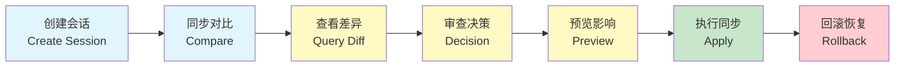
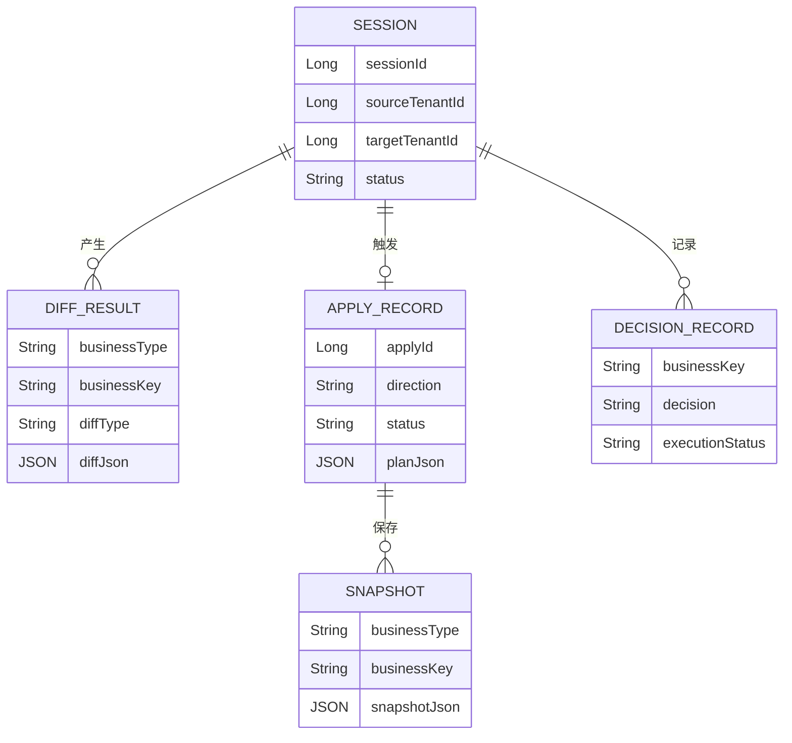
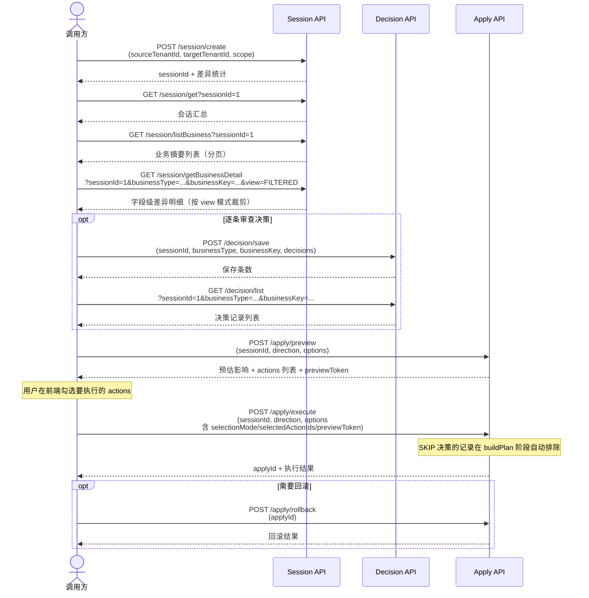

# Tenant Diff 产品需求文档 (PRD)

> SSOT 版本 | 最后更新：2026-03-16
> 本文档为产品需求唯一权威源，整合了需求规格、快速开始、版本策略的所有内容。

---

## 1. 产品概述

### 1.1 背景与定位

在多租户 SaaS 环境中，"标准租户"维护着最佳实践的业务配置（产品定义、API 模板、指令等）。当客户租户需要获取这些配置时，需要一种**可预览、可选择、可回滚**的同步机制，而非直接覆盖。

**Tenant Diff** 是一个面向多租户场景的数据差异对比与同步组件，提供 Compare / Apply / Rollback / SPI 扩展 / Standalone REST API 等能力。

### 1.2 目标用户

| 角色 | 使用场景 |
|------|---------|
| 实施顾问 | 将标准配置同步到客户租户，预览差异后选择性同步 |
| 产品运维 | 批量更新租户配置，出问题时回滚 |
| 开发人员 | 扩展新业务类型的对比与同步能力 |

### 1.3 核心价值主张

- **可视化差异预览**：对比前后一目了然，避免盲目覆盖
- **选择性同步**：支持按业务对象和记录级别选择同步范围，支持逐条 ACCEPT/SKIP 审查决策，用户在前端勾选后仅执行确认的明细
- **安全回滚**：Apply 成功且 plan 含实际动作时自动保存 TARGET 快照，支持按快照恢复
- **插件化扩展**：通过 SPI 机制扩展新的业务类型，无需修改框架代码

### 1.4 核心流程概览



> **Compare 阶段**（蓝色）：按业务键对齐源/目标租户数据，生成差异结果
> **Review 阶段**（黄色）：查询差异明细，逐条审查决策（ACCEPT/SKIP），预览 Apply 影响范围
> **Apply 阶段**（绿色）：执行数据同步（INSERT / UPDATE / DELETE），SKIP 决策的记录自动排除
> **Rollback 阶段**（红色）：基于快照将目标数据恢复到 Apply 前状态

### 1.5 不解决的问题

- 不处理运行时业务数据（订单、库存等）的同步
- 不替代数据库级别的主从复制
- 不提供跨数据库类型的兼容性适配（当前以 MySQL / H2 为主）

### 1.6 业务概念关系



> 一个 **Session** 对应一次完整的对比过程，产生多条 **Diff Result**。
> 对 Session 执行 **Apply** 后生成审计记录，同时保存目标侧 **Snapshot**。
> 回滚时基于 Snapshot 恢复数据。**Decision Record** 记录逐条审查决策（ACCEPT/SKIP），Apply 执行时自动过滤 SKIP 记录。

---

## 2. 快速体验（Quick Start）

### 2.1 环境要求

- JDK `17+`
- 可用的本地 `8080` 端口
- `curl`
- 使用仓库自带 Maven Wrapper，无需单独安装 Maven

### 2.2 启动 Demo

推荐直接使用仓库脚本：

```bash
./scripts/demo/start-demo.sh
```

它会执行：

```bash
./mvnw -pl tenant-diff-demo -am package -DskipTests
java -jar tenant-diff-demo/target/tenant-diff-demo-0.0.1-SNAPSHOT.jar
```

启动成功后，默认访问地址：

- Base URL：`http://localhost:8080`
- H2 Console：`http://localhost:8080/h2-console`
- JDBC URL：`jdbc:h2:mem:tenant_diff`

### 2.3 验证服务已加载

```bash
./scripts/demo/health-check.sh
```

预期返回 `success=false`，`code=DIFF_E_1001`，`message=会话不存在`。这说明：

- 应用已经启动
- 路由已经注册
- `tenant-diff.standalone.enabled=true` 已生效

### 2.4 创建差异会话

Demo 已预置示例数据：

- 租户 `1`：`PROD-001`、`PROD-002`、`PROD-003`
- 租户 `2`：`PROD-001`、`PROD-002`

以 `1 -> 2` 创建会话时，通常能看到：

- `PROD-001`：无变化（NOOP）
- `PROD-002`：更新（UPDATE）
- `PROD-003`：插入（INSERT）

```bash
./scripts/demo/create-session.sh
```

或手动：

```bash
curl -X POST 'http://localhost:8080/api/tenantDiff/standalone/session/create' \
  -H 'Content-Type: application/json' \
  -d '{
    "sourceTenantId": 1,
    "targetTenantId": 2,
    "scope": {
      "businessTypes": ["EXAMPLE_PRODUCT"]
    }
  }'
```

请记录返回结果中的 `sessionId`，后续查询和 Apply 都会用到。

### 2.5 查询差异结果

假设上一步得到的 `sessionId` 为 `1`。

#### 查询会话汇总

```bash
./scripts/demo/get-session.sh 1
```

#### 查询业务摘要列表

```bash
./scripts/demo/list-business.sh 1
```

#### 查询单个业务明细

```bash
./scripts/demo/get-business-detail.sh 1 PROD-002
```

你会看到 `EXAMPLE_PRODUCT` 在 `example_product` 表上的记录级差异。

### 2.6 执行 Apply

> 说明：Demo 提供的是"针对默认种子数据"的演示，目的是让你体验主流程。

当前 Standalone Apply API 由后端重建 Plan（不信任前端传入 actions），直接执行写入：

```bash
./scripts/demo/execute-apply.sh 1
```

或手动：

```bash
curl -X POST 'http://localhost:8080/api/tenantDiff/standalone/apply/execute' \
  -H 'Content-Type: application/json' \
  -d '{
    "sessionId": 1,
    "direction": "A_TO_B",
    "options": {
      "allowDelete": false,
      "maxAffectedRows": 10,
      "businessTypes": ["EXAMPLE_PRODUCT"],
      "diffTypes": ["INSERT", "UPDATE"]
    }
  }'
```

成功时，响应中会包含 `applyId`，用于后续回滚。

### 2.7 执行回滚

假设上一步返回的 `applyId` 为 `1`：

```bash
./scripts/demo/rollback.sh 1
```

或手动：

```bash
curl -X POST 'http://localhost:8080/api/tenantDiff/standalone/apply/rollback' \
  -H 'Content-Type: application/json' \
  -d '{"applyId": 1}'
```

### 2.8 Demo 脚本清单

| 脚本 | 用途 |
|------|------|
| `scripts/demo/start-demo.sh` | 构建并启动 Demo |
| `scripts/demo/health-check.sh` | 路由探活 |
| `scripts/demo/create-session.sh` | 创建对比会话 |
| `scripts/demo/get-session.sh` | 查询会话汇总 |
| `scripts/demo/list-business.sh` | 查询业务摘要 |
| `scripts/demo/get-business-detail.sh` | 查询单个业务明细 |
| `scripts/demo/execute-apply.sh` | 执行 Demo Apply |
| `scripts/demo/rollback.sh` | 回滚某次 Apply |

### 2.9 常见问题

**Q: `code=DIFF_E_1001` 是错误吗？**

不是。这是健康检查的预期结果，表示 Controller 已加载成功，但当前查询的会话不存在。

**Q: 为什么 `execute-apply.sh` 只能演示默认数据？**

因为当前 Demo 计划模板是基于默认种子数据构造的，目的是帮助你体验 API 主流程。生产环境应由后端根据 diff 结果动态构建 `ApplyPlan`。

**Q: 端口被占用怎么办？**

释放 `8080`，或修改 `tenant-diff-demo/src/main/resources/application.yml` 中的端口配置后重新启动。

---

## 3. 功能规格

### 3.1 对比会话管理

#### 3.1.1 创建对比会话

**接口**：`POST /api/tenantDiff/standalone/session/create`

**请求体** (`CreateDiffSessionRequest`)：

| 字段 | 类型 | 必填 | 说明 |
|------|------|------|------|
| `sourceTenantId` | Long | 是 | 源租户 ID（通常为"标准租户"） |
| `targetTenantId` | Long | 是 | 目标租户 ID（客户租户） |
| `scope` | TenantModelScope | 是 | 对比范围 |
| `scope.businessTypes` | List\<String\> | 是 | 对比的业务类型列表 |
| `scope.filter` | ScopeFilter | 否 | 业务键过滤条件 |
| `options` | DiffSessionOptions | 否 | 对比选项（含 diffRules、加载选项等） |

**行为**：创建会话后**立即同步执行**对比，返回汇总结果。

**响应** (`ApiResponse<DiffSessionSummaryResponse>`)：

| 字段 | 类型 | 说明 |
|------|------|------|
| `data.sessionId` | Long | 会话 ID |
| `data.sourceTenantId` | Long | 源租户 ID |
| `data.targetTenantId` | Long | 目标租户 ID |
| `data.status` | SessionStatus | 会话状态：`CREATED` / `RUNNING` / `SUCCESS` / `FAILED` |
| `data.statistics` | DiffStatistics | 差异统计 |
| `data.createdAt` | LocalDateTime | 创建时间 |
| `data.finishedAt` | LocalDateTime | 完成时间 |
| `data.errorMsg` | String | 错误信息（若有） |

**限制**：当前为同步执行，大数据量可能超时。

#### 3.1.2 查询会话汇总

**接口**：`GET /api/tenantDiff/standalone/session/get`

**参数**：`sessionId`（必填，Long）

**响应**：同 3.1.1 的 `DiffSessionSummaryResponse`。

#### 3.1.3 分页查询业务摘要

**接口**：`GET /api/tenantDiff/standalone/session/listBusiness`

**参数**：

| 参数 | 类型 | 必填 | 默认值 | 说明 |
|------|------|------|--------|------|
| `sessionId` | Long | 是 | - | 会话 ID |
| `businessType` | String | 否 | - | 按业务类型过滤 |
| `diffType` | String | 否 | - | 按差异类型过滤，传 `DiffType` 枚举值（业务级过滤常用 `BUSINESS_INSERT`、`BUSINESS_DELETE`；传入其他枚举值如 `INSERT` 虽不报错但不会匹配结果表中的业务级记录） |
| `pageNo` | int | 否 | 1 | 页码 |
| `pageSize` | int | 否 | 20 | 每页大小（服务端硬上限 200，超过自动截断） |

**响应** (`ApiResponse<PageResult<TenantDiffBusinessSummary>>`)：

每条摘要包含：

| 字段 | 类型 | 说明 |
|------|------|------|
| `sessionId` | Long | 会话 ID |
| `businessType` | String | 业务类型 |
| `businessTable` | String | 主表名 |
| `businessKey` | String | 业务键 |
| `businessName` | String | 业务名称 |
| `diffType` | DiffType | 差异类型 |
| `statistics` | DiffStatistics | 差异统计 |
| `createdAt` | LocalDateTime | 创建时间 |

#### 3.1.4 查询业务差异明细

**接口**：`GET /api/tenantDiff/standalone/session/getBusinessDetail`

**参数**：

| 参数 | 类型 | 必填 | 默认值 | 说明 |
|------|------|------|--------|------|
| `sessionId` | Long | 是 | - | 会话 ID |
| `businessType` | String | 是 | - | 业务类型 |
| `businessKey` | String | 是 | - | 业务键 |
| `view` | DiffDetailView | 否 | `FULL` | 视图模式（控制返回详细程度） |

**视图模式说明**：

| 模式 | 行为 |
|------|------|
| `FULL` | 原始引擎输出，含 NOOP 记录 + 全量 sourceFields/targetFields（向后兼容默认值） |
| `FILTERED` | 过滤 NOOP 记录 + 按 Schema `showFieldsByTable` 投影展示字段，保留 sourceFields/targetFields |
| `COMPACT` | 过滤 NOOP 记录 + 投影展示字段 + 裁剪 sourceFields/targetFields 为 null（适合移动端/列表概览） |

> `FILTERED` 和 `COMPACT` 模式会重算 `TableDiffCounts` 和 `DiffStatistics`，统计结果仅反映过滤后的有变化记录。

**响应** (`ApiResponse<BusinessDiff>`)：业务级差异对象，包含表级 / 记录级 / 字段级差异明细（详细程度取决于 `view` 参数）。

### 3.2 Apply（同步执行）

#### 3.2.1 预览 Apply 影响范围

**接口**：`POST /api/tenantDiff/standalone/apply/preview`

**请求体** (`ApplyExecuteRequest`)：

| 字段 | 类型 | 必填 | 说明 |
|------|------|------|------|
| `sessionId` | Long | 是 | 关联的对比会话 |
| `direction` | ApplyDirection | 是 | `A_TO_B`（源->目标）或 `B_TO_A`（目标->源） |
| `options` | ApplyOptions | 否 | 允许删除、影响行数上限、白名单过滤等 |

**响应** (`ApiResponse<ApplyPreviewResponse>`)：

| 字段 | 类型 | 说明 |
|------|------|------|
| `data.sessionId` | Long | 会话 ID |
| `data.direction` | ApplyDirection | Apply 方向 |
| `data.statistics` | ApplyStatistics | 影响行数统计 |
| `data.businessTypePreviews` | List | 按 businessType 分组的操作统计（insertCount / updateCount / deleteCount / totalActions） |
| `data.previewToken` | String | 一致性令牌（`pt_v1_` + 32 位 hex），execute 时 `selectionMode=PARTIAL` 必须回传 |
| `data.actions` | List\<ActionPreviewItem\> | action 级明细列表，前端据此展示勾选 UI（含 actionId、businessType、businessKey、tableName、recordBusinessKey、diffType、dependencyLevel） |

**行为**：后端从数据库加载 diff 结果重建 Plan，**不写库**，仅返回预估影响范围。preview 时强制 `selectionMode=ALL`，忽略客户端传入的 selection 参数。action 数量超过 `previewActionLimit`（默认 5000）时返回 `DIFF_E_2014`。

#### 3.2.2 执行同步

**接口**：`POST /api/tenantDiff/standalone/apply/execute`

**请求体**：同 3.2.1 的 `ApplyExecuteRequest`。

**ApplyOptions 补充字段**（用于选择性执行）：

| 字段 | 类型 | 必填 | 说明 |
|------|------|------|------|
| `selectionMode` | SelectionMode | 否 | `ALL`（默认，全量执行）或 `PARTIAL`（仅执行勾选项） |
| `selectedActionIds` | Set\<String\> | PARTIAL 时必填 | 用户勾选的 actionId 集合（来自 preview 响应的 `actions[].actionId`） |
| `previewToken` | String | PARTIAL 时必填 | preview 响应返回的一致性令牌，防止 diff 数据在 preview 和 execute 之间发生变化 |

**行为**：

1. 后端从数据库加载 diff 结果重建 Plan（不信任前端传入 actions）
2. 若 `selectionMode=PARTIAL`：校验 previewToken 一致性 → 校验 selectedActionIds 有效性 → 过滤为用户选中的子集
3. 记录审计（`apply_record`）
4. 保存 TARGET 侧 apply 前快照
5. 逐条执行 INSERT / UPDATE / DELETE SQL
6. 返回执行结果

**响应** (`ApiResponse<TenantDiffApplyExecuteResponse>`)：

| 字段 | 类型 | 说明 |
|------|------|------|
| `data.applyId` | Long | 本次 Apply 的唯一标识（用于后续回滚） |
| `data.sessionId` | Long | 关联会话 ID |
| `data.direction` | ApplyDirection | Apply 方向 |
| `data.status` | ApplyRecordStatus | `RUNNING` / `SUCCESS` / `FAILED` |
| `data.errorMsg` | String | 错误信息 |
| `data.startedAt` | LocalDateTime | 开始时间 |
| `data.finishedAt` | LocalDateTime | 完成时间 |
| `data.applyResult` | ApplyResult | 执行结果（影响行数、ID 映射、错误明细） |

> 注：成功时返回 `ApiResponse.ok(data)`；失败时返回 `ApiResponse.fail(message)` 且 `data=null`。

### 3.3 Rollback（回滚）

#### 3.3.1 回滚同步

**接口**：`POST /api/tenantDiff/standalone/apply/rollback`

**请求体** (`ApplyRollbackRequest`)：

| 字段 | 类型 | 必填 | 说明 |
|------|------|------|------|
| `applyId` | Long | 是 | 需回滚的 Apply 记录 ID |

**行为**：

1. 加载 apply 前快照
2. 构建当前 TARGET 模型
3. 快照 vs 当前 TARGET 再次 diff
4. 生成恢复计划并执行（允许 DELETE）
5. TARGET 恢复到 apply 前状态

**响应** (`ApiResponse<TenantDiffRollbackResponse>`)：

| 字段 | 类型 | 说明 |
|------|------|------|
| `data.applyId` | Long | 被回滚的 Apply ID |
| `data.applyResult` | ApplyResult | 回滚执行结果 |

**限制**：Rollback v1 仅支持 target=primary 方向，外部数据源回滚暂不支持。

### 3.4 审查决策管理（Decision）

> Decision 功能为 opt-in 设计：仅当 `DecisionRecordService` Bean 存在时，Decision Controller 才会注册。路径前缀为 `/api/tenant-diff/decision`。

#### 3.4.1 批量保存审查决策

**接口**：`POST /api/tenant-diff/decision/save`

**请求体** (`SaveDecisionsRequest`)：

| 字段 | 类型 | 必填 | 说明 |
|------|------|------|------|
| `sessionId` | Long | 是 | 关联的对比会话 |
| `businessType` | String | 是 | 业务类型 |
| `businessKey` | String | 是 | 业务键 |
| `decisions` | List\<DecisionItem\> | 是 | 逐条决策列表 |

**DecisionItem 结构**：

| 字段 | 类型 | 说明 |
|------|------|------|
| `tableName` | String | 表名 |
| `recordBusinessKey` | String | 记录业务键 |
| `diffType` | String | 差异类型 |
| `decision` | String | `ACCEPT` 或 `SKIP` |
| `decisionReason` | String | 决策原因（可选） |

**行为**：upsert 语义——按 `(sessionId, businessType, businessKey, tableName, recordBusinessKey)` 组合键匹配，存在则更新，不存在则新建。

**响应** (`ApiResponse<Integer>`)：实际保存的条数。

#### 3.4.2 查询审查决策列表

**接口**：`GET /api/tenant-diff/decision/list`

**参数**：

| 参数 | 类型 | 必填 | 说明 |
|------|------|------|------|
| `sessionId` | Long | 是 | 会话 ID |
| `businessType` | String | 是 | 业务类型 |
| `businessKey` | String | 是 | 业务键 |

**响应** (`ApiResponse<List<TenantDiffDecisionRecordPo>>`)：该业务对象下的所有决策记录。

#### 3.4.3 Decision 与 Apply 的联动

当 `DecisionRecordService` Bean 存在时，Apply 的 `buildPlan` 阶段会在 `PlanBuilder.build()` 之前自动执行 Decision 过滤：将标记为 `SKIP` 的记录从 diff 结果中移除，使其不进入 Apply 计划。过滤粒度为 `tableName|recordBusinessKey` 组合。

典型交互流程：
1. 创建会话并对比
2. 查看差异明细
3. 对每条记录做 ACCEPT / SKIP 决策（调用 `/decision/save`）
4. 执行 Apply（SKIP 的记录自动被排除）

---

## 4. API 合约速查

### 4.1 端点列表

| 方法 | 路径 | 说明 |
|------|------|------|
| POST | `/api/tenantDiff/standalone/session/create` | 创建会话并执行对比 |
| GET | `/api/tenantDiff/standalone/session/get` | 查询会话汇总 |
| GET | `/api/tenantDiff/standalone/session/listBusiness` | 分页查询业务摘要 |
| GET | `/api/tenantDiff/standalone/session/getBusinessDetail` | 查询业务差异明细（支持 `view` 参数） |
| POST | `/api/tenantDiff/standalone/apply/preview` | 预览 Apply 影响范围（不写库） |
| POST | `/api/tenantDiff/standalone/apply/execute` | 执行 Apply（写库） |
| POST | `/api/tenantDiff/standalone/apply/rollback` | 回滚 Apply |
| POST | `/api/tenant-diff/decision/save` | 批量保存审查决策（opt-in，需 `DecisionRecordService` Bean） |
| GET | `/api/tenant-diff/decision/list` | 查询审查决策列表（opt-in） |

> **路径前缀说明**：Session/Apply API 使用 `/api/tenantDiff/standalone/` 前缀；Decision API 使用 `/api/tenant-diff/` 前缀（带连字符）。

### 4.2 典型 API 交互时序



### 4.3 统一响应格式

所有 API 返回统一的 `ApiResponse` 格式：

```json
{
  "success": true,
  "code": null,
  "message": "OK",
  "data": { ... }
}
```

失败时：

```json
{
  "success": false,
  "code": "DIFF_E_xxxx",
  "message": "错误描述",
  "data": null
}
```

**HTTP 状态码映射**：异常处理器根据错误类型返回语义化的 HTTP 状态码：

| HTTP 状态码 | 错误类型 |
|-------------|---------|
| 400 Bad Request | 参数校验失败、JSON 解析失败、非法参数 |
| 404 Not Found | SESSION_NOT_FOUND、APPLY_RECORD_NOT_FOUND、BUSINESS_DETAIL_NOT_FOUND |
| 409 Conflict | APPLY_CONCURRENT_CONFLICT、ROLLBACK_CONCURRENT_CONFLICT、SESSION_ALREADY_APPLIED |
| 422 Unprocessable Entity | 其他业务异常（如 SELECTION_STALE、APPLY_THRESHOLD_EXCEEDED 等） |
| 500 Internal Server Error | 未预期的内部异常 |

> 注：`ApiResponse.fail(String message)` 会对 message 做安全过滤，包含 `exception`、`sql`、`jdbc` 等关键字或长度超过 120 字符的消息会被替换为"请求处理失败"。

### 4.4 错误码速查表

错误码定义于 `ErrorCode.java`，格式为 `DIFF_E_xxxx`，按功能域分段。

#### 通用错误

| 错误码 | 标识 | 消息 |
|--------|------|------|
| `DIFF_E_0001` | PARAM_INVALID | 请求参数不合法 |
| `DIFF_E_0002` | REQUEST_BODY_MALFORMED | 请求体格式错误 |
| `DIFF_E_0003` | INTERNAL_ERROR | 请求处理失败，请稍后重试 |

#### Session 错误

| 错误码 | 标识 | 消息 |
|--------|------|------|
| `DIFF_E_1001` | SESSION_NOT_FOUND | 会话不存在 |
| `DIFF_E_1002` | BUSINESS_DETAIL_NOT_FOUND | 业务明细不存在 |
| `DIFF_E_1003` | SESSION_NOT_READY | 会话尚未完成对比，无法执行 Apply |
| `DIFF_E_1004` | SESSION_ALREADY_APPLIED | 该会话已有成功的 Apply 记录，请勿重复执行 |

#### Apply 错误

| 错误码 | 标识 | 消息 |
|--------|------|------|
| `DIFF_E_2001` | APPLY_THRESHOLD_EXCEEDED | 影响行数超过安全阈值 |
| `DIFF_E_2002` | APPLY_DELETE_NOT_ALLOWED | 未授权 DELETE 操作 |
| `DIFF_E_2003` | APPLY_RECORD_NOT_FOUND | Apply 记录不存在 |
| `DIFF_E_2004` | APPLY_NOT_SUCCESS | Apply 记录状态不是 SUCCESS，无法回滚 |
| `DIFF_E_2005` | APPLY_ALREADY_ROLLED_BACK | 该 Apply 已被回滚，请勿重复执行 |
| `DIFF_E_2006` | APPLY_CONCURRENT_CONFLICT | 并发冲突：当前会话正在执行 Apply 或已被其他请求处理 |
| `DIFF_E_2010` | SELECTION_EMPTY | 未选择任何记录 |
| `DIFF_E_2011` | SELECTION_INVALID_ID | 所选记录标识无效 |
| `DIFF_E_2012` | SELECTION_STALE | 数据已变化，请重新预览 |
| `DIFF_E_2014` | PREVIEW_TOO_LARGE | 预览结果过大，请缩小筛选范围 |

#### Rollback 错误

| 错误码 | 标识 | 消息 |
|--------|------|------|
| `DIFF_E_3001` | ROLLBACK_DATASOURCE_UNSUPPORTED | 回滚暂不支持外部数据源 |
| `DIFF_E_3002` | ROLLBACK_CONCURRENT_CONFLICT | 并发冲突：当前 Apply 正在回滚或已被其他请求处理 |

---

## 5. 业务规则

### 5.1 对比规则

| 规则 | 说明 |
|------|------|
| 业务键对齐 | 以 `businessType#businessTable#businessKey` 复合键对齐业务对象 |
| 记录键对齐 | 以 `recordBusinessKey` 对齐同一表内的记录，而非物理 ID |
| 指纹优化 | 记录字段集合的 MD5 指纹一致时跳过字段级对比 |
| 忽略字段 | 默认忽略字段以 `DiffDefaults.DEFAULT_IGNORE_FIELDS` 为准（含 id、tenantsid、version、data_modify_time、外键字段、base* 继承字段等），可通过 `DiffRules` 覆盖 |
| 容错不阻断 | 单个 businessKey 加载失败不影响全局，异常收集为 warnings |
| 结果可重跑 | 同一 session 重跑 compare 时先删旧结果再插入，保证幂等 |

### 5.2 Apply 规则

| 规则 | 说明 |
|------|------|
| 后端重建 Plan | 执行端从数据库加载 diff 结果重建 Plan，不信任前端传入的 actions |
| DELETE 保护 | 默认禁止 DELETE，需 `allowDelete=true` 显式开启 |
| 影响行数保护 | `maxAffectedRows > 0` 时超过阈值拒绝生成计划（仅 `PlanBuilder.build()` 阶段校验；执行端不二次校验） |
| 执行顺序 | INSERT / UPDATE 先执行（依赖层级升序），DELETE 后执行（依赖层级降序） |
| 外键替换 | INSERT 生成的新 ID 通过 `IdMapping` 传递给子表的字段转换 |
| 方向反转 | `B_TO_A` 时 INSERT 与 DELETE 互换，UPDATE 不变 |
| 审计追溯 | 每次 Apply 写入 `apply_record`（含完整 planJson） |
| 快照保存 | Apply 前自动保存 TARGET 侧快照（actions 为空则不快照） |
| Selection 防篡改 | PARTIAL 模式下 previewToken 防止 diff 数据过时，actionId 由服务端确定性生成且存在性校验 |
| Selection 主表限制 | V1 PARTIAL 仅支持 dependencyLevel=0 的主表动作，子表动作被排除 |
| Preview 大小保护 | preview action 数量超过 `previewActionLimit`（默认 5000）时拒绝返回 |
| Decision 过滤 | 若 `DecisionRecordService` Bean 存在，buildPlan 前按 `DecisionType.SKIP` 自动移除对应记录，不进入 Apply 计划 |

### 5.3 回滚规则

| 规则 | 说明 |
|------|------|
| 快照恢复 | 基于 apply 前 TARGET 快照与当前 TARGET 的 diff 生成恢复计划 |
| 外键字段纳入 | 回滚在同一租户内执行，外键字段不应被忽略 |
| 允许 DELETE | 回滚计划默认允许 DELETE（用于删除 Apply 新增的记录） |
| 数据源限制 | v1 仅支持 target=primary 方向，外部数据源回滚暂不支持 |

---

## 6. 支持的业务类型

### 6.1 当前已实现

| 业务类型 | 标识 | 模块 | 说明 |
|---------|------|------|------|
| 示例产品（单表） | `EXAMPLE_PRODUCT` | tenant-diff-demo | 单表演示插件，展示最小实现 |
| 示例订单（多表） | `EXAMPLE_ORDER` | tenant-diff-demo | 多表 + 外键演示插件，展示父子表场景 |

### 6.2 扩展方式

新业务类型通过实现两个 SPI 接口扩展：

1. `StandaloneBusinessTypePlugin`：定义业务类型、Schema、数据加载
2. `BusinessApplySupport`：定义 Apply 阶段的字段变换

注册为 Spring Bean 后，框架自动发现并注册。`scope.businessTypes` 传入未注册的类型会在插件路由阶段失败。

详细开发指南请参考 `docs/design-doc.md` 的"插件开发指南"章节。

---

## 7. 非功能性需求

### 7.1 可用性

- `TenantDiffStandaloneExceptionHandler`（`@RestControllerAdvice`）统一拦截所有异常，所有响应均返回 `ApiResponse` 格式
- `@Valid` 校验失败、JSON 解析失败、`ConstraintViolationException` 等均被拦截并返回 `ApiResponse`（HTTP 400）
- `TenantDiffException` 按错误码映射到语义化 HTTP 状态码（400/404/409/422/500），而非统一返回 200
- 非法 `diffType` 入参抛出的 `IllegalArgumentException` 也被拦截，返回 HTTP 400 + `DIFF_E_0001`

### 7.2 可追溯性

- 对比会话记录（session_po）：scope + options + 状态 + 时间戳
- 对比结果记录（result_po）：每个业务对象一条，含完整 diffJson
- Apply 审计记录（apply_record_po）：完整 planJson + 执行状态
- Apply 前快照（snapshot_po）：每个受影响业务对象的完整数据备份

> 注：Apply 失败时事务回滚会连同 apply_record 和 snapshot 一起丢失，排查需依赖应用日志。

### 7.3 可测试性

- 核心对比引擎 `TenantDiffEngine` 无 Spring 运行时耦合，可独立单测
- `PlanBuilder` 无外部依赖，可独立单测
- 业务插件通过接口隔离，可 mock 测试
- Demo 模块提供完整的集成测试套件

---

## 8. 版本策略

### 8.1 当前阶段

项目当前处于 `0.x` 阶段：

- 功能可试用，但 Public API / SPI 仍在收敛
- 允许发生不兼容调整
- 每次发布都应明确列出破坏性变更

### 8.2 版本号约定

采用三段式版本：`MAJOR.MINOR.PATCH`

在 `0.x` 阶段：

- `0.MINOR.0`：一次功能批次或边界调整发布，可能包含不兼容变化
- `0.MINOR.PATCH`：Bug 修复、文档修正、测试补强、非破坏性小改动

### 8.3 模块版本

以下模块保持同版本发布：

- `tenant-diff-core`
- `tenant-diff-standalone`
- `tenant-diff-demo`

当前阶段不做模块级独立版本管理。

### 8.4 兼容性承诺

**`0.x` 阶段**：默认不承诺完整二进制兼容或源代码兼容，但维护者应尽量做到：

- 在同一 `0.MINOR` 下，`PATCH` 版本不主动引入破坏性变更
- 破坏性变更必须在 `CHANGELOG.md` 和 Release Note 中明确说明
- 对 Demo 路径和主文档入口尽量保持连续可用

**未来 `1.0` 之后**：提升为更严格的兼容性承诺（API / SPI 稳定面、弃用周期、升级指南）。

### 8.5 破坏性变更处理

以下改动视为破坏性变更：

- 公共 Maven 坐标变化
- 包名、类名、接口签名变化
- REST API 请求 / 响应字段的非兼容变化
- SPI 方法签名变化
- 默认行为变化导致既有集成无法按原方式运行

出现这类改动时，至少要同步：

- 更新 `CHANGELOG.md`
- 在 PR 中标注兼容性影响
- 在 Release Note 中提供迁移说明

---

## 9. 产品路线图

### 9.1 已完成

- Phase 0：Apply 链路安全基线（后端重建 Plan、DRY_RUN、事务边界验证）
- Phase 1：核心测试补齐（引擎、Service、Rollback 端到端、多表 Plugin 模板）
- 仓库治理基线（README、LICENSE、CI、Issue/PR 模板）
- 第一轮模块拆分（core / standalone / demo）
- 文档入口重建

### 9.2 进行中

- Phase 2：业务可落地（真实业务 Plugin 开发、集成测试）
- Phase 3：交付对接（文档闭环、前后端契约对齐、内部接手说明）

### 9.3 未来规划

- Phase 4：生产加固
  - Session 状态机 + 乐观锁
  - Batch INSERT 性能优化
  - 增量对比
  - 多数据源回滚支持
  - 运维告警与止损能力

---

## 10. 已知限制

| 限制 | 说明 | 规划 |
|------|------|------|
| 同步执行 | 对比和 Apply 均为同步调用，大数据量可能超时 | 建议上层改造异步 |
| Rollback 数据源限制 | Rollback v1 仅支持 target=primary | 二期支持 |
| 无并发控制 | 同一租户并发 Apply 可能冲突 | 建议上层加分布式锁 |
| Apply 失败审计丢失 | 失败时事务回滚导致 apply_record 和 snapshot 丢失 | 二期考虑独立事务 |
| 影响行数保护边界 | maxAffectedRows 仅在 PlanBuilder 阶段校验，执行端不二次校验 | 二期考虑执行端补校验 |
| Selection V1 仅支持主表 | `selectionMode=PARTIAL` 仅允许选择主表动作（dependencyLevel=0），子表动作被静默排除 | 二期支持子表联动选择 |
| ALL 模式无 preview 强制 | `selectionMode=ALL` 可跳过 preview 直接 execute，不要求 previewToken | 上层/前端强制流程 |
| previewToken 无过期时间 | token 只要 diff 数据不变即永久有效 | 二期编入时间维度 |
