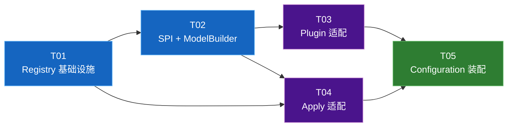

# Diff 多数据源支持 — 任务索引

> **目标**：为 Diff 比对组件增加多数据源能力，源端和目标端可分别指定不同的数据库数据源。
> **历史迁移说明**：本目录保留了从内部项目迁移而来的任务卡，部分子文档中的模块名、包路径和命令仍是历史记录，不完全等同于当前仓库结构。

## 前提约束

> **以下约束必须在实施前与使用方对齐，违反将导致运行时错误。**

1. **表结构一致性**：外部数据源与主库的业务表（表名、列名、列类型）**必须保持一致**。Plugin 的 SQL 硬编码了列名列表，结构不一致会导致 SQL 异常或数据错误。
2. **v1 回滚方向限制**：v1 仅支持 **"外部库（source）→ 主库（target）"** 方向的 Apply 回滚。如果 Apply 的 `targetDataSourceKey` 指向非主库，回滚功能暂不可用（将在二期实现）。
3. **静态数据源配置**：数据源配置在启动时加载，运行时**不支持动态添加/移除**。变更需重启服务。
4. **网络可达性**：外部数据源的连接依赖 HikariCP 内建重连机制，不提供应用层重试。持续的网络不可达会导致对比/Apply 失败。

## 卡片清单

| 卡号 | 标题 | 依赖 | 可并行 |
|------|------|------|--------|
| T01 | DataSource 注册表基础设施 | 无 | — |
| T02 | SPI 层 + ModelBuilder 适配 | ← T01 | — |
| T03 | Plugin 层适配（ApiDefinition） | ← T01, T02 | 与 T04 并行 |
| T04 | Apply 层适配（含事务安全加固） | ← T01, T02 | 与 T03 并行 |
| T05 | Configuration 装配 + 集成 | ← T01, T02, T03, T04 | — |

## 依赖关系图



## 复用组件清单（不修改的现有组件）

| 组件 | 用途 | 备注 |
|------|------|------|
| `StandaloneLoadOptionsResolver` | source/target LoadOptions 解析 | 不改。`LoadOptions` 新增 `dataSourceKey` 字段（T02），Resolver 只做对象选择，不感知具体字段 |
| `StandalonePluginRegistry` | 插件注册表 | 不变 |
| `TenantDiffEngine` | 对比引擎 | 不变，纯内存对比 |
| `PlanBuilder` | Apply 计划构建器 | 不变 |
| MyBatis-Plus Mapper（5 个） | 元数据持久化 | 始终用主数据源，不变 |
| `TenantDiffStandaloneServiceImpl` | 对比编排 | 不改。现有代码已通过 `resolveSource/resolveTarget` 分别传入 per-side LoadOptions（T02 审核检查点 CP-4 验证） |

## 已知范围外（二期）

| 项目 | 说明 |
|------|------|
| `TenantDiffStandaloneApiDefinitionServiceImpl` 多数据源 | 该 Service 有 2 处硬编码 JdbcTemplate 查询，改造量大，二期处理 |
| `ApiTemplateStandalonePlugin` / `InstructionStandalonePlugin` | 当前全部被注释/不活跃。**未来启用时必须同步适配多数据源** |
| 回滚支持非主库 target | v1 回滚只支持 target=主库，二期从 apply_record 追踪 targetDataSourceKey |
| 按租户动态路由数据源 | v1 的 dataSourceKey 由调用方显式指定，不支持按租户自动路由 |

## 实施状态表

| 卡号 | 阶段一 核心 | 阶段二 执行 | 阶段三 自省 | 阶段四 反馈 | 阶段五 总结 | Code-Review |
|------|------------|------------|------------|------------|------------|-------------|
| T01 | ✅ 已完善 | ✅ 已完善 | ✅ 已填写 | ✅ 已回填 | ✅ 已回填 | — |
| T02 | ✅ 已完善 | ✅ 已完善 | ✅ 已填写 | ✅ 已回填 | ✅ 已回填 | — |
| T03 | ✅ 已完善 | ✅ 已完善 | ✅ 已填写 | ✅ 已回填 | ✅ 已回填 | — |
| T04 | ✅ 已完善 | ✅ 已完善 | ✅ 已填写 | ✅ 已回填 | ✅ 已回填 | — |
| T05 | ✅ 已完善 | ✅ 已完善 | ✅ 已填写 | ✅ 已回填 | ✅ 已回填 | — |

## 全局验收命令

```bash
# 编译通过
./mvnw -DskipTests package

# 单测通过
./mvnw -pl tenant-diff-core test -Dsurefire.failIfNoSpecifiedTests=false

# 回归
./mvnw test -Dsurefire.failIfNoSpecifiedTests=false
```
